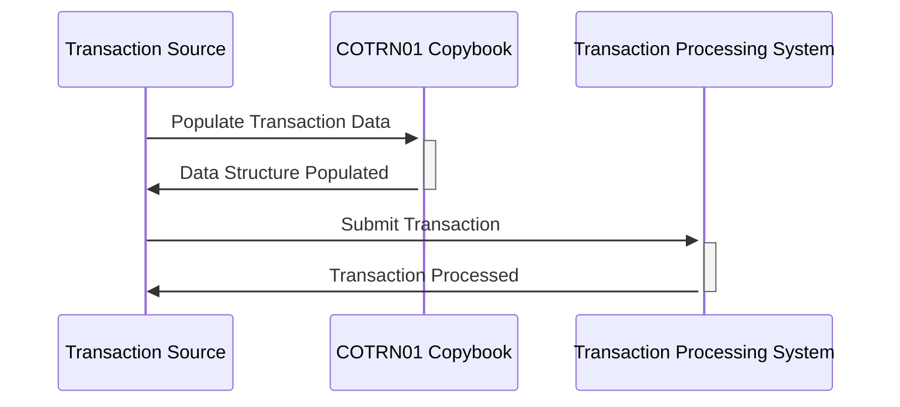

Generated at: 2nd October of 2024

**Title Document:** Credit Card Transaction Record - Data Structure Specification

**Summary Description:**
This document defines the data structure for storing credit card transaction details in a COBOL application. It includes fields for transaction ID, card number, merchant details, timestamps, and error messages. The structure is designed to be used in both character-based and packed-decimal formats.

**User Stories:**
As a data analyst, I need a standardized format for credit card transaction records so that I can perform analysis and reporting on transaction data consistently and accurately.

**Related Epic:**
4 - Transaction Processing

**Technical Requirements:**
- **Transaction Data Structure Definition:** This method defines the structure of a credit card transaction record.
  - Step: Define two layouts for the transaction record, `COTRN1AI` and `COTRN1AO`.
  - Step: Define fields for transaction details, card information, merchant details, timestamps, and error messages.
  - Result: A standardized data structure for storing and exchanging transaction information.

**Related Models**
- `COTRN1AI`
  - `TRNIDINI` `Alphanumeric`: Unique identifier for the transaction. 
  - `CARDNUMI` `Alphanumeric`: Credit card number used in the transaction.
  - `TTYPCDI` `Alphanumeric`: Code indicating the type of transaction (e.g., purchase, refund).
  - `TRNSRCI` `Alphanumeric`: Source of the transaction (e.g., online, POS terminal).
  - `TDESCI` `Alphanumeric`: Description of the transaction.
  - `TRNAMTI` `Alphanumeric`: Amount of the transaction.
  - `MIDI` `Alphanumeric`: Unique identifier of the merchant involved.
  - `MNAMEI` `Alphanumeric`: Name of the merchant.
  - `ERRMSGI` `Alphanumeric`: Message indicating any errors encountered during the transaction.
  - `TRNNAMEI` `Alphanumeric`: Name of the transaction.
  - `TITLE01I` `Alphanumeric`: First title of the transaction.
  - `CURDATEI` `Alphanumeric`: Date of the transaction.
  - `PGMNAMEI` `Alphanumeric`: Program name associated with the transaction.
  - `TITLE02I` `Alphanumeric`: Second title of the transaction.
  - `CURTIMEI` `Alphanumeric`: Time of the transaction.
  - `TRNIDI` `Alphanumeric`: Secondary transaction ID.
  - `TCATCDI` `Alphanumeric`: Transaction category code.
  - `TORIGDTI` `Alphanumeric`: Origination date and time of the transaction.
  - `TPROCDTI` `Alphanumeric`: Processing date and time of the transaction.
  - `MCITYI` `Alphanumeric`: City of the merchant.
  - `MZIPI` `Alphanumeric`: ZIP code of the merchant.

**Configurations:**
- Not available.

**Code Improvements:**
- Add data validation checks for each field to ensure data integrity.
- Implement error handling to gracefully handle invalid or missing data.
- Document the purpose and usage of each field in the data structure.
- Consider using a data dictionary to centrally manage data definitions.

**Security Improvements:**
- Encrypt sensitive data fields, such as the credit card number, to protect customer information.
- Implement access control mechanisms to restrict unauthorized access to transaction data.
- Log all data access and modifications for auditing purposes.

**Conceptual Diagram:**

--Made by "Smart Engineering" (by Compass.UOL)--