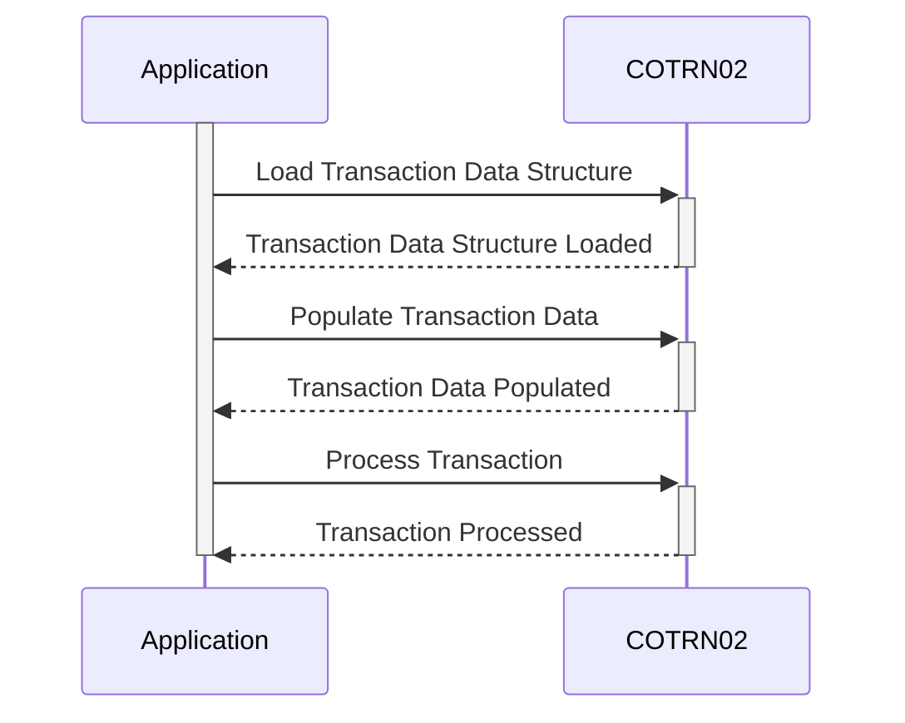

Generated at: 2nd October of 2024

**Title Document: CardDemo Application - Transaction Data Structure Specification**

**Summary Description:**
This document specifies the data structure for credit card transactions within the CardDemo application. It defines a standardized format for capturing and storing key transaction details, enabling consistent processing and analysis.

**User Stories:**
As a data analyst, I need a standardized data structure for credit card transactions so that I can perform analysis on transaction data accurately and efficiently.

**Related Epic:**
4 - Transaction Processing

**Technical Requirements:**

- Transaction Data Management: This method defines the structure of data for both input and output related to transactions within the CardDemo Application.
  - Input: Receives data about a transaction, including `TRNNAME`, `CURDATE`, `CURTIME`, `ACTIDIN`, `CARDNIN`, `TTYPCD`, `TCATCD`, `TRNSRC`, `TDESC`, `TRNAMT`, `TORIGDT`, `TPROCDT`, `MID`, `MNAME`, `MCITY`, `MZIP`, `CONFIRM` and `ERRMSG`.
  - Output: Sends data about the transaction, including `TRNNAME`, `CURDATE`, `CURTIME`, `ACTIDIN`, `CARDNIN`, `TTYPCD`, `TCATCD`, `TRNSRC`, `TDESC`, `TRNAMT`, `TORIGDT`, `TPROCDT`, `MID`, `MNAME`, `MCITY`, `MZIP`, `CONFIRM` and `ERRMSG`.

**Related Models**
- Transaction Data
  - `TRNNAME` `String`: Transaction Name (e.g., purchase, refund).
  - `CURDATE` `Date`: Date of the transaction.
  - `CURTIME` `Time`: Time of the transaction.
  - `ACTIDIN` `String`: Activity ID (unique identifier for the transaction).
  - `CARDNIN` `String`: Credit Card Number.
  - `TTYPCD` `String`: Transaction Type Code.
  - `TCATCD` `String`: Transaction Category Code.
  - `TRNSRC` `String`: Transaction Source (e.g., online, POS).
  - `TDESC` `String`: Transaction Description.
  - `TRNAMT` `Numeric`: Transaction Amount.
  - `TORIGDT` `Date`: Transaction Origination Date.
  - `TPROCDT` `Date`: Transaction Processing Date.
  - `MID` `String`: Merchant ID.
  - `MNAME` `String`: Merchant Name.
  - `MCITY` `String`: Merchant City.
  - `MZIP` `String`: Merchant ZIP Code.
  - `CONFIRM` `String`: Confirmation Status (e.g., approved, declined).
  - `ERRMSG` `String`: Error Message (if any).

**Configurations:**
- `COTRN02.CPY`
  - `COTRN2AI`: `{Data Structure}`
	- Description: Defines the structure for input transaction data.
  - `COTRN2AO`: `{Data Structure}`
	- Description: Defines the structure for output transaction data.

**Code Improvements:**
- Implement data validation checks for each field in the data structure to ensure data integrity.
- Add comments to the copybook to explain the purpose and usage of each field.
- Consider using a data dictionary to document the data structure and its fields in a centralized location.

**Security Improvements:**
- If the data structure contains sensitive information like credit card numbers, implement appropriate encryption mechanisms to protect the data at rest and in transit.
- Ensure that access to the data structure is restricted to authorized personnel only.
- Implement audit trails to track any modifications made to the data structure.

**Conceptual Diagram:**

--Made by "Smart Engineering" (by Compass.UOL)--