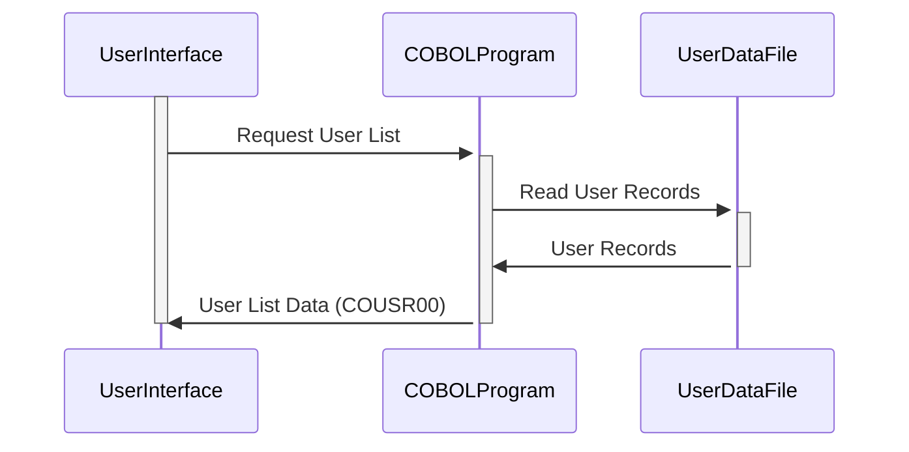

Generated at: 2nd October of 2024

**Title Document: COUSR00 Copybook Specification**

**Summary Description:**
This document details the structure and usage of the `COUSR00.CPY` copybook, which defines data structures for user information display and manipulation within a COBOL application. It outlines the fields used to represent user details, system information, and selection flags for user management operations.

**User Stories:**
As an administrator, I need a way to view a list of users in the system so that I can manage their accounts and permissions.

**Related Epic:**
6 - User Management and Security

**Technical Requirements:**

- **User Data Structure Definition:** Defines two data structures, `COUSR0AI` (input) and `COUSR0AO` (output), using the `REDEFINES` clause to allow for different interpretations of the same data.
  - Input: N/A
  - Result `COUSR0AI` and `COUSR0AO`: Data structures containing user information, system details, and selection flags.

**Related Models**

- **`COUSR00`**
  - `TRNNAM` `String`: Transaction name.
  - `PGMNAM` `String`: Program name.
  - `CURDAT` `Date`: Current date.
  - `CURTIM` `Time`: Current time.
  - `PAGENU` `Integer`: Page number.
  - `USRID` `String`: Unique user ID.
  - `FNAME` `String`: User's first name.
  - `LNAME` `String`: User's last name.
  - `UTYPE` `String`: User type code.
  - `SEL####` `Boolean`: Selection flag for each user row (e.g., `SEL0001`, `SEL0002`).

**Configurations:**

- N/A - No specific configuration values are directly defined within the copybook.

**Code Improvements:**

- **Documentation:** Add comments to clarify the purpose and usage of each field within the data structures.
- **Standardization:** Consider using a consistent naming convention for fields (e.g., using underscores to separate words) to improve readability.
- **Data Validation:** Implement data validation checks within the program that uses this copybook to ensure data integrity (e.g., checking for valid user types, non-empty user IDs).

**Security Improvements:**

- **Sensitive Data Handling:** If the `COUSR00` structure contains sensitive information (e.g., passwords), consider encrypting this data or storing it separately in a more secure location.
- **Access Control:** Implement access control mechanisms to restrict access to user information based on user roles and permissions.

**Conceptual Diagram:**

--Made by "Smart Engineering" (by Compass.UOL)--