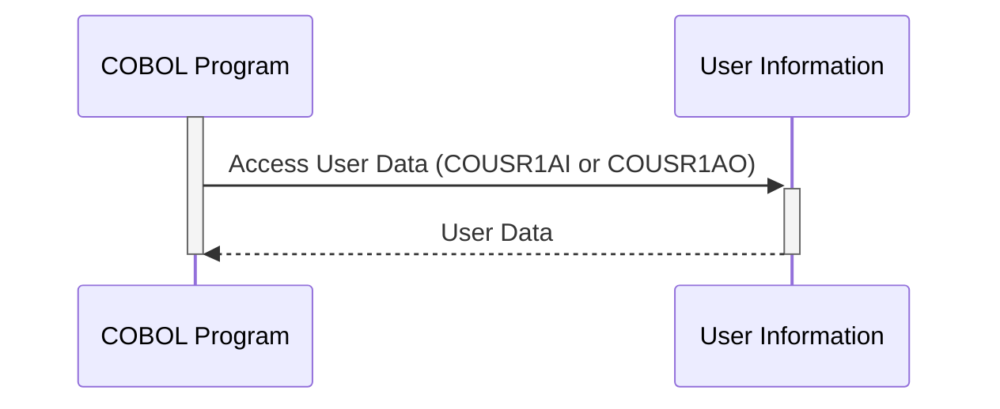

Generated at: 2nd October of 2024

**Title Document: COUSR01 - User Information Copybook Specification**

**Summary Description:**
The `COUSR01` copybook defines a standardized structure for storing and accessing user information within a COBOL-based system. It provides two different views of the same user data, catering to potential variations in data access and presentation.

**User Stories:**
As a system administrator, I need a reliable and structured way to manage user information, including their credentials, personal details, and system access levels. This ensures secure authentication, efficient data retrieval, and consistent user management operations.

**Related Epic:**
6 - User Management and Security

**Technical Requirements:**
- **User Information Structure:**
  - The copybook defines two data structures (`COUSR1AI` and `COUSR1AO`) to represent user information.
  - Both structures contain fields for storing user-related data like transaction names, titles, dates, times, first name, last name, user ID, password, user type, and error messages.
  - `COUSR1AO` redefines `COUSR1AI` to provide an alternative view of the same data, potentially for display or communication purposes. 
- **Data Types and Lengths:**
  - Each field in the data structures has a defined data type (e.g., `COMP`, `PICTURE X`, `PIC X(n)`) and length.
  - This ensures that the system allocates the correct amount of storage for each piece of information and handles it appropriately.
- **Data Validation (Not Implemented in the Copybook):**
  - The copybook itself doesn't implement data validation rules.
  - It's crucial to implement data validation routines in the COBOL programs that use this copybook to maintain data integrity.
  - Validations should include checks for:
    - Valid user ID formats.
    - Password complexity requirements.
    - Allowed characters in names and other fields.
    - Data type compatibility (e.g., numeric values in numeric fields).
- **Error Handling (Partially Addressed):**
  - The copybook includes an `ERRMSGI` field to store error messages related to user data.
  - However, it doesn't define specific error codes or handling mechanisms.
  - COBOL programs using this copybook should implement robust error handling, including:
    - Defining specific error codes for different situations (e.g., invalid user ID, incorrect password).
    - Logging error details for auditing and troubleshooting.
    - Displaying user-friendly error messages to the user.
- **Security Considerations:**
  - **Password Storage:**
    - The copybook doesn't specify how passwords are stored.
    - It's crucial to **NOT** store passwords in plain text.
    - Implement secure password hashing algorithms (e.g., bcrypt, scrypt) to protect passwords from unauthorized access.
  - **Access Control:**
    - The `USRTYPEI` field likely indicates user roles and permission levels.
    - Leverage this field to enforce role-based access control (RBAC) within the system.
    - Ensure that users can only access and modify data according to their assigned roles and permissions.

**Related Models**
- `User`: Represents a user in the system.
  - `TRNNAMEI` `String`: Transaction name.
  - `TITLE01I` `String`: First title.
  - `CURDATEI` `String`: Current date.
  - `PGMNAMEI` `String`: Program name.
  - `TITLE02I` `String`: Second title.
  - `CURTIMEI` `String`: Current time.
  - `FNAMEI` `String`: First name.
  - `LNAMEI` `String`: Last name.
  - `USERIDI` `String`: User ID.
  - `PASSWDI` `String`: Password (should be securely hashed).
  - `USRTYPEI` `String`: User type (e.g., 'A' for administrator, 'U' for regular user).
  - `ERRMSGI` `String`: Error message related to user data.

**Configurations:**
- No configurations found.

**Code Improvements:**
- **Data Validation:** Implement comprehensive data validation rules within the COBOL programs that use this copybook to ensure data accuracy and integrity.
- **Error Handling:** Enhance error handling by defining specific error codes, logging error details, and presenting user-friendly messages.
- **Password Security:** Never store passwords in plain text. Use strong, one-way hashing algorithms to protect passwords.
- **Documentation:** Add comments to the copybook to explain the purpose of each field and any associated business rules.
- **Coding Standards:** Apply consistent coding standards for improved readability and maintainability.

**Security Improvements:**
- **Password Hashing:** Implement a secure password hashing mechanism to protect user passwords from unauthorized access.
- **Access Control:** Enforce strict access control measures based on user roles and permissions to prevent unauthorized data access and modifications.
- **Data Encryption:** Consider encrypting sensitive user information both in transit and at rest to protect against data breaches.
- **Audit Trails:** Implement audit trails to track user-related events, such as login attempts, profile updates, and data changes, for security and compliance purposes.

**Conceptual Diagram:**

--Made by "Smart Engineering" (by Compass.UOL)--