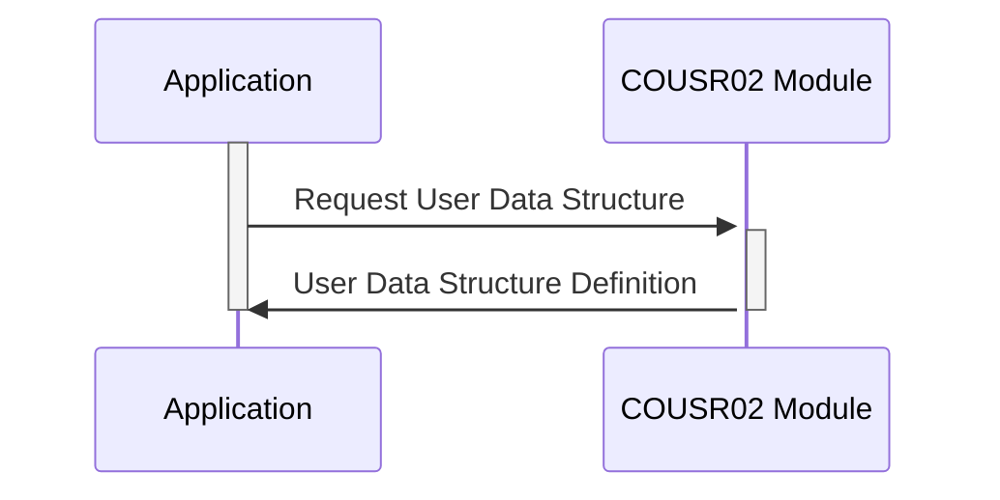

Generated at: 2nd October of 2024

**Title Document: COUSR02.CPY - User Data Structure for Secure Access**

**Summary Description:**
This code defines the structure for storing and accessing user information, including sensitive data like passwords, in a secure and organized manner. It ensures data consistency and lays the foundation for user authentication and authorization within a larger system.

**User Stories:**
As a system administrator, I need a secure way to store and manage user account information, including passwords and access levels, to ensure only authorized personnel can access sensitive data and functionalities.

**Related Epic:**
6 - User Management and Security

**Technical Requirements:**

- **User Data Structure Definition:** This code defines the structure of how user information is organized and stored.
  - Input: None.
  - Processing: Defines two data layouts, `COUSR2AI` and `COUSR2AO`, to represent user information. Each layout contains fields for user ID (`USRIDIN`), password (`PASSWD`), first name (`FNAME`), last name (`LNAME`), user type (`USRTYPE`), transaction name (`TRNNAME`), current date (`CURDATE`), current time (`CURTIME`), program name (`PGMNAME`), titles (`TITLE01`, `TITLE02`), and error messages (`ERRMSG`).
  - Result: Two data structures are defined to hold user information.

**Related Models:**

- **User:** Represents a user account within the system.
  - `USRIDIN` `String`: Unique identifier for the user.
  - `PASSWD` `String`: User's password, should be stored securely using hashing.
  - `FNAME` `String`: User's first name.
  - `LNAME` `String`: User's last name.
  - `USRTYPE` `String`: User's role and access level (e.g., 'A' for administrator, 'U' for regular user).

**Configurations:**

- **COUSR02.CPY:**
  - None

**Code Improvements:**

- **Password Security:** The code mentions a password field (`PASSWD`) but doesn't specify how it's stored. **Implement a robust password hashing algorithm (e.g., bcrypt, scrypt) to store passwords securely.**  Never store passwords in plain text.
- **Data Validation:**  Add data validation checks for fields like `USRIDIN`, `FNAME`, `LNAME`, and `USRTYPE` to ensure data integrity and prevent potential issues from malformed input.
- **Error Handling:**  Incorporate error handling mechanisms to gracefully handle scenarios like invalid user IDs, incorrect passwords, or data access errors.
- **Documentation:** Add comments to explain the purpose of each field and the overall functionality of the code. This makes the code easier to understand and maintain.

**Security Improvements:**

- **Data Encryption:** Consider encrypting the entire user data structure, especially when storing it on disk or transmitting it over a network.
- **Access Control:** Implement strict access control measures to restrict access to this code and the data it handles. Only authorized personnel should be able to modify user information.
- **Auditing:** Log all user account changes, including creation, modification, and deletion. This provides an audit trail for security and accountability purposes.

**Conceptual Diagram:**

--Made by "Smart Engineering" (by Compass.UOL)--