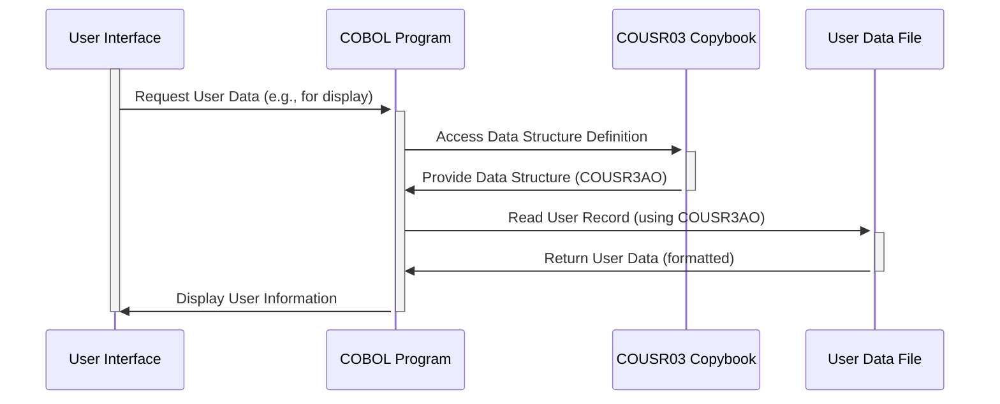

Generated at: 2nd October of 2024

**Title Document:** User Information Management - COUSR03 Copybook Specification

**Summary Description:**
This COBOL copybook defines a standardized data structure for user information within the CardDemo application, outlining fields for identification, attributes, system interaction details, and communication.  It facilitates consistent user data handling across different programs and functionalities, supporting activities like user authentication, authorization, tracking, and messaging.

**User Stories:**
As a system administrator, I need a standardized way to define and manage user information, including their credentials, roles, and system interaction details, so that I can effectively control access, monitor activities, and communicate with users within the CardDemo application.

**Related Epic:**
6 - User Management and Security

**Technical Requirements:**
- **User Data Structure Definition:**
  - Objective: Define a consistent structure for storing and accessing user information within the CardDemo application.
  - Input: None. The data structure is defined within the copybook itself.
  - Processing:  The copybook utilizes COBOL data definition syntax to define fields for `USRIDINI` (User ID), `FNAMEI` (First Name), `LNAMEI` (Last Name), `USRTYPEI` (User Type), `TRNNAMEI` (Transaction Name), `PGMNAMEI` (Program Name), `CURDATEI` (Current Date), `CURTIMEI` (Current Time), and `ERRMSGI` (Error Message).
  - Output:  Provides a standardized template (`COUSR3AI` and `COUSR3AO`) for representing user data, ensuring consistency across different programs using this copybook.
- **Data Type and Length Enforcement:**
  - Objective: Ensure data integrity by specifying the type and maximum length for each field in the user information structure.
  - Input:  Data assigned to the fields of the `COUSR3AI` or `COUSR3AO` data structures.
  - Processing: COBOL's inherent data typing mechanism (`PIC` clause) enforces the specified data types and lengths. For example, `USRIDINI PIC X(8)` restricts the User ID to 8 alphanumeric characters.
  - Output: User information stored and processed according to the defined data types and lengths, preventing potential data truncation or corruption.
- **User Identification and Uniqueness:**
  - Objective: Provide a mechanism for uniquely identifying each user within the CardDemo system.
  - Input: User ID (`USRIDINI`) provided during user creation or modification.
  - Processing:  Programs using this copybook are responsible for ensuring the uniqueness of the `USRIDINI` field, potentially by checking for duplicates before creating a new user record.
  - Output:  Each user record is identifiable by a unique User ID, facilitating individual user management, tracking, and communication. 

**Related Models**

- **`COUSR3AI`:** Internal representation of user data.
  - `USRIDINI` `PIC X(8)`: Unique user identifier.
  - `FNAMEI` `PIC X(20)`: User's first name.
  - `LNAMEI` `PIC X(20)`: User's last name.
  - `USRTYPEI` `PIC X(1)`: User's role or access level (e.g., 'A' for Administrator, 'U' for Regular User).
  - `TRNNAMEI` `PIC X(4)`: Code representing the specific transaction or operation being performed.
  - `PGMNAMEI` `PIC X(8)`: Name of the program or module the user is interacting with.
  - `CURDATEI` `PIC X(8)`: Current date in YYYYMMDD format.
  - `CURTIMEI` `PIC X(8)`: Current time in HHMMSS format.
  - `ERRMSGI` `PIC X(78)`:  System-generated messages or error notifications for the user.
- **`COUSR3AO`:** Output-oriented representation of user data (redefines `COUSR3AI`).
  - Structure and fields are essentially the same as `COUSR3AI` but organized for display purposes, potentially including formatting or presentation attributes.

**Configurations:**

- No specific configuration settings were found within the provided code snippet.

**Code Improvements:**

- **Error Handling:** While the `ERRMSGI` field is present, the code lacks explicit error handling routines. Implementing standardized error handling, including logging and user-friendly error messages, would improve the robustness and maintainability of the system.
- **Data Validation:** Consider adding data validation checks for fields like `USRTYPEI` to ensure only valid user types are allowed. 
- **Documentation:** Include comprehensive comments within the copybook to explain the purpose of each field, allowed values, and any dependencies on other parts of the system.

**Security Improvements:**

- **Password Management:** The copybook does not include a field for storing user passwords. If passwords are handled within the system, implement secure password storage using hashing and salting techniques. Never store passwords in plain text.
- **Access Control:**  Ensure that access to user information, particularly sensitive fields like user type and error messages, is restricted based on user roles and permissions.

**Conceptual Diagram:**

--Made by "Smart Engineering" (by Compass.UOL)--