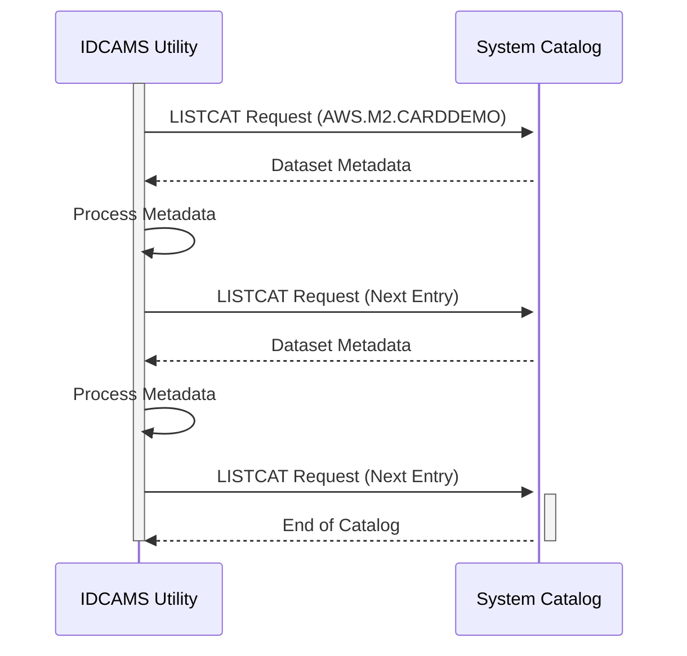

Generated at: 2nd October of 2024

**Title Document:** CardDemo Application - Data Storage Analysis

**Summary Description:**
This document analyzes the `LISTCAT.txt` file, which provides a comprehensive inventory of data files used by the CardDemo application, a mainframe-based system for managing credit card accounts. The analysis details the organization, types, storage, and attributes of these files, offering insights into the application's data landscape.

**User Stories:**
As a system administrator, I need a clear understanding of the data files used by the CardDemo application to ensure efficient data management, backup, and recovery processes.

**Related Epic:** 10 - Data Files Management

**Technical Requirements:**

- `Data File Listing`: This process lists all data files used by the CardDemo application, including VSAM and non-VSAM files, providing details on their organization, storage, and attributes.
  - `File Identification`: Each file is identified by its name and type (VSAM or non-VSAM).
  - `Organization Details`: The organization of the data within the file is specified (e.g., KSDS, ESDS, RRDS, AIX).
  - `Storage Information`: The volume where the file is stored, along with its physical characteristics, is listed.
  - `Attributes`: Key attributes of the file, such as record length, key length, buffer space, and compression information, are presented.
  - `Statistics`: Statistical data about the file, including record counts, splits, extents, and free space, is provided.
  - `Allocation`: Details about the file's allocation, including space type, primary and secondary allocation, are shown.
  - `Volume Information`: Information about the volume where the file resides, such as volume serial number, device type, and extent information, is listed.
  - `Associations`: Associations with other files, such as data component, index component, and alternate index paths, are identified.
  - `History`: The file's creation date, last alteration date, release information, and expiration date are included.
  - `SMS Data`: Information related to SMS (Storage Management Subsystem), such as storage class, management class, data class, and backup information, is presented.
  - `Encryption Data`: Encryption status of the file is indicated.
  - `Protection`: Password protection and RACF (Resource Access Control Facility) status are shown.
  - `Result` `{Data Structure}`: A structured representation of the file's metadata, encompassing all the details mentioned above.

**Related Models**

- `VSAM File`
  - `FileName` `String`: The name of the VSAM file.
  - `FileType` `String`: The type of VSAM file (KSDS, ESDS, RRDS, AIX).
  - `DataComponent` `String`: The name of the data component of the VSAM file.
  - `IndexComponent` `String`: The name of the index component of the VSAM file.
  - `AlternateIndex` `String`: The name of the alternate index, if applicable.
  - `Volume` `String`: The volume where the VSAM file is stored.
  - `RecordLength` `Integer`: The length of each record in the VSAM file.
  - `KeyLength` `Integer`: The length of the key field in the VSAM file.
- `NonVSAM File`
  - `FileName` `String`: The name of the non-VSAM file.
  - `Volume` `String`: The volume where the non-VSAM file is stored.
- `GDG Base`
  - `BaseName` `String`: The base name of the GDG (Generation Data Group).
  - `Limit` `Integer`: The maximum number of generations allowed in the GDG.
- `GDG Generation`
  - `GenerationName` `String`: The name of the GDG generation.
  - `GDGBase` `String`: The base name of the GDG to which this generation belongs.
  - `Status` `String`: The status of the GDG generation (ACTIVE, ROLLED-OFF).
- `Volume`
  - `Volser` `String`: The volume serial number.
  - `DeviceType` `String`: The device type of the volume.

**Configurations:**

- `LISTCAT.txt`
  - `HIGH-LEVEL-QUALIFIER`: `"AWS.M2.CARDDEMO"`
	- Description: High-level qualifier for the datasets.

**Code Improvements:**
- Not applicable, as this document analyzes an output file rather than source code.

**Security Improvements:**
- Access Control: Implement strict access control measures to restrict unauthorized access to the `LISTCAT.txt` file and the system catalog it represents.
- Encryption: Consider encrypting the `LISTCAT.txt` file to protect sensitive information about data file organization and storage.
- Auditing: Enable auditing mechanisms to track access and modifications to the system catalog and the `LISTCAT.txt` file.

**Conceptual Diagram:**

--Made by "Smart Engineering" (by Compass.UOL)--