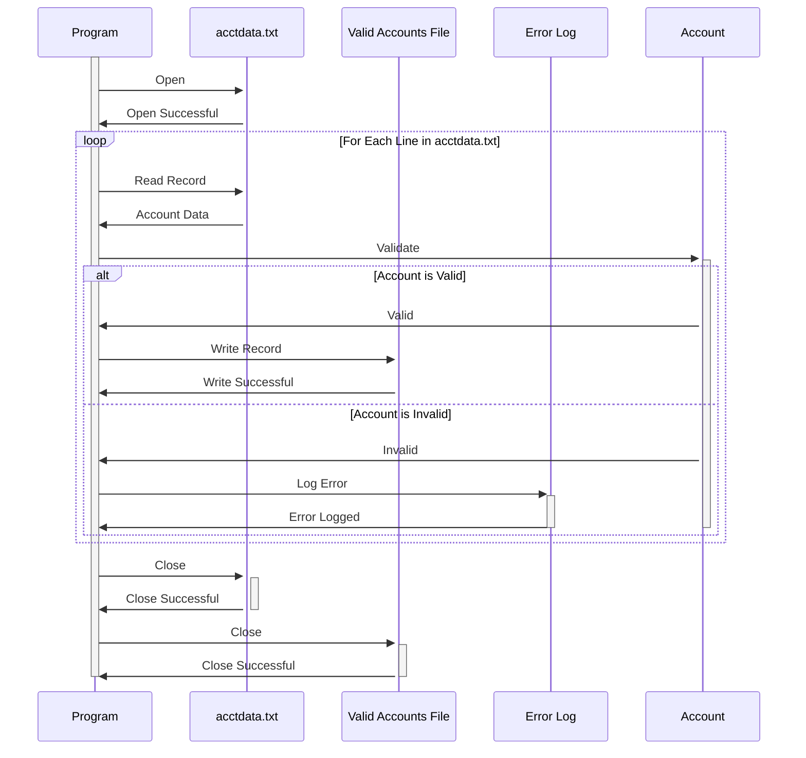

Generated at: 2nd October of 2024

**Title Document:** `acctdata.txt` File Processing Program Specification

**Summary Description:**
This program reads and processes account data from the `acctdata.txt` file. Each line in the file represents a customer account, containing information such as account number, credit limit, balance, and status. The program validates the data in each record, applying specific business rules to identify valid and invalid accounts. Valid accounts are written to an output file, while invalid accounts are logged for further investigation.

**User Stories:**
As a data analyst, I need a program to ensure that only valid customer account data is used for analysis, reporting, and decision-making. The program should identify and separate valid accounts from invalid ones based on predefined criteria.

**Related Epic:**
10 - Data Files Management

**Technical Requirements:**

- `Read Account Data`: This method reads and parses account data from the `acctdata.txt` file.
  - Input: Account data records from the `acctdata.txt` file.
  - Processing: Reads each line from the file and splits it into individual fields based on fixed-width delimiters.
  - Output: A list of `Account` objects, each representing a single account record.
- `Validate Account Data`: This method applies business rules to validate the data in each `Account` object.
  - Input: An `Account` object containing account data.
  - Validation: 
    - Checks if the account number is numeric and within a valid range.
    - Verifies that the credit limit and balance are numeric and non-negative.
    - Ensures that the account status is one of the allowed values (`A` for Active, `C` for Closed, `S` for Suspended, etc.).
  - Output: A boolean value indicating whether the account is valid or invalid.
- `Write Valid Accounts`: This method writes valid account data to an output file.
  - Input: A list of valid `Account` objects.
  - Processing: Formats each `Account` object's data into a string representation.
  - Output: Writes the formatted account data to a new file, one record per line.
- `Log Invalid Accounts`: This method logs details of invalid accounts for further investigation.
  - Input: An invalid `Account` object and the reason for invalidity.
  - Processing: Creates a log entry containing the account number, invalid fields, and reason for invalidity.
  - Output: Writes the log entry to a log file or database.

**Related Models**

- `Account`
  - `AccountNumber` `String`: Unique identifier for the account.
  - `CreditLimit` `Decimal`: Maximum credit available on the account.
  - `Balance` `Decimal`: Current outstanding balance on the account.
  - `Status` `String`: Indicates whether the account is active, closed, suspended, etc.
  - `OpenDate` `Date`: Date when the account was opened.
  - `LastStatementDate` `Date`: Date of the last statement generated.
  - `PaymentDueDate` `Date`: Date the next payment is due.

**Configurations:**

- `acctdata.txt`
  - `RECLN`: `300`
	- Description: Record length of the account data file.

**Code Improvements:**

- Implement a more robust error handling mechanism, including specific exception types for different validation errors.
- Add detailed code comments to improve readability and maintainability.
- Consider using a logging framework for more structured and configurable logging.
- Explore performance optimizations for large input files, such as parallel processing or data streaming techniques.

**Security Improvements:**

- Securely store the `acctdata.txt` file with appropriate access controls to prevent unauthorized access.
- Encrypt sensitive data fields like account numbers and balances at rest and in transit.
- Implement audit trails to track all data access and modifications.

**Conceptual Diagram:**

--Made by "Smart Engineering" (by Compass.UOL)--