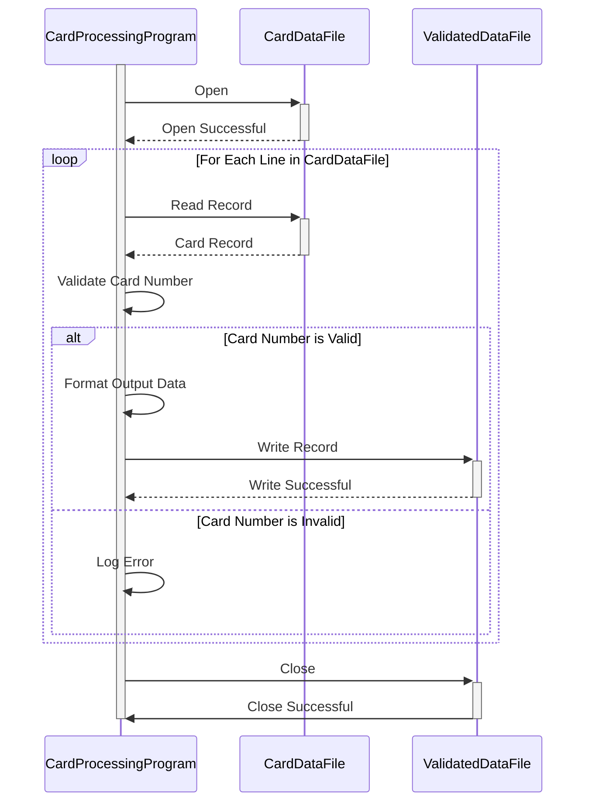

Generated at: 2nd October of 2024

**Title Document:** Credit Card Data Extraction, Validation and Transformation Specification

**Summary Description:**
This program reads credit card data from a text file (`carddata.txt`), validates the card numbers using Luhn's Algorithm, and writes the validated data to an output file. The program ensures data integrity by validating the card numbers and transforming the data into a standard format, making it suitable for further processing or analysis.

**User Stories:**
As a data analyst, I need to ensure that only valid credit card records are used for analysis, so I need a program to validate and extract valid credit card information from a file.

**Related Epic:**
8 - Customer Data Management

**Technical Requirements:**

- **Read Card Data:** This method reads and parses data from `carddata.txt`.
  - Input: Each line in the input file represents a credit card record with the format: `card_number, customer_name, expiration_date`.
  - Validation: The card number should be a numeric string.
  - Output: A list of strings, where each string represents a credit card record.
- **Validate Card Number (Luhn's Algorithm):** This method validates each card number using Luhn's Algorithm.
  - Input: A string representing a credit card number.
  - Calculation: 
    1.	Starting from the rightmost digit (excluding the check digit, if any), double the value of every second digit.
    2.	If doubling a digit results in a two-digit number, sum the digits of the doubled value.
    3.	Sum all the digits obtained in steps 1 and 2.
    4.	If the total sum is a multiple of 10, the credit card number is valid; otherwise, it is invalid.
  - Output: Boolean value indicating if the card number is valid or not.
- **Format Output Data:** This method formats the validated data.
  - Input: A list of valid credit card records.
  - Transformation: Format each record as `card_number,customer_name,expiration_date,valid`.
  - Output: A string containing the formatted data.
- **Write Validated Data:** This method writes the validated and formatted data.
  - Input: A string containing the validated and formatted data.
  - Output: Writes the input string to a new file named `carddata_processed.txt`.

**Related Models**

- CreditCard
  - `card_number` `String`: The credit card number.
  - `customer_name` `String`: The name of the customer.
  - `expiration_date` `String`: The expiration date of the credit card.
  - `valid` `Boolean`: A flag indicating whether the credit card number is valid.

**Configurations:**

- `carddata.txt`
  - N/A: `050002445376574000000000050747,Aniya Von,2023-03-09Y`
	- Description: Card Number/Account ID/Name/Expiration Date

**Code Improvements:**

- Implement more robust error handling for file operations, such as handling cases where the input file does not exist or is not accessible.
- Add logging to record successful operations, errors, and warnings.
- Optimize for performance, especially if processing large files, by using buffered reads and writes.
- Consider adding support for validating other credit card attributes, such as the cardholder's name and CVV.

**Security Improvements:**

- Do not store sensitive credit card information, such as the CVV or the full card number, unless absolutely necessary.
- If storing credit card data is required, use encryption to protect the data at rest.
- Implement access control measures to restrict access to sensitive data to authorized personnel only.

**Conceptual Diagram:**

--Made by "Smart Engineering" (by Compass.UOL)--