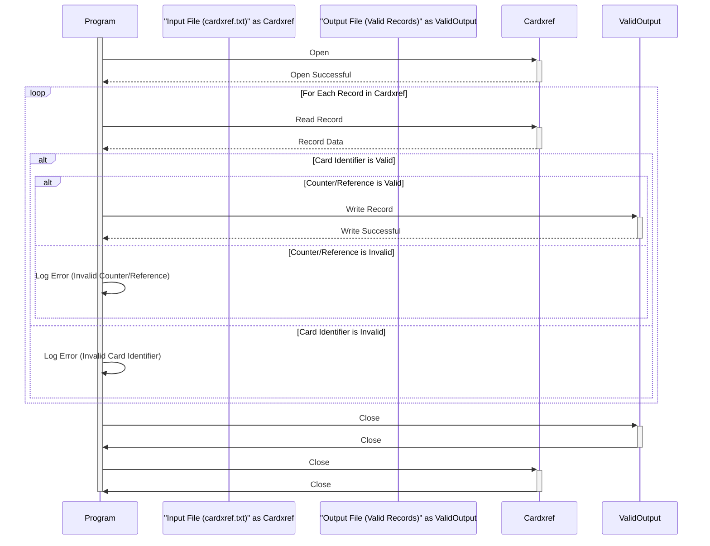

Generated at: 2nd October of 2024

**Title Document:** Credit Card Cross-Reference Validation and Processing Program

**Summary Description:**
This program validates credit card cross-reference records from the `cardxref.txt` file, ensuring data integrity and generating an output file containing only valid records. 

**User Stories:**
As a data analyst, I need to ensure that only valid credit card cross-reference records are used for analysis and reporting. The program should validate each record based on predefined criteria and generate an output file containing only the valid records.

**Related Epic:** 10 - Data Files Management

**Technical Requirements:**

- **Validate and Process Card Cross-Reference Records:** Reads the `cardxref.txt` file, validates each record, and writes valid records to an output file.
  - Input: Credit card cross-reference records from the `cardxref.txt` file. Each record contains a 19-digit card identifier and a 2-digit counter/reference.
  - Validation:
    1.  Check if the card identifier is numeric and 19 digits long.
    2.  Check if the counter/reference is numeric and 2 digits long.
  - Output: Write the valid records to an output file, maintaining the same format as the input file.

**Related Models**
- Credit Card Cross-Reference
  - CardIdentifier `String(19)`: Unique identifier for a credit card.
  - CounterReference `String(2)`: Represents usage count, file reference, or card status.

**Configurations:**
- `cardxref.txt`
  - Each line in the file represents a credit card cross-reference record.
  - Format: `{CardIdentifier}{CounterReference}`
  - Example: `411111111111111111101`

**Code Improvements:**
- **Error Handling:** Implement specific error handling for different validation failures. Log these errors with details (e.g., invalid record, error type, line number) for easier debugging.
- **Configuration:** Externalize validation rules (e.g., card identifier length, counter/reference length) to a configuration file for easier modification without code changes.
- **Performance:** For large files, consider optimizing file reading and writing operations (e.g., buffered reading, asynchronous writing) to improve performance.

**Security Improvements:**
- **Access Control:** Restrict access to the `cardxref.txt` file and the output file to authorized users and processes only.
- **Logging:** Implement secure logging mechanisms to record all file access and processing activities, including timestamps, user IDs, and actions performed.

**Conceptual Diagram:**

--Made by "Smart Engineering" (by Compass.UOL)--