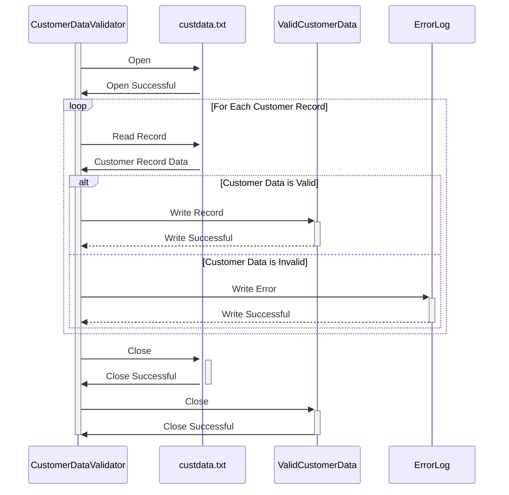

Generated at: 2nd October of 2024

**Title Document: Customer Data Validation and Processing Program**

**Summary Description:**
This program is designed to validate and process customer data from a text file named `custdata.txt`. The main objective is to ensure that the customer records meet specific validation criteria, including data type, length, and format checks. Valid customer records are then written to an output file, while invalid records are logged for further review.

**User Stories:**
As a data analyst, I need a program to validate customer data from a text file so that I can be sure that only valid records are used for analysis.

**Related Epic:**
8 - Customer Data Management

**Technical Requirements:**

- **Customer Record Validation**: This method reads the input file and processes each record to validate the customer data.
  - Input: Customer record data from the file `custdata.txt`.
  - Validations:
    - `CustomerID`: Numeric and unique.
    - `FirstName`, `MiddleName`, `LastName`: Alphanumeric, maximum length 50 characters.
    - `StreetAddress`: Alphanumeric, maximum length 100 characters.
    - `ApartmentNumber`: Alphanumeric, maximum length 10 characters.
    - `City`: Alphanumeric, maximum length 50 characters.
    - `State`: Two-letter state code, uppercase.
    - `ZipCode`: Numeric, 5 or 9 digits.
    - `CountryCode`: Two-letter country code, uppercase.
    - `PhoneNumber1`, `PhoneNumber2`: Numeric, 10 digits.
    - `CreditCardNumber`: Numeric, 16 digits, Luhn algorithm check.
    - `CreditCardExpirationDate`: Date format MM/YY, not expired.
    - `InternalCodes`: Alphanumeric, maximum length 20 characters.
  - Output: Write the valid records to the output file.

**Related Models:**

- `Customer`: Represents a customer record.
  - `CustomerID` `Integer`: Unique identifier for each customer.
  - `FirstName` `String`: Customer's first name.
  - `MiddleName` `String`: Customer's middle name (optional).
  - `LastName` `String`: Customer's last name.
  - `StreetAddress` `String`: Customer's street address.
  - `ApartmentNumber` `String`: Customer's apartment or suite number (optional).
  - `City` `String`: Customer's city.
  - `State` `String`: Customer's state.
  - `ZipCode` `String`: Customer's zip code.
  - `CountryCode` `String`: Customer's country code.
  - `PhoneNumber1` `String`: Customer's primary phone number.
  - `PhoneNumber2` `String`: Customer's secondary phone number (optional).
  - `CreditCardNumber` `String`: Customer's credit card number.
  - `CreditCardExpirationDate` `Date`: Customer's credit card expiration date.
  - `InternalCodes` `String`: Additional codes for internal tracking and classifications.

**Configurations:**

- `custdata.txt`
  - `RECLN`: `300`
	- Description: Record length of the customer data file.

**Code Improvements:**

- **Error Handling:** Implement a more robust error handling mechanism to capture and log specific errors encountered during validation, including the record number and the reason for the error.
- **Logging:** Enhance logging to include timestamps, error levels, and detailed error messages for easier debugging and troubleshooting.
- **Performance Optimization:** Consider using buffered input/output operations for reading and writing files to improve performance, especially for large datasets.
- **Data Transformation:** Implement data transformation functions to standardize data formats, such as converting phone numbers to a consistent format or validating email addresses.

**Security Improvements:**

- **Access Control:** Secure the input and output files with appropriate file permissions to restrict unauthorized access.
- **Data Encryption:** Encrypt sensitive data, such as credit card numbers, both in the input file and during processing to protect confidential information.
- **Audit Logging:** Implement audit logging to track all data access and modifications, including timestamps, user IDs, and actions performed, for security and compliance purposes.

**Conceptual Diagram:**

--Made by "Smart Engineering" (by Compass.UOL)--