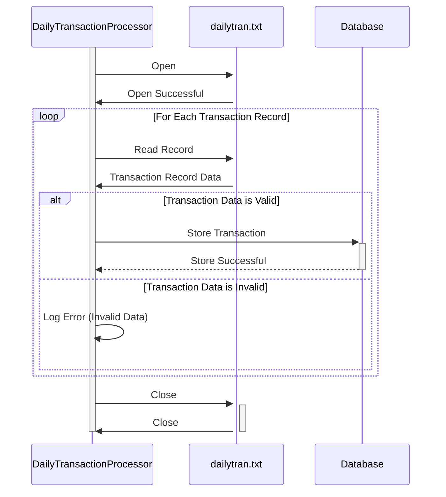

Generated at: 2nd October of 2024

**Title Document:** Daily Transaction Processing System - Specification

**Summary Description:**
This document outlines the specifications for a system designed to process daily transaction logs from retail store locations. The system aims to provide insights into sales trends, inventory management, customer behavior, and operational efficiency.

**User Stories:**
As a data analyst, I need a system to process daily transaction logs so that I can analyze sales patterns, manage inventory effectively, understand customer behavior, and optimize store operations.

**Related Epic:**
4 - Transaction Processing

**Technical Requirements:**
- **`Process Daily Transaction File`**: This method reads the daily transaction log file (`dailytran.txt`) and processes each record.
  - Input: Transaction data from the `dailytran.txt` file.
  - Processing: The method parses each line of the file, extracting data such as transaction type, store location, timestamp, and customer information. It validates the extracted data based on predefined rules.
  - Output: Validated transaction data is stored in a database for further analysis and reporting.

**Related Models**
- `Transaction`
  - `TransactionId` `{String}`: Unique identifier for each transaction.
  - `TransactionType` `{String}`: Type of transaction (`Purchase` or `Return`).
  - `StoreName` `{String}`: Name of the store where the transaction occurred.
  - `StoreLocation` `{String}`: Address of the store where the transaction occurred.
  - `Timestamp` `{DateTime}`: Date and time of the transaction.
  - `CustomerId` `{String}`: Unique identifier for the customer (if available).
  - `ProductId` `{String}`: Unique identifier for the product involved in the transaction.
  - `Quantity` `{Integer}`: Quantity of the product involved in the transaction.
  - `Price` `{Decimal}`: Price of the product.
  - `TotalAmount` `{Decimal}`: Total amount of the transaction.

**Configurations:**
- `dailytran.txt`
  - `TransactionType`: `{Purchase or Return}`
	- Description: Indicates whether the transaction was a purchase or a return.
  - `StoreName`: `{Store Name}`
	- Description: The name of the store where the transaction took place.
  - `StoreLocation`: `{Store Location}`
	- Description: The address of the store where the transaction took place.
  - `Timestamp`: `{Date and Time}`
	- Description: The date and time when the transaction occurred.

**Code Improvements:**
- Implement a more robust error handling mechanism to catch and log invalid data or file format errors.
- Add detailed inline documentation to the code to improve readability and maintainability.
- Consider implementing a logging framework to capture system events and errors for debugging and auditing purposes.
- Explore performance optimization techniques, such as parallel processing or asynchronous operations, to handle large transaction files efficiently.

**Security Improvements:**
- Restrict file access permissions to authorized personnel only.
- Encrypt sensitive data, such as customer information and transaction details, both in transit and at rest.
- Implement an audit trail to track all system activities, including data access and modifications.
- Regularly review and update security measures to address emerging threats and vulnerabilities.

**Conceptual Diagram:**

--Made by "Smart Engineering" (by Compass.UOL)--