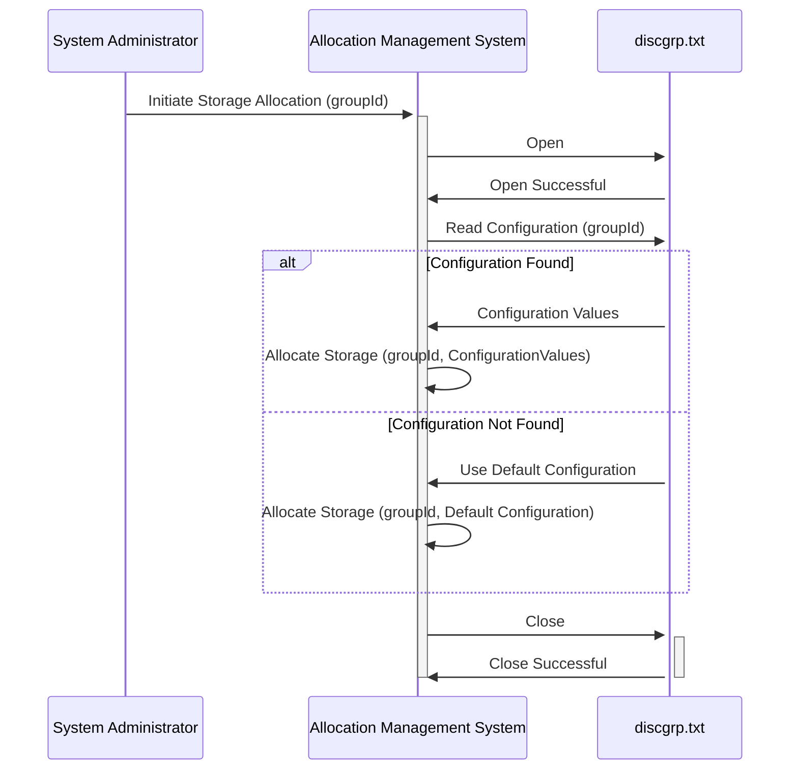

Generated at: 2nd October of 2024

**Title Document:** Disk Group Allocation Management System

**Summary Description:**
This document describes a system for managing disk group allocations based on a configuration file. It maps data group identifiers to specific storage parameters, ensuring efficient data organization and potential customization.

**User Stories:**
As a system administrator, I need a way to define how different types of data are stored on the disk so that I can optimize performance and manage storage capacity effectively.

**Related Epic:** 
10 - Data Files Management

**Technical Requirements:**

- **Read Disk Group Configuration File:** This function reads and parses the `discgrp.txt` configuration file.
  - Input: Path to the `discgrp.txt` file.
  - Validation:
    - Verify that the file exists and is accessible.
    - Validate the format of each line (e.g., correct delimiters, expected number of fields).
  - Result `Dictionary<string, string[]>`: A dictionary where the key is the group identifier (e.g., "A000000000010001", "ZEROAPR", "DEFAULT") and the value is an array of configuration values associated with that group.
- **Allocate Storage:** This function simulates allocating storage for a given group based on its configuration.
  - Input: 
    - `groupId` `String`: The identifier of the group for which storage needs to be allocated.
    - `configuration` `string[]`: An array of configuration values for the group, obtained from the parsed configuration file.
  - Processing:
    - Log the `groupId` and `configuration` being used for allocation.
    - **(Further implementation needed):**  Interact with the storage management system to physically allocate storage based on the `configuration` values.
  - Output: 
    - **(Further implementation needed):**  A success or failure status indicating the result of the storage allocation. 

**Related Models**

- **DiskGroupAllocation:**
  - `GroupId` `string`: Unique identifier for a data group.
  - `ConfigurationValues` `string[]`: Array of configuration values associated with the group.

**Configurations:**

- `discgrp.txt`:
  - Each line in the file follows the format: `{GroupId}{ConfigurationValues}`
    - `GroupId`: A string representing the unique identifier of a data group.
    - `ConfigurationValues`: A string (potentially structured) containing values that define the storage parameters for the group.

**Code Improvements:**

- **Configuration Validation:** Implement more robust validation for the `ConfigurationValues` to ensure they conform to the expected format and ranges.
- **Error Handling:** Implement comprehensive error handling to gracefully manage scenarios like:
    - File not found or inaccessible.
    - Invalid file format.
    - Storage allocation failures.
- **Logging:** Enhance logging to include timestamps, severity levels, and more detailed information about the allocation process. 
- **Configuration Flexibility:** Consider supporting different configuration file formats (e.g., JSON, YAML) for better readability and structure.
- **Dynamic Allocation:** Explore the feasibility of dynamically adjusting storage allocation based on real-time usage patterns. 

**Security Improvements:**

- **Access Control:** Restrict access to the `discgrp.txt` file and the allocation management system to authorized personnel only.
- **Configuration Backup:** Implement a mechanism to regularly back up the `discgrp.txt` file to ensure recoverability in case of accidental or malicious modifications. 
- **Input Sanitization:** Sanitize any user-provided input to prevent injection attacks, although this is less critical if the system is not directly exposed to user input.

**Conceptual Diagram:**

--Made by "Smart Engineering" (by Compass.UOL)--