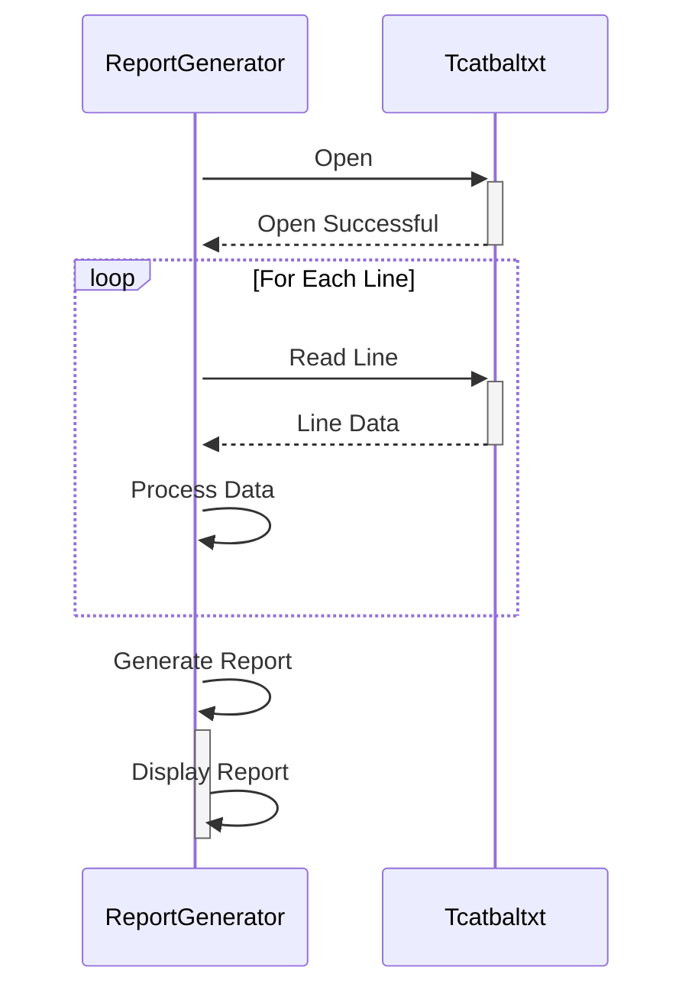

Generated at: 2nd October of 2024

**Title Document: Transaction Category Balance Report Generator**

**Summary Description:**
This program processes a transaction category balance file (`tcatbal.txt`) to generate a report that summarizes balances for various financial categories. 

**User Stories:**
As a data analyst, I need a way to quickly view the balance of each transaction category so I can use this information for financial reporting and analysis.

**Related Epic:**
10 - Data Files Management

**Technical Requirements:**

- **Read Transaction Category Balance File:** This function reads and parses the `tcatbal.txt` file, extracting information for each transaction category.
  - Input: Reads data from the `tcatbal.txt` file.
  - Processing: The file should be read line by line. Each line represents a transaction category and contains the following fields:
    - `categoryID`: A 10-digit integer representing the unique identifier for the transaction category.
    - `unknownField`: A 4-digit field with an unknown purpose (always contains "1000").
    - `balance`: A 10-digit integer representing the balance for the category.
    - `unknownData`: A 30-digit field with an unknown purpose (always contains "000000000000000000000000000000").
  - Output: A list or array of transaction category objects, each containing the extracted `categoryID` and `balance`.

- **Generate Balance Report:** This function takes the processed transaction category data and generates a formatted report.
  - Input: Receives the list of transaction category objects from the "Read Transaction Category Balance File" function.
  - Processing:  Iterates through the list of transaction category objects. For each category, it formats the `categoryID` and `balance` into a readable format (e.g., tabular, comma-separated).
  - Output: Outputs the formatted report, which can be displayed on the screen, written to a file, or sent to another system.

**Related Models**

- `TransactionCategory`: Represents a single transaction category with its balance.
  - `categoryID` `Integer`: Unique identifier for the transaction category.
  - `balance` `Integer`:  Current balance of the transaction category.

**Configurations:**

- `tcatbal.txt`
  - N/A
	- Description: The file path for `tcatbal.txt` might be hardcoded in the program or passed as a parameter. The file format is fixed-width, with each line representing a transaction category and its balance.

**Code Improvements:**

- **Error Handling:** Implement robust error handling to handle scenarios like file not found, invalid file format, or data type mismatches. This could include logging errors, displaying user-friendly messages, and providing options to retry or correct the input.
- **Data Validation:** Validate the extracted data to ensure data integrity. For example, check for negative balances, empty category IDs, or invalid characters in the data fields.
- **Configuration:** If the file path or format is subject to change, consider using a configuration file or environment variables to externalize these settings. This makes the application more flexible and easier to deploy in different environments.
- **Code Structure:** Refactor the code to follow modular design principles. Separate the file reading, data parsing, report generation, and error handling logic into independent functions or classes for better maintainability and testability.
- **Documentation:** Add clear and concise comments to explain the purpose of different code sections, functions, and variables. This improves code readability and makes it easier for others to understand and maintain the code.

**Security Improvements:**

- **File Access Control:** Implement appropriate file access control mechanisms to restrict unauthorized access to the `tcatbal.txt` file. This is crucial if the file contains sensitive financial information.
- **Input Sanitization:** Sanitize any user-provided input to prevent injection attacks. While this specific program doesn't seem to directly take user input, it's a good security practice to implement, especially if the program is integrated with other systems that might provide input.
- **Logging and Auditing:** Implement logging to record file access attempts, successful report generations, and any errors encountered. This can help track suspicious activities and ensure accountability.

**Conceptual Diagram:**

--Made by "Smart Engineering" (by Compass.UOL)--