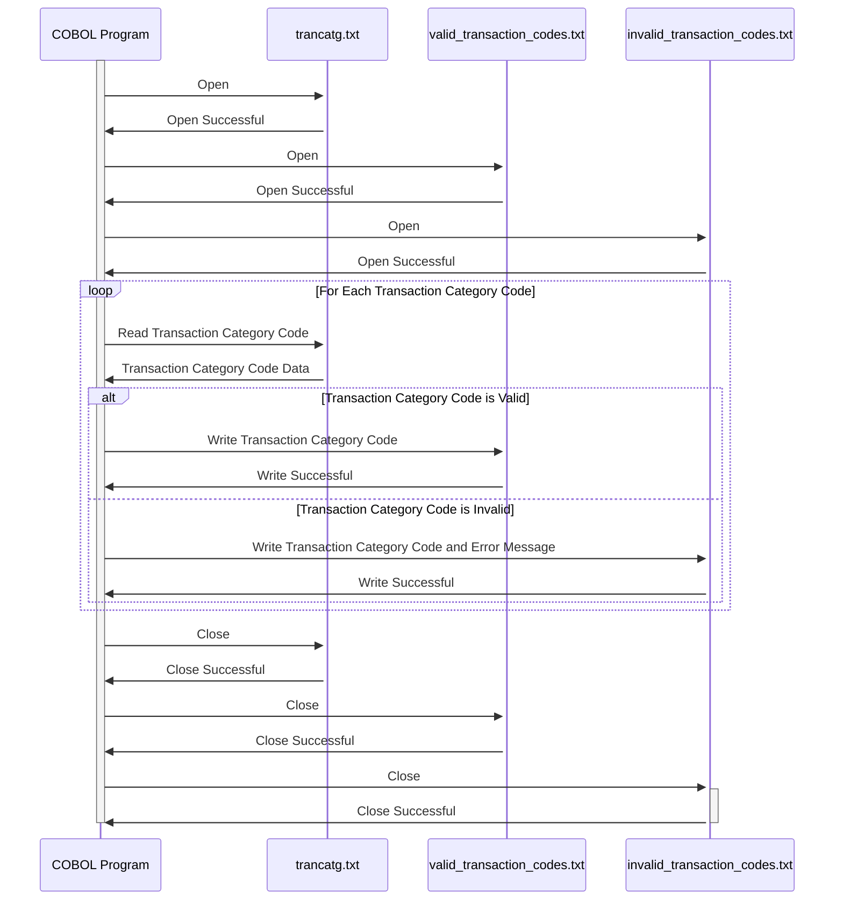

Generated at: 2nd October of 2024

**Title Document:** Credit Card Transaction Processing - Transaction Category Code Validation and Processing

**Summary Description:**
This document describes a program that validates and processes transaction category codes from the `trancatg.txt` file. The program ensures each code is correctly formatted and generates a report of valid and invalid codes.

**User Stories:**
As a data analyst, I need to ensure that only valid transaction category codes are used in the system so that I can generate accurate reports and analyze spending patterns effectively.

**Related Epic:** 4 - Transaction Processing

**Technical Requirements:**

- **Transaction Category Code Validation and Processing:** This process reads the `trancatg.txt` file and validates each transaction category code.
  - Input: Reads transaction category codes from the `trancatg.txt` file.
  - Validation: Validates if the transaction code is exactly 6 digits long and numeric.
  - Output Valid Codes: Writes valid transaction category codes and their descriptions to `valid_transaction_codes.txt`.
  - Output Invalid Codes:  Writes invalid transaction category codes and error messages to `invalid_transaction_codes.txt`.

**Related Models**
- TransactionCategory: Represents a transaction category code and its description.
  - Code `String`: The six-digit code for the transaction category.
  - Description `String`: A description of the transaction category.

**Configurations:**
- `trancatg.txt`
  - Structure: Each line in the file represents a transaction category, with the code and description separated by at least one space.
    - Example: `010001 Regular Sales Draft`
- Output Files
  - `valid_transaction_codes.txt`: Stores valid transaction codes and their descriptions.
  - `invalid_transaction_codes.txt`: Stores invalid transaction codes and corresponding error messages. 

**Code Improvements:**
- Implement a logging mechanism to record the program's execution details, including the start and end times, the number of records processed, and any errors encountered.
- Add error handling to gracefully handle situations like the input file being missing or inaccessible. 
- Create a configuration file to store the input and output file paths, making it easier to modify these settings without changing the program's code.

**Security Improvements:**
- Limit access to the `trancatg.txt` file and the output files to authorized personnel only.
- Implement a review process for any changes made to the `trancatg.txt` file to prevent unauthorized or accidental modifications. 

**Conceptual Diagram:**

--Made by "Smart Engineering" (by Compass.UOL)--