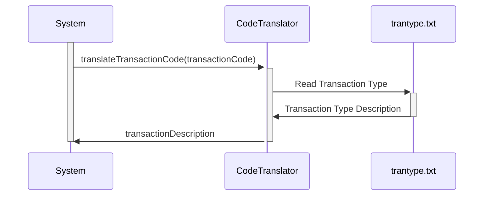

Generated at: 2nd October of 2024

**Title Document:** Transaction Type Code Translator

**Summary Description:**
This document outlines the functionality of a program designed to translate numerical transaction codes into user-friendly descriptions. This program aims to improve the clarity and transparency of transaction data for various users, including customers, analysts, and customer service representatives.

**User Stories:**
As a data analyst, I need a way to easily understand the meaning of transaction codes so that I can effectively analyze transaction data.

**Related Epic:** 4 - Transaction Processing

**Technical Requirements:**

- `translateTransactionCode`: This function receives a transaction code as input and returns its description.
  - Input: `transactionCode` `Integer`: The numerical code representing a specific transaction type.
  - Processing: Searches for the `transactionCode` within `trantype.txt` file.
  - Output:  `transactionDescription` `String`: The description associated with the provided code. If not found return `"Not Found"`.

**Related Models**
- Transaction: Represents a financial transaction.
  - Code `Integer`: The numerical code of the transaction type.
  - Description `String`: The user-friendly description of the transaction type.

**Configurations:**
- `trantype.txt`
  - `01`: `"Purchase"`
	- Description: Represents a purchase transaction.
  - `02`: `"Payment"`
	- Description: Represents a payment transaction.
  - `03`: `"Credit"`
	- Description: Represents a credit transaction.
  - `04`: `"Authorization"`
	- Description: Represents an authorization transaction.
  - `05`: `"Refund"`
	- Description: Represents a refund transaction.
  - `06`: `"Reversal"`
	- Description: Represents a reversal transaction.
  - `07`: `"Adjustment"`
	- Description: Represents an adjustment transaction.

**Code Improvements:**
- Implement a more robust lookup mechanism, such as using a hash table or a binary search algorithm, to improve performance, especially for larger code tables.
- Handle cases where the input code is not found in the table more gracefully. Instead of simply returning an empty string, consider returning an error message or a default description.
- Add logging or exception handling to record any errors encountered during the translation process. This can be helpful for debugging and monitoring the program's health.
- Consider using a database or a more structured data format to store the transaction code mappings, especially if the list of codes is large or subject to frequent updates. This can make it easier to manage and maintain the code table.

**Security Improvements:**
- Implement access control measures to restrict unauthorized access to the transaction code table or the translation program. This could involve using authentication and authorization mechanisms to verify user identities and permissions.
- If the transaction codes or descriptions are considered sensitive information, consider encrypting the data at rest and in transit. This can help protect the data from unauthorized access and disclosure.

**Conceptual Diagram:**

--Made by "Smart Engineering" (by Compass.UOL)--