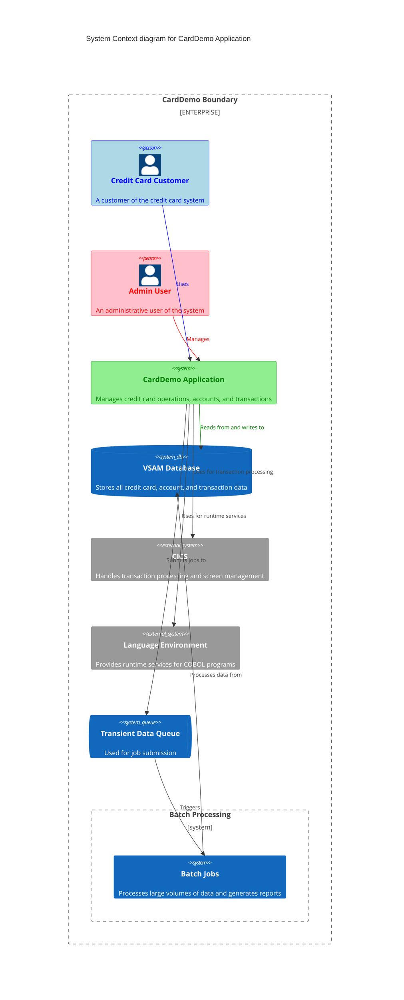

Generated at: 1st October of 2024

# CardDemo Application: A comprehensive credit card management system implemented in COBOL for mainframe environments.

# Summary:
The CardDemo application is a COBOL-based mainframe system designed for managing credit card operations. It provides functionalities for account management, transaction processing, user authentication, and reporting. The system utilizes CICS for transaction processing and VSAM for data storage. It features a modular design with separate components for different aspects of credit card management, including account viewing and updating, transaction listing and processing, user management, and report generation.

# Key Functionalities
1. User Authentication and Authorization
2. Account Management (View, Update)
3. Credit Card Operations (List, Add, Update)
4. Transaction Processing and Viewing
5. Report Generation
6. Admin Functions (User Management)

# Technology used:
- Programming Language: COBOL
- Transaction Processing: CICS (Customer Information Control System)
- Database: VSAM (Virtual Storage Access Method)
- Screen Handling: BMS (Basic Mapping Support)
- Job Submission: CICS Transient Data Queue (TDQ)
- Date Utilities: Language Environment (LE) services

# Diagram

--Made by "Smart Engineering" (by Compass.UOL)--