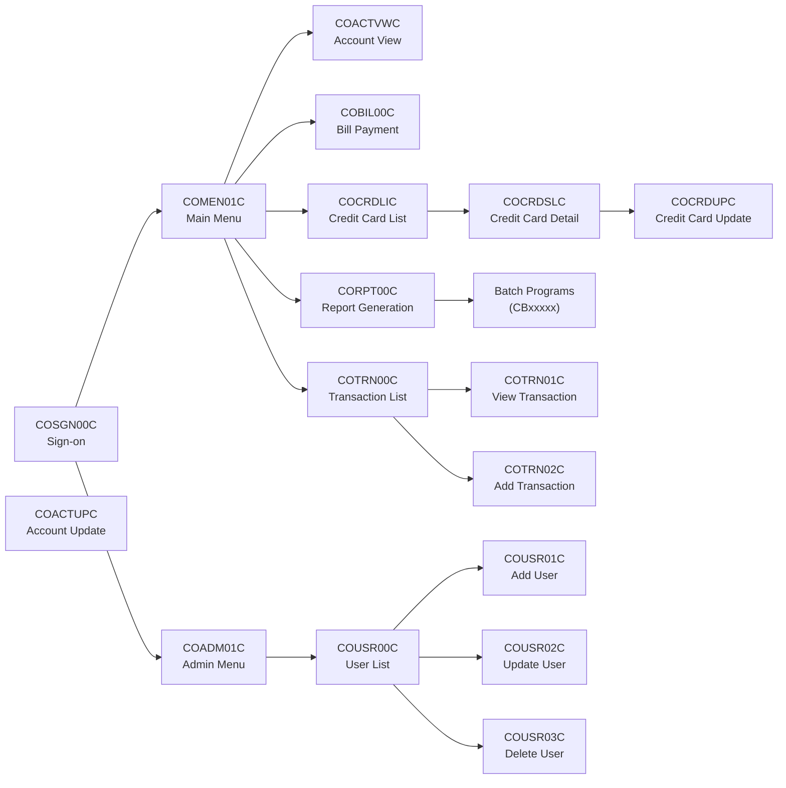

Generated at: 1st October of 2024

# Title: CardDemo: A CICS-based COBOL Application for Credit Card Management

# Summary:
The CardDemo application is a legacy system written in COBOL, designed to manage credit card transactions and related data. It operates within a CICS (Customer Information Control System) environment, typical of IBM mainframe systems. The application utilizes VSAM (Virtual Storage Access Method) files for persistent data storage and BMS (Basic Mapping Support) for screen interactions with users via 3270 terminals.

The system provides functionalities for account management, transaction processing, user authentication, and reporting. These functionalities are implemented through a series of interconnected COBOL programs, each responsible for specific tasks such as viewing account details, processing payments, adding new users, generating reports, and more.

# Description:
The CardDemo application is a monolithic system where different modules are tightly coupled. Changes in one module may have a cascading impact on other parts of the application. For example, modifications to the structure of a VSAM file would necessitate changes in all programs that read or write to that file. Similarly, changes to the common communication area (COMMAREA) would affect all programs that rely on it for data exchange.

# Diagram

--Made by "Smart Engineering" (by Compass.UOL)--