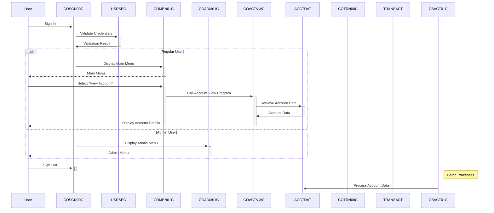

Generated at: 1st October of 2024

# Title: CardDemo: A COBOL-based Credit Card Management System

# Summary:
The CardDemo application is a legacy system implemented in COBOL, designed to manage various aspects of credit card operations. It leverages CICS for transaction processing and VSAM for data storage. The application features a menu-driven interface, allowing users to perform actions such as account inquiries, transaction viewing, credit card management, and user administration. Batch processes are employed for tasks like interest calculation and report generation.

# Workflow:
1. **User Authentication (COSGN00C):**  A user provides credentials (User ID and password). The system validates the credentials against the `USRSEC` file.
2. **Menu Display:** Based on the user's role (Regular or Admin), either the main menu (COMEN01C) or the admin menu (COADM01C) is displayed.
3. **User Selection:** The user chooses a menu option, which corresponds to a specific functionality (e.g., account view, transaction list, add user).
4. **Program Execution:** The selected menu option triggers the execution of a corresponding COBOL program (e.g., COACTVWC for account view, COTRN00C for transaction list).
5. **Data Access:** The program interacts with VSAM files (e.g., `ACCTDAT`, `CARDDAT`, `TRANSACT`) to retrieve or update data as needed.
6. **Screen Display:** The program presents results or prompts for input using CICS BMS maps, interacting with the user through a terminal-like interface.
7. **Batch Processing:** Separate batch programs (e.g., CBACT01C, CBTRN02C) handle bulk operations like interest calculation, transaction posting, and report generation.

# Diagram

--Made by "Smart Engineering" (by Compass.UOL)--