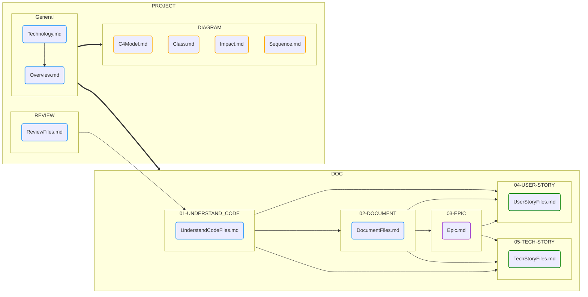

# **AI-Cockpit - Smart Engineering**

## Creation Workflow

 
 

## **Project Summary**

The Smart Engineering Tool is designed to generate a variety of documents that provide an extensive and holistic review of a project. This documentation is structured to give both technical and non-technical stakeholders a broad understanding of the project's architecture, dependencies, and workflows. Each output is organized into dedicated folders and files, offering different levels of insight, from high-level overviews to detailed technical diagrams.

### **Folder and File Structure**

- **REVIEW Folder**:  
  The `REVIEW` folder contains multiple documents, each offering a summary of different files within the project. The goal is to provide a bird's-eye view of the project structure, highlighting key components and their roles. These documents are useful for stakeholders who require a general understanding of the project's scope without diving into the detailed technicalities.

- **DIAGRAM Folder**:  
  The `DIAGRAM` folder includes four essential diagrams that visually represent key aspects of the project. These diagrams help to demystify complex processes and dependencies, offering insights that are easier to comprehend through visual representation:
  
    - **Sequence.md**:  
      This document explains the sequence of operations within the project workflow. It details the interaction between different components, services, or systems, demonstrating how data flows and processes execute step by step. This is particularly useful for understanding how various pieces of the project interact over time.

    - **Impact.md**:  
      The `Impact.md` document provides a deeper dive into project dependencies. It highlights the coupled elements within the system, showing how changes in one area could impact others. This is valuable for engineers and project managers who need to understand the ripple effects of modifications in the codebase.

    - **Class.md**:  
      This document contains a macro-level class diagram that outlines the overall structure of the project. While it does not show every class or component in the solution, it focuses on the most critical elements that define the project's architecture. This is useful for developers who need to understand the big-picture design before diving into individual modules.

    - **C4Model.md**:  
      The `C4Model.md` file provides a high-level overview of the system using the C4 model approach. It includes Context, Container, Component, and Code views to explain how the system interacts with external entities, its internal architecture, and how the system is broken down into smaller components. This is ideal for both technical and non-technical stakeholders who need an architectural overview.

- **Overview.md**:  
  The `Overview.md` document provides a comprehensive overview of the project as a whole. It summarizes the purpose, scope, and key elements of the project, serving as a high-level introduction. This document is often used by team members new to the project or by external stakeholders who require a general understanding without needing to dive into the technical specifics.

- **Technology.md**:  
  This document lists all the technologies utilized within the project, including programming languages, frameworks, databases, and external services. It offers a quick reference for developers and project managers to assess the technical stack and ensure alignment with organizational standards or requirements.

## **01-Understand_Code**

The "Understand Code" section provides detailed insights into the codebase, breaking down each file in the project. This section is particularly useful for developers who are onboarding or for teams conducting code reviews. Each file's purpose, key functionalities, and interactions with other parts of the system are outlined here. It serves as a guide for anyone looking to understand the role of specific files within the larger system.

The insights include:
- **Purpose of the file**: Explains why the file exists and what problem it solves.
- **Key functions or classes**: Highlights the most important code segments, such as core functions or classes that drive the file's functionality.
- **Dependencies**: Identifies other files, libraries, or services that this file relies on, providing a context for understanding its position within the project.

## **02-Document**

This section provides guidance on document structure, configuration settings, and the business rules that each file must adhere to. It is crucial for maintaining consistency across the project documentation, ensuring that every file follows the same standards. This support documentation also helps the team maintain clarity as the project evolves, making it easier to onboard new team members or ensure compliance with documentation policies.

The following aspects are covered:
- **Document structure**: Ensures that each document follows a uniform format, making the project documentation easier to navigate.
- **Configuration guidelines**: Provides details on how files should be configured, particularly if they contain dynamic or environment-specific information.
- **Business rules**: Clarifies the business logic and rules that govern each file's content, helping to align the documentation with the project’s objectives.

## **03-Epic**

This section lists all the macro-level stories in the project, often referred to as "epics." These epics represent large bodies of work that are central to the project's development and modernization. Each epic encompasses multiple user stories and technical tasks, providing a strategic view of the project's development progress. The documentation here serves as a roadmap for stakeholders to track major milestones in the project.

The `EPIC Overview` is particularly useful for:
- **Project managers**: To track the progress of key initiatives.
- **Stakeholders**: To understand the big-picture objectives and how they are being achieved.
- **Development teams**: To align their work with the larger goals of the project.

## **04-User Stories**

User Stories provide a detailed list of the functional requirements from the perspective of end users. This section breaks down the user stories by file, helping to map the functionality of the codebase to real-world user needs. In the future, these stories will be condensed and organized by business workflows, making it easier to see how various user needs are met across different parts of the project.

The `User Stories` section is vital for:
- **Product managers**: To ensure that the project is delivering value to users.
- **Developers**: To understand the reasoning behind specific features and how they should be implemented.
- **QA teams**: To create test cases based on real-world scenarios.

## **05-Tech Stories**

Similar to User Stories, Tech Stories provide a more technical perspective on the project. While User Stories focus on the "what" of the functionality, Tech Stories dive into the "how." These stories detail the technical requirements, configurations, and internal workings of the system, offering developers a clearer understanding of the tasks at hand.

The `Tech Stories` section covers:
- **Technical implementation details**: Provides specifics on how features should be technically implemented.
- **Configuration requirements**: Outlines any special configurations that need to be set up for the system to function correctly.
- **Dependencies and interactions**: Explains how different parts of the system interact on a technical level, providing a holistic view of the system architecture.

---

This expanded version of the README offers a more in-depth explanation of each section, providing greater context and clarity for both technical and non-technical users. It aims to guide the audience through the outputs of the Smart Engineering Tool in a structured and understandable way.

--Made by "Smart Engineering" (by Compass.UOL)--