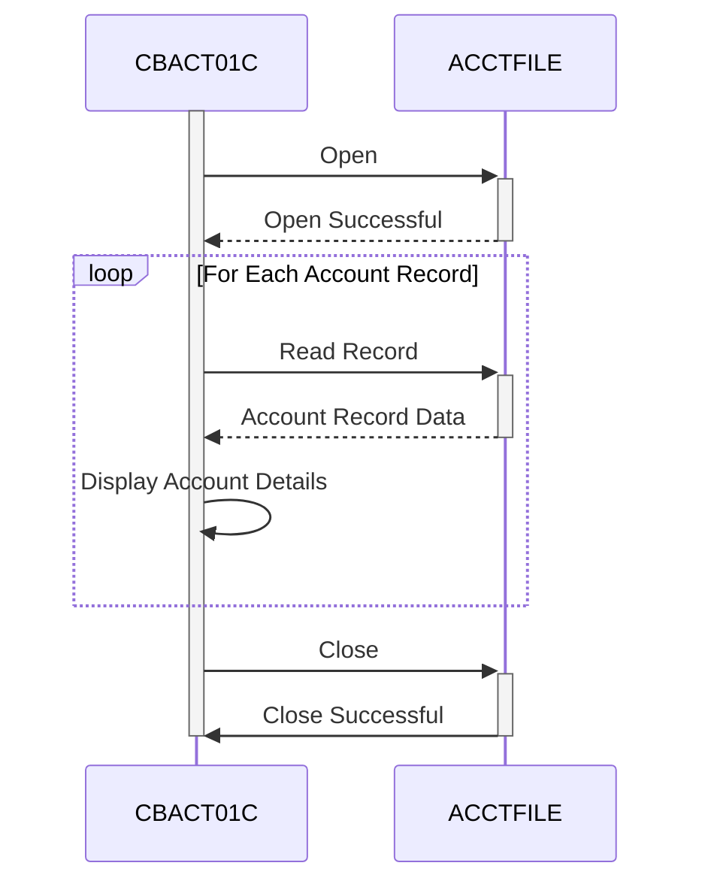

Gerado em: 1º de outubro de 2024

# **Título do Documento:** CardDemo Application - Especificação do Programa de Processamento em Lote de Dados de Conta

# **Descrição Resumida:**

O programa de Processamento em Lote de Dados de Conta CardDemo foi projetado para ler e exibir informações de contas de cartão de crédito de um arquivo seguro. Este programa processa sequencialmente cada registro de conta, apresentando um resumo de seus detalhes e garantindo a integridade dos dados durante todo o processo.

# **Histórias do Usuário:**

Como analista de dados, preciso ter certeza de que todas as informações da conta do cartão de crédito sejam processadas com precisão e estejam facilmente disponíveis para análise e geração de relatórios.

# **Épico Relacionado:**

7 - Processamento em Lote

# **Requisitos Funcionais:**

1. **Acesso e Manuseio de Arquivos:**
    - O programa deve ser capaz de localizar e abrir o arquivo de dados da conta designado (ACCTFILE).
    - Ele deve manipular o arquivo com segurança, abrindo-o apenas para entrada.
    - O programa deve ser capaz de lidar normalmente com cenários em que o arquivo não é encontrado ou está inacessível.

2. **Processamento Sequencial de Registros:**
    - O programa deve ler os registros da conta um após o outro na ordem em que estão armazenados no arquivo, garantindo que todos os registros sejam processados.
    - Após o processamento de um registro, ele deve buscar o próximo registro disponível até que o final do arquivo seja atingido.

3. **Extração e Exibição de Dados:**
    - Para cada registro de conta, o programa deve extrair os detalhes relevantes, incluindo:
        - ID da conta (ACCT-ID)
        - Status da conta (ACCT-ACTIVE-STATUS)
        - Saldo atual (ACCT-CURR-BAL)
        - Limite de crédito (ACCT-CREDIT-LIMIT)
        - Limite de crédito em dinheiro (ACCT-CASH-CREDIT-LIMIT)
        - Data de abertura da conta (ACCT-OPEN-DATE)
        - Data de expiração da conta (ACCT-EXPIRAION-DATE)
        - Data de reemissão da conta (ACCT-REISSUE-DATE)
        - Crédito do ciclo atual (ACCT-CURR-CYC-CREDIT)
        - Débito do ciclo atual (ACCT-CURR-CYC-DEBIT)
        - ID do grupo da conta (ACCT-GROUP-ID)
    - Os detalhes extraídos devem ser exibidos claramente na tela em um formato legível.

4. **Detecção de Fim de Arquivo:**
    - O programa deve reconhecer quando atingiu o final do arquivo de dados da conta.
    - Ao atingir o final do arquivo, ele deve interromper o processamento e prosseguir para fechar o arquivo.

5. **Tratamento e Relato de Erros:**
    - O programa deve incorporar mecanismos de tratamento de erros para gerenciar com elegância problemas potenciais:
        - Erros de abertura de arquivo: incapacidade de abrir o arquivo de dados da conta.
        - Erros de leitura de arquivo: problemas encontrados ao ler registros de contas.
    - Quando ocorre um erro, o programa deve:
        - Exibir claramente uma mensagem de erro indicando a natureza do problema.
        - Exibir o código de status do arquivo associado para diagnóstico técnico.
        - Terminar normalmente, evitando processamento adicional.

# **Requisitos Não Funcionais:**

1. **Desempenho:**
    - O programa deve processar os dados da conta com eficiência, especialmente para arquivos grandes, minimizando o tempo necessário para a conclusão.

2. **Confiabilidade:**
    - O programa deve operar de forma confiável, processando dados e tratando erros de forma consistente, sem término inesperado.

3. **Manutenibilidade:**
    - O código do programa deve ser bem estruturado, modular e documentado para facilitar a manutenção e os aprimoramentos futuros.

# **Critérios de Aceitação:**

1. **Processamento de Arquivo Bem-Sucedido:**
    - O programa deve abrir, ler e processar com sucesso todos os registros de contas no arquivo de entrada designado.
    - Ele deve exibir os detalhes da conta extraídos do arquivo corretamente.
2. **Tratamento Preciso de Fim de Arquivo:**
    - O programa deve detectar com precisão o final do arquivo de entrada e interromper o processamento de registros.
    - Ele deve fechar o arquivo de entrada normalmente após o processamento.
3. **Tratamento Robusto de Erros:**
    - O programa deve lidar normalmente com cenários em que o arquivo de entrada não é encontrado ou está inacessível, exibindo mensagens de erro apropriadas.
    - Ele deve gerenciar erros durante a leitura do arquivo, exibindo mensagens relevantes e terminando normalmente.

# **Melhorias de Código:**

1. **Tratamento de Erros Centralizado:** Implemente uma rotina centralizada de tratamento de erros para gerenciar e registrar erros de forma consistente em todo o programa.
2. **Flexibilidade de Saída:** Forneça opções para gravar os dados da conta processados em um arquivo de saída ou banco de dados para persistência e análises futuras.
3. **Otimização de Desempenho:** Para arquivos muito grandes, considere implementar otimizações como leituras em buffer ou processamento paralelo para melhorar o desempenho.

# **Melhorias de Segurança:**

1. **Controle de Acesso a Arquivos:** Implemente controles de acesso para restringir o acesso não autorizado ao arquivo de dados da conta.
2. **Criptografia de Dados:** Se o arquivo de dados da conta contiver informações confidenciais, considere criptografar os dados para protegê-los contra acesso não autorizado.
3. **Registro de Auditoria:** Implemente o registro de auditoria para rastrear o acesso a arquivos e atividades de processamento para fins de segurança e auditoria.

# **Diagrama Conceitual:**

--Made by "Smart Engineering" (by Compass.UOL)--