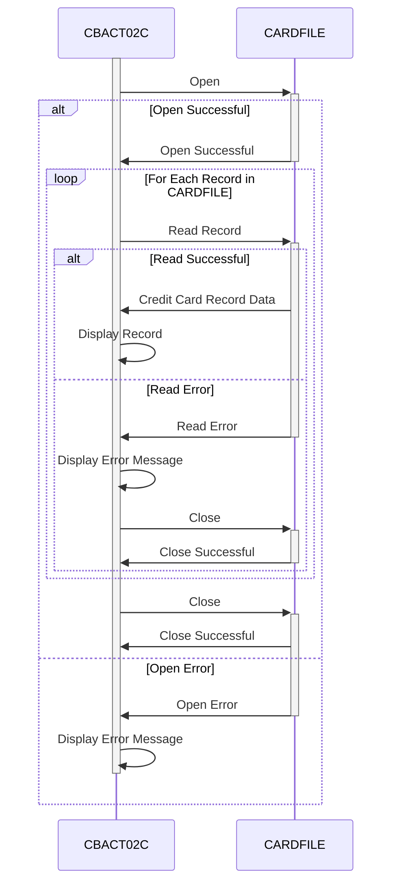

Gerado em: 1 de outubro de 2024

# **Título do Documento:** Aplicativo CardDemo - Especificação Detalhada do Processador de Lotes de Arquivos de Dados de Cartão

## **Descrição Resumida:**

Este documento fornece uma visão geral abrangente do programa CBACT02C dentro do aplicativo CardDemo. Este programa foi projetado para ler e exibir informações de cartão de crédito de um arquivo específico (CARDFILE). É como abrir uma planilha contendo detalhes do cartão de crédito e imprimir seu conteúdo.

## **Histórias do Usuário:**

Como analista de dados, preciso ter certeza de que todos os dados do cartão de crédito sejam processados ​​com precisão para que eu possa realizar análises e relatórios confiáveis.

## **Épico Relacionado:** 
7 - Processamento em Lote

## **Requisitos Funcionais:**

1. **Acesso a Arquivos:** O programa deve ser capaz de abrir e ler dados de um arquivo chamado "CARDFILE".
2. **Leitura Sequencial:** O programa deve ler os registros do cartão de crédito um após o outro na ordem em que estão armazenados no arquivo.
3. **Exibição de Dados:** O programa deve exibir o conteúdo de cada registro de cartão de crédito lido do arquivo. O método de saída específico (por exemplo, tela, impressora) não está definido no código fornecido.
4. **Tratamento de Erros:**
    - Se o programa não conseguir abrir o "CARDFILE", ele deverá exibir uma mensagem de erro indicando o problema e, em seguida, parar.
    - Se ocorrer um erro ao ler dados do "CARDFILE", o programa deverá exibir uma mensagem de erro e, em seguida, parar.
5. **Fechamento do Arquivo:** O programa deve fechar automaticamente o "CARDFILE" depois que todos os registros forem processados ​​ou se ocorrer um erro.

## **Requisitos Não Funcionais:**

- **Desempenho:** O programa deve processar os dados do cartão de crédito com eficiência, especialmente considerando os possíveis tamanhos grandes de arquivo. 
- **Confiabilidade:** O programa deve ler e exibir os dados do cartão de crédito de forma confiável, garantindo a integridade dos dados durante todo o processo.
- **Manutenibilidade:** O código do programa deve ser bem estruturado e documentado para facilitar a manutenção e atualizações futuras.

## **Critérios de Aceitação:**

- O programa abre e lê dados do "CARDFILE" com sucesso.
- O programa exibe o conteúdo de cada registro de cartão de crédito com precisão.
- O programa lida com erros de arquivo normalmente, exibindo mensagens de erro apropriadas e fechando o arquivo corretamente.
- O programa segue os padrões de codificação para legibilidade e manutenção.

## **Melhorias de Código:**

- **Registro Detalhado de Erros:** Implemente um mecanismo de tratamento de erros mais robusto que registre detalhes específicos do erro (por exemplo, códigos de erro, timestamps) em um arquivo separado. Isso ajudará na depuração e resolução de problemas.
- **Flexibilidade de Saída:** Modifique o programa para permitir que o usuário especifique o destino de saída (por exemplo, tela, impressora, arquivo) para os dados do cartão de crédito.
- **Modularidade de Código:** Divida o programa em módulos menores e reutilizáveis ​​(por exemplo, tratamento de arquivos, exibição de dados) para melhorar a organização e legibilidade do código.

## **Melhorias de Segurança:**

- **Controle de Acesso a Arquivos:** Implemente mecanismos de controle de acesso para restringir o acesso não autorizado ao "CARDFILE". Isso pode envolver o uso de permissões de arquivo ou outras medidas de segurança fornecidas pelo sistema operacional ou software de segurança.
- **Criptografia de Dados:** Se o "CARDFILE" contiver informações confidenciais do cartão de crédito, considere criptografar os dados em repouso para protegê-los de acesso não autorizado.

## **Diagrama Conceitual:**

--Made by "Smart Engineering" (by Compass.UOL)--