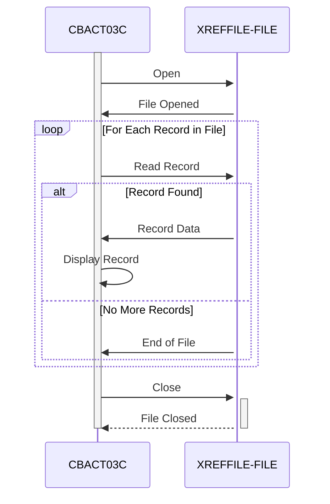

Gerado em: 1º de outubro de 2024

# **Título do Documento:** Processador de Arquivo de Dados de Referência Cruzada de Conta de Cartão

# **Descrição Resumida:**
O Processador de Arquivo de Dados de Referência Cruzada de Conta de Cartão é um programa que lê e exibe o conteúdo de um arquivo contendo informações de contas de cartão de crédito com referência cruzada. Este processo é executado em segundo plano sem exigir interação do usuário.

# **Histórias do Usuário:**
Como analista de dados, preciso garantir que apenas registros válidos sejam usados para análise, portanto, preciso de um programa que possa ler e validar registros de clientes de um arquivo.

# **Épico Relacionado:**
7 - Processamento em Lote

# **Requisitos Funcionais:**
* O programa deve ser capaz de abrir e ler um arquivo contendo informações de contas de cartão de crédito com referência cruzada.
* O programa deve ser capaz de ler e processar cada registro no arquivo sequencialmente.
* Para cada registro, o programa deve exibir as seguintes informações:
    * Número do cartão de crédito
    * Dados adicionais de referência cruzada
* O programa deve ser capaz de lidar com condições de fim de arquivo normalmente.
* O programa deve ser capaz de lidar com erros de arquivo, como a incapacidade de abrir o arquivo.

# **Requisitos Não Funcionais:**
* **Desempenho:** O programa deve ser capaz de processar arquivos grandes com eficiência.
* **Confiabilidade:** O programa deve ser robusto e capaz de lidar com erros inesperados.
* **Manutenibilidade:** O código deve ser bem estruturado, documentado e fácil de entender para manutenção futura.

# **Critérios de Aceitação:**
* O programa abre e lê o arquivo de dados de referência cruzada com sucesso.
* O programa lê e exibe corretamente as informações de cada registro no arquivo.
* O programa lida com as condições de fim de arquivo normalmente e termina com sucesso.
* O programa lida com erros de arquivo adequadamente e exibe mensagens de erro descritivas.

# **Melhorias de Código:**
* Implementar um mecanismo de registro em log para registrar detalhes de execução do programa, erros e avisos. Isso ajudará na depuração e monitoramento.
* Considere adicionar um recurso para gravar os dados processados em um arquivo de saída, fornecendo flexibilidade em como os dados podem ser usados.
* Refatore a lógica de tratamento de erros para fornecer mensagens de erro mais específicas com base nos códigos de status do arquivo.
* Adicione comentários ao código para explicar o propósito de cada seção e melhorar a legibilidade.

# **Melhorias de Segurança:**
* Implementar controles de acesso para restringir o acesso não autorizado ao programa e ao arquivo de dados de referência cruzada.
* Se os dados no arquivo forem confidenciais, considere implementar criptografia em repouso para protegê-los de acesso não autorizado.
* Manter um registro de auditoria das execuções do programa, incluindo o usuário que executou o programa e o horário de execução.

# **Diagrama Conceitual:**

--Made by "Smart Engineering" (by Compass.UOL)--