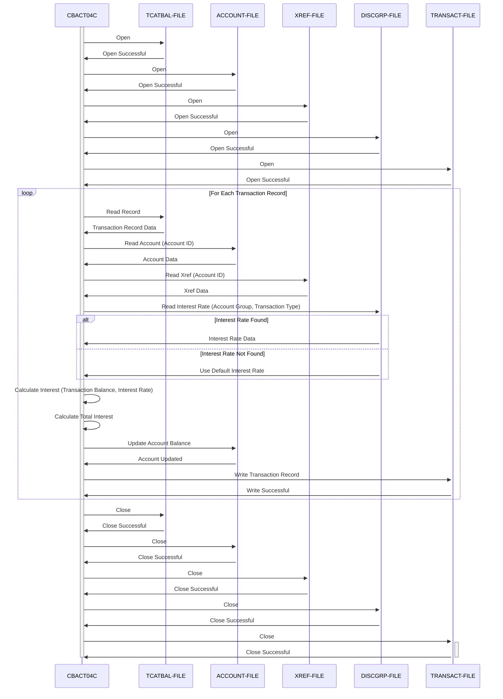

Gerado em: 1º de outubro de 2024

**Título do Documento:** CardDemo - Programa de Processamento em Lote para Cálculo de Juros

**Descrição Resumida:** Este programa calcula e aplica juros mensais às contas de cartão de crédito dos clientes com base no histórico de transações e taxas de juros predefinidas. Os juros calculados são então atualizados no saldo da conta e um registro da transação é gerado.

**Histórias do Usuário:**
Como analista de dados financeiros, preciso garantir que as contas dos clientes sejam cobradas com os juros corretos a cada mês, para que possamos manter registros financeiros precisos.

**Epic Relacionado:** 7 - Processamento em Lote

**Requisitos Funcionais:**
1. **Ler Dados da Transação:** Ler e processar os detalhes da transação de cada cliente do Arquivo de Saldo da Categoria da Transação (`TCATBAL-FILE`).
2. **Recuperar Informações da Conta:** Para cada transação, buscar as informações da conta do cliente correspondente no Arquivo Mestre da Conta (`ACCOUNT-FILE`) usando o ID da Conta.
3. **Determinar a Taxa de Juros:** Identificar a taxa de juros aplicável com base no grupo da conta do cliente e na categoria da transação no Arquivo do Grupo de Divulgação (`DISCGRP-FILE`).
    * **Regra de Negócio:** Se a taxa de juros de um grupo de divulgação específico não for encontrada, o sistema deverá usar a taxa de juros padrão associada ao código de grupo 'DEFAULT'.
4. **Calcular Juros:** Calcular os juros mensais para cada categoria de transação:
    * **Regra de Negócio:** Divida o produto do saldo da categoria da transação pela taxa de juros anual correspondente por 1200 (representando 12 meses).
5. **Atualizar Saldo da Conta:** Atualizar o saldo da conta do cliente no Arquivo Mestre da Conta (`ACCOUNT-FILE`) adicionando o total de juros calculado.
6. **Gerar Registro de Transação:** Criar um registro de transação para cada aplicação de juros, detalhando o ID da transação, valor, data e hora e detalhes relevantes. Gravar este registro no Arquivo de Transações (`TRANSACT-FILE`).
7. **Fechar Arquivos:** Fechar adequadamente todos os arquivos de entrada e saída (`TCATBAL-FILE`, `ACCOUNT-FILE`, `DISCGRP-FILE`, `TRANSACT-FILE`) para garantir a integridade dos dados.

**Requisitos Não Funcionais:**
* **Desempenho:** O programa deve processar grandes volumes de dados de transações de forma eficiente dentro de um prazo razoável.
* **Confiabilidade:** O programa deve operar de forma confiável sem erros, garantindo cálculos precisos de juros e atualizações nos saldos das contas.
* **Manutenibilidade:** O código do programa deve ser bem estruturado, documentado e fácil de entender para futuras manutenções e aprimoramentos.
* **Segurança:**
    * O programa deve ser executado em um ambiente seguro com controles de acesso adequados para evitar o acesso não autorizado a dados financeiros confidenciais.
    * Todas as operações de arquivo (leitura, gravação, atualização) devem ser registradas para fins de auditoria.

**Critérios de Aceitação:**
* O programa lê e processa com sucesso todos os registros de transações do cliente do arquivo de entrada.
* O cálculo de juros para cada transação está correto, aderindo às regras de negócio definidas.
* Os saldos das contas do cliente no Arquivo Mestre da Conta são atualizados corretamente com os juros calculados.
* Um registro de transação para cada aplicação de juros é gerado e gravado no Arquivo de Transações.
* O programa lida com erros de arquivo normalmente, registrando quaisquer problemas encontrados durante o processamento.
* A execução do programa é concluída dentro de um prazo aceitável.

**Melhorias de Código:**
* **Tratamento de Erros:** Implementar um mecanismo de tratamento de erros centralizado e consistente para gerenciar exceções normalmente, registrar erros e potencialmente permitir recuperação ou notificação.
* **Log:** Aprimorar o registro para capturar informações mais detalhadas sobre a execução do programa, incluindo o número de registros processados, taxas de juros aplicadas e quaisquer erros encontrados. Isso ajudará na depuração e monitoramento do desempenho do programa.
* **Modularidade:** Dividir o programa em módulos ou sub-rotinas menores e mais gerenciáveis para melhorar a legibilidade do código, a capacidade de manutenção e a potencial reutilização do código.
* **Parametrização:** Permitir que parâmetros de configuração sejam passados para o programa, como caminhos de arquivo, taxas de juros ou outras variáveis, para aumentar a flexibilidade e reduzir a necessidade de alterações no código.

**Melhorias de Segurança:**
* **Controle de Acesso:** Garantir que apenas pessoal ou sistemas autorizados tenham acesso para executar o programa em lote e acessar os arquivos de dados confidenciais.
* **Criptografia de Dados:** Considerar a criptografia de dados em repouso (nos arquivos de dados) e em trânsito (durante o processamento de arquivos) para proteger contra acesso não autorizado.
* **Trilhas de Auditoria:** Implementar trilhas de auditoria abrangentes para rastrear todos os acessos a arquivos, modificações de dados e execuções de programas para fins de segurança e conformidade.

**Diagrama Conceitual:**

--Made by "Smart Engineering" (by Compass.UOL)--