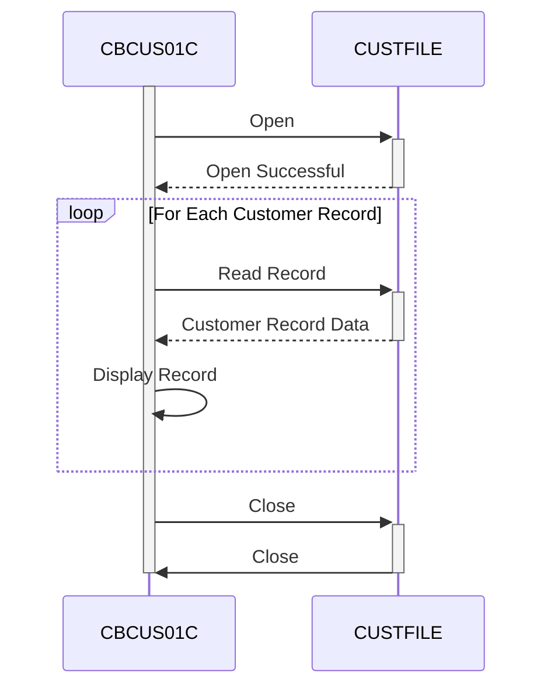

Gerado em: 1 de outubro de 2024

# **CardDemo Customer Data Extract**

## **Descrição Resumida:**

Este programa em lote lê dados de clientes de um arquivo chamado `CUSTFILE` e exibe as informações na tela. É como folhear um arquivo, abrindo a pasta de cada cliente e mostrando as informações para o usuário.

## **Histórias de Usuário:**

Como analista de dados, preciso visualizar os dados do cliente para analisá-los e gerar relatórios.

## **Épico Relacionado:**

8 - Gestão de Dados do Cliente

## **Requisitos Funcionais:**

1.  **Abrir Arquivo de Dados do Cliente:** O programa deve abrir o arquivo `CUSTFILE`.
2.  **Ler Registros do Cliente:** O programa deve ler os registros do cliente sequencialmente do arquivo `CUSTFILE`.
3.  **Exibir Dados do Cliente:** O programa deve exibir o conteúdo de cada registro do cliente na tela.
4.  **Tratar Fim de Arquivo:** O programa deve tratar o final do arquivo `CUSTFILE` normalmente.
5.  **Fechar Arquivo de Dados do Cliente:** O programa deve fechar o arquivo `CUSTFILE`.
6.  **Tratamento de Erros:** O programa deve incluir tratamento de erros para operações de arquivo, como:
    *   Erros de abertura de arquivo
    *   Erros de leitura de arquivo
    *   Erros de fechamento de arquivo.

## **Requisitos Não Funcionais:**

1.  **Desempenho:** O programa deve processar os dados do cliente com eficiência.
2.  **Confiabilidade:** O programa deve ser confiável e tratar erros normalmente.
3.  **Manutenibilidade:** O programa deve ser bem documentado e fácil de entender para manutenção futura.
4.  **Segurança:** O acesso ao `CUSTFILE` e a exibição de dados confidenciais do cliente devem ser restritos e auditados para manter a segurança e a privacidade dos dados.

## **Critérios de Aceitação:**

1.  O programa abre o arquivo `CUSTFILE` com sucesso.
2.  O programa lê e exibe todos os registros de clientes do arquivo.
3.  O programa trata o final do arquivo normalmente.
4.  O programa fecha o arquivo `CUSTFILE`.
5.  O programa trata erros de operação de arquivo e exibe mensagens apropriadas.

## **Melhorias de Código:**

1.  **Melhorar Tratamento de Erros:** Implemente um tratamento de erros mais específico para diferentes erros de operação de arquivo. Isso pode envolver a verificação de códigos de status de arquivo específicos e a exibição de mensagens de erro mais informativas para o usuário.
2.  **Aprimorar Documentação:** Adicione mais comentários ao código para explicar o propósito de diferentes seções e funções. Isso tornará o código mais fácil de entender para manutenção futura.
3.  **Considerar Log:** Implemente um mecanismo de log para registrar detalhes de execução do programa, incluindo quaisquer erros encontrados. Isso pode ser útil para depurar e monitorar o comportamento do programa.

## **Melhorias de Segurança:**

1.  **Permissões de Arquivo:** Certifique-se de que o `CUSTFILE` tenha permissões de arquivo apropriadas para restringir o acesso não autorizado.
2.  **Criptografia de Dados:** Considere criptografar os dados confidenciais do cliente dentro do `CUSTFILE` para protegê-los de acesso não autorizado.
3.  **Auditoria:** Implemente um rastro de auditoria para rastrear quem acessa e modifica o `CUSTFILE`.

## **Diagrama Conceitual:**

--Made by "Smart Engineering" (by Compass.UOL)--