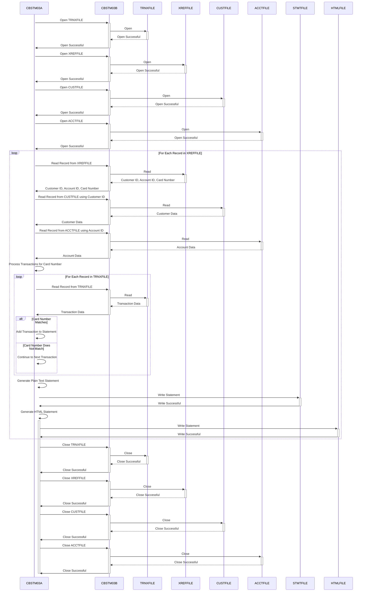

--CONTENT TO TRANSLATE--
Gerado em: 1 de outubro de 2024

# **Título do Documento:** Gerador de Extrato de Conta CardDemo - Especificação do Programa

# **Descrição Resumida:**
O programa Gerador de Extrato de Conta CardDemo (CBSTM03A.CBL) é um processo em lote que gera extratos de conta para portadores de cartão de crédito. O programa lê dados do cliente, conta e transação de vários arquivos de entrada, realiza cálculos e gera extratos em formato de texto simples e HTML.

# **Histórias do Usuário:**
Como analista de dados, preciso garantir que apenas registros válidos sejam usados na análise financeira, portanto, preciso de um programa que possa ler e validar dados de várias fontes e gerar extratos de conta precisos.

# **Épico Relacionado:**
4 - Processamento de Transações

# **Requisitos Funcionais:**
* O programa deve ler os dados do cliente do `CUSTFILE`.
* O programa deve ler os dados da conta do `ACCTFILE`.
* O programa deve ler os dados da transação do `TRNXFILE`.
* O programa deve validar se os dados da transação estão corretamente associados aos dados do cliente e da conta.
* O programa deve calcular as despesas totais de cada conta com base nos dados da transação.
* O programa deve gerar extratos de conta em formato de texto simples, aderindo a um layout predefinido.
* O programa deve gerar extratos de conta em formato HTML, adequados para visualização online.
* O programa deve lidar com operações de E/S de arquivo, incluindo abertura, leitura, gravação e fechamento de arquivos.
* O programa deve implementar mecanismos de tratamento de erros para gerenciar problemas como dados inválidos ou erros de arquivo.

**Regras de Negócio:**
* **Integridade de Dados:** O programa garante que os dados de diferentes fontes (`CUSTFILE`, `ACCTFILE`, `TRNXFILE`) sejam combinados e apresentados com precisão. Por exemplo, ele garante que as transações estejam vinculadas à conta e ao cliente corretos.
* **Clareza e Transparência:** A declaração gerada foi projetada para ser fácil de entender, fornecendo uma visão geral clara de toda a atividade da conta. 
* **Flexibilidade:** Ao produzir versões em texto simples e HTML, o programa atende a diferentes preferências e métodos de entrega.

# **Requisitos Não Funcionais:**
* **Desempenho:** O programa deve processar grandes volumes de transações com eficiência dentro de um prazo razoável.
* **Confiabilidade:** O programa deve operar de forma confiável, produzindo resultados precisos e consistentes.
* **Manutenção:** O código do programa deve ser bem estruturado, documentado e fácil de entender e manter.
* **Segurança:** O programa deve lidar com dados financeiros confidenciais com segurança, incorporando controles de acesso e criptografia de dados conforme necessário.

# **Critérios de Aceitação:**
* O programa lê e processa com sucesso os dados do cliente, conta e transação dos arquivos de entrada.
* O programa valida corretamente a integridade dos dados, garantindo que as transações estejam vinculadas aos clientes e contas corretos.
* O programa calcula com precisão as despesas totais de cada conta com base no histórico de transações.
* O programa gera instruções de texto simples e HTML que aderem aos layouts especificados.
* O programa lida com erros normalmente, registrando problemas e saindo normalmente sem corrupção de dados.

# **Melhorias de Código:**
* **Tratamento de Erros:** Aprimore o tratamento de erros fornecendo mensagens de erro mais específicas e implementando um mecanismo centralizado de registro de erros.
* **Documentação:** Melhore a legibilidade e manutenção do código adicionando mais comentários em linha explicando a lógica complexa e as estruturas de dados.
* **Otimização de Desempenho:** Investigue gargalos de desempenho, potencialmente usando técnicas de classificação ou indexação para grandes conjuntos de dados.

# **Melhorias de Segurança:**
* **Permissões de Arquivo:** Implemente permissões de arquivo rígidas para restringir o acesso a arquivos de dados confidenciais.
* **Criptografia de Dados:** Considere criptografar dados confidenciais em repouso e em trânsito para proteger as informações do cliente.
* **Auditoria:** Implemente um trilha de auditoria para rastrear a execução do programa, acesso a dados e quaisquer modificações feitas em dados confidenciais.

# **Diagrama Conceitual:**

--Made by "Smart Engineering" (by Compass.UOL)--