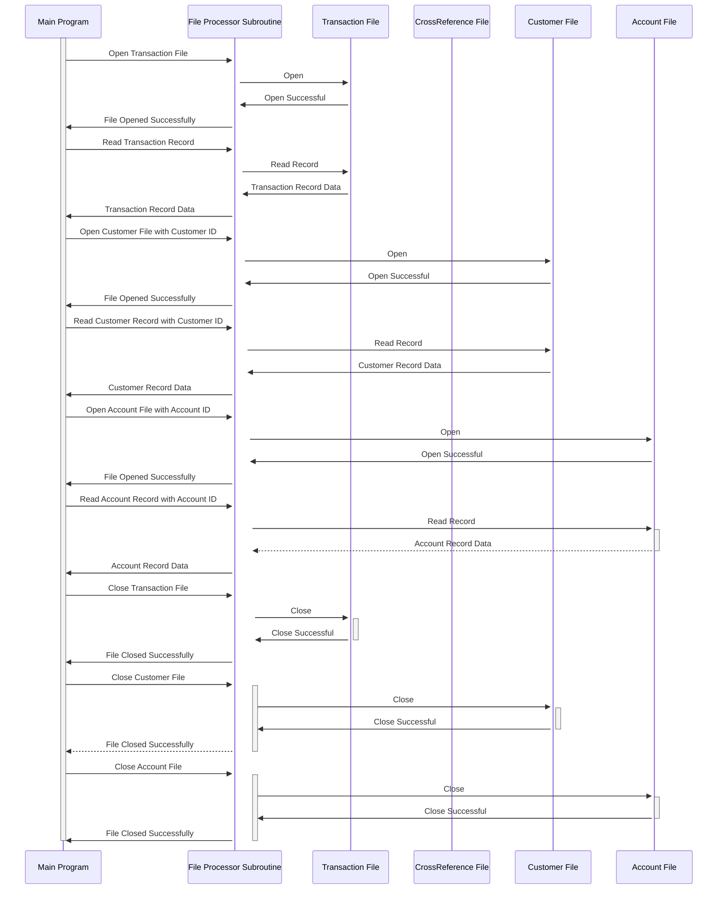

Gerado em: 1º de outubro de 2024

# **Título do Documento:** Sub-rotina de Processamento de Arquivo de Transação de Cartão - Especificação Técnica

# **Descrição Resumida:**
Esta sub-rotina é uma parte crítica de um programa COBOL maior que gerencia transações de cartão de crédito. Ela age como um bibliotecário de dados, buscando informações de diferentes arquivos mediante solicitação. 

Imagine que você tenha arquivos separados para:

1. **Transações:** Detalhes de cada compra com cartão de crédito.
2. **Referências Cruzadas:** Vinculando cartões de crédito às suas respectivas contas.
3. **Clientes:** Informações pessoais sobre cada titular do cartão.
4. **Contas:** Especificidades como limite de crédito e saldo para cada conta.

Esta sub-rotina abre o arquivo correto, recupera as informações necessárias com base nos identificadores fornecidos (como número da conta) e as entrega de volta ao programa principal. Ela garante um processamento de dados preciso e eficiente para operações de cartão de crédito.

# **Histórias do Usuário:**
Como um sistema de processamento em lote, preciso acessar e processar dados de clientes, contas e transações de arquivos separados para garantir a operação suave e precisa das tarefas de gerenciamento de cartão de crédito.

# **Epic Relacionado:**
4 - Processamento de Transações

# **Requisitos Funcionais:**
* **Acesso a Arquivos:** Abrir, ler e fechar conexões com os arquivos de Transação, Referência Cruzada, Cliente e Conta.
* **Tratamento de Solicitações:**  Receber e interpretar solicitações do programa principal, incluindo:
    * **Arquivo de Destino:** Com qual arquivo interagir.
    * **Ação:**  Abrir, ler, fechar ou ler com uma chave específica (por exemplo, encontrar cliente por ID).
    * **Chave:** Quando aplicável, o identificador para localizar registros específicos dentro de um arquivo.
* **Recuperação de Dados:**  Recuperar dados do arquivo e registro especificado, com base na chave fornecida.
* **Tratamento de Erros:**  Detectar e relatar quaisquer erros encontrados durante as operações do arquivo, como arquivo não encontrado, chave inválida ou problemas de permissão.

**Regras de Negócio:**
* **Processamento Sequencial (Arquivo de Transação):** As transações são processadas uma a uma na ordem em que aparecem no arquivo.
* **Acesso Baseado em Chave (Arquivos de Cliente e Conta):**  Os registros são recuperados usando identificadores exclusivos (ID do cliente, ID da conta).
* **Relato de Erros:**  Códigos de erro padronizados são usados para comunicar problemas de volta ao programa principal.

# **Requisitos Não Funcionais:**
* **Desempenho:** A sub-rotina deve concluir as operações de arquivo de forma rápida e eficiente, minimizando o impacto no tempo geral de processamento em lote.
* **Confiabilidade:**  Garantir a recuperação e o tratamento precisos dos dados, evitando a corrupção ou perda de dados.
* **Manutenibilidade:**  O código deve ser bem estruturado, documentado e fácil de entender para futuras modificações.

# **Critérios de Aceite:**
* A sub-rotina abre, lê e fecha com sucesso todos os arquivos de dados especificados.
* A recuperação de dados usando as chaves fornecidas é precisa e consistente.
* Os erros durante as operações do arquivo são capturados e relatados com os códigos de erro apropriados.
* O desempenho da sub-rotina não afeta significativamente o tempo geral de processamento em lote.

# **Melhorias no Código:**
* **Tratamento de Erros Centralizado:**  Crie uma rotina comum de tratamento de erros para evitar código redundante e garantir o relato de erros consistente.
* **Registro Detalhado:**  Implemente o registro para todas as operações e erros do arquivo para ajudar na depuração e no monitoramento do sistema.
* **Validação de Parâmetro:** Adicione verificações para garantir que os parâmetros de entrada (arquivo de destino, ação, chave) sejam válidos antes de prosseguir com as operações do arquivo.

# **Melhorias na Segurança:**
* **Controle de Acesso a Arquivos:** Implemente permissões de arquivo apropriadas para restringir o acesso não autorizado a dados confidenciais.
* **Criptografia de Dados:**  Considere criptografar dados confidenciais dentro dos arquivos para proteção contra divulgação não autorizada.
* **Trilha de Auditoria:** Registre todas as tentativas de acesso a arquivos, incluindo ID do usuário e carimbos de hora, para fins de auditoria de segurança.

# **Diagrama Conceitual:**

--Made by "Smart Engineering" (by Compass.UOL)--