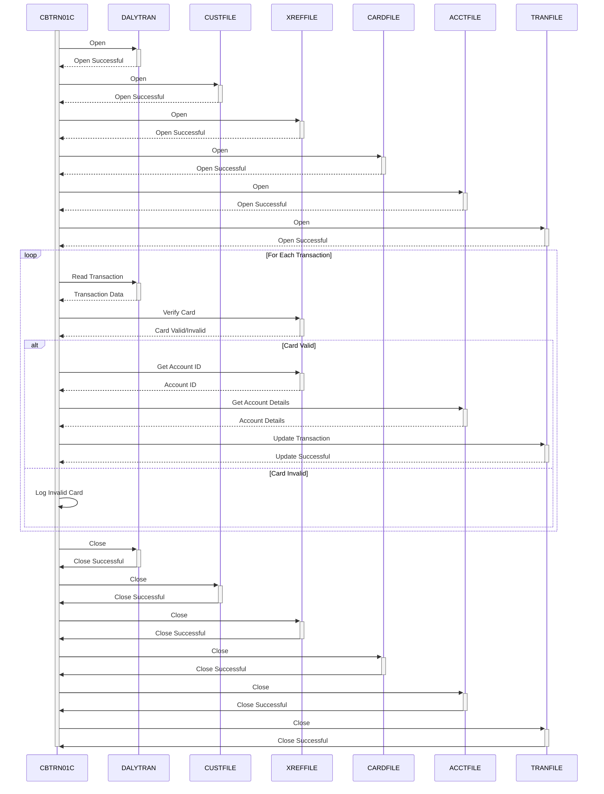

Gerado em: 1 de outubro de 2024

# **Título do Documento:** CardDemo - Processamento Diário de Transações - Especificação do Programa

# **Descrição Resumida:**
Este programa processa transações diárias de cartão de crédito. Ele verifica se cada transação é válida e atualiza as contas dos clientes de acordo. É como um sistema que garante automaticamente que toda a atividade do cartão de crédito do dia esteja correta e que os saldos dos clientes estejam atualizados.

# **Histórias do Usuário:**
Como analista de dados, preciso garantir que todas as transações de cartão de crédito sejam processadas com precisão para que eu possa usar esses dados para análise e geração de relatórios.

# **Épico Relacionado:**
4 - Processamento de Transações

# **Requisitos Funcionais:**

1. **Manipulação de Arquivos:**
    - O programa deve abrir e ler registros do arquivo de transações diárias (`DALYTRAN`).
    - Deve abrir e ler registros do arquivo do cliente (`CUSTFILE`) com base no ID do cliente.
    - Deve abrir e ler registros do arquivo de referência cruzada da conta do cartão (`XREFFILE`) com base no número do cartão.
    - Deve abrir e ler registros do arquivo do cartão (`CARDFILE`) com base no número do cartão.
    - Deve abrir e ler registros do arquivo da conta (`ACCTFILE`) com base no ID da conta.
    - Deve abrir e gravar registros no arquivo de transações (`TRANFILE`).
    - Finalmente, o programa deve fechar todos os arquivos abertos.

2. **Verificação do Cartão:**
    - Para cada transação, o programa deve verificar se o número do cartão é válido comparando-o com o `XREFFILE`.
    - **Regra de Negócio:** Somente transações feitas com cartões válidos e ativos devem ser processadas.

3. **Recuperação de Conta:**
    - Após a verificação bem-sucedida do cartão, o programa deve recuperar o ID da conta correspondente do `XREFFILE`.
    - **Regra de Negócio:**  Cada cartão válido deve estar vinculado a uma conta para garantir que as transações sejam atribuídas corretamente.

4. **Processamento de Transações:**
    - O programa deve se preparar para atualizar os registros de transações com base nos dados processados.
    - **Regra de Negócio:**  Todas as transações processadas, bem-sucedidas ou não, devem ser registradas para fins de auditoria e reconciliação.

# **Requisitos Não Funcionais:**

1. **Desempenho:** O programa deve processar transações de forma eficiente, especialmente considerando o alto volume de transações diárias.
2. **Confiabilidade:** O programa deve ser robusto e capaz de lidar com erros inesperados normalmente, sem interromper o processamento de outras transações.
3. **Manutenibilidade:** O código deve ser bem estruturado, documentado e fácil de entender para futuras manutenções e aprimoramentos.
4. **Segurança:** O acesso ao programa, arquivos de dados e informações confidenciais deve ser restrito apenas ao pessoal autorizado. Números de cartão e outros dados confidenciais devem ser criptografados.

# **Critérios de Aceitação:**

- O programa deve abrir e ler dados com sucesso de todos os arquivos de entrada necessários (`DALYTRAN`, `CUSTFILE`, `XREFFILE`, `CARDFILE`, `ACCTFILE`).
- Deve verificar com precisão a validade dos números dos cartões usados ​​nas transações.
- O programa deve recuperar os IDs de conta corretos associados aos números de cartão válidos.
- Deve gravar com sucesso os registros de transações processados ​​no arquivo de transações (`TRANFILE`).
- O programa deve lidar com erros de arquivo e erros de validação de dados normalmente, registrando-os adequadamente para investigação.
- Todas as transações devem ser processadas completamente, sem quaisquer atualizações parciais ou corrupção de dados.

# **Melhorias de Código:**

- Implementar um mecanismo centralizado de tratamento de erros para gerenciar diferentes cenários de erro normalmente.
- Adicionar registro detalhado para melhor depuração e auditoria, incluindo carimbos de data/hora, códigos de erro e dados relevantes.
- Considere o uso de um sistema de gerenciamento de banco de dados (DBMS) em vez de arquivos simples para melhorar a integridade, segurança e recursos de consulta de dados.
- Explorar técnicas de otimização de desempenho, como indexação e otimização de consulta, para processamento mais rápido.

# **Melhorias de Segurança:**

- Implementar mecanismos de controle de acesso para restringir a execução do programa e o acesso a dados apenas a usuários autorizados.
- Criptografar dados confidenciais, como números de cartão e informações do cliente, tanto em trânsito quanto em repouso.
- Implementar trilhas de auditoria para rastrear todo acesso a dados e modificações para segurança e conformidade.

# **Diagrama Conceitual:**

--Made by "Smart Engineering" (by Compass.UOL)--