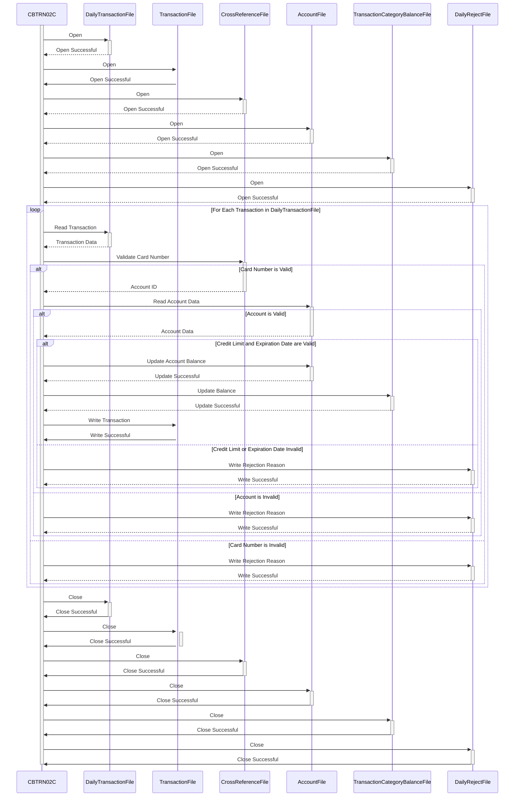

Gerado em: 1º de outubro de 2024

# **CardDemo - Especificação do Processador de Transações Diárias**

## **Descrição Resumida:**
O Processador de Transações Diárias CardDemo é um programa em lote que processa transações diárias de cartão de crédito. Ele valida cada transação em relação às informações do cliente e da conta, atualiza saldos de contas e categoriza transações. As transações rejeitadas são registradas para investigação posterior.

## **Histórias do Usuário:**
Como analista de dados, preciso ter certeza de que apenas transações de cartão de crédito válidas sejam usadas para análise e geração de relatórios.

## **Épico Relacionado:**
4 - Processamento de Transações

## **Requisitos Funcionais:**
- **Ler transações diárias:** O programa lê um arquivo sequencial contendo transações diárias de cartão de crédito.
- **Validar transações:**
    - **Validação do Número do Cartão:** Cada número de cartão de crédito é verificado em relação a um arquivo de referência cruzada para garantir que seja válido e esteja associado a uma conta ativa.
    - **Validação da Conta:** O programa verifica se existe uma conta correspondente para o número do cartão de crédito fornecido.
    - **Verificação de Limite de Crédito:** O sistema garante que uma transação não exceda o limite de crédito disponível da conta.
    - **Verificação de Validade do Cartão:** As transações são verificadas para garantir que o cartão de crédito usado não esteja com a data de validade expirada.
- **Atualizar saldos de contas:**
    - **Saldo da Conta:** Para transações válidas, o saldo da conta do cliente é ajustado. Pagamentos aumentam o saldo, enquanto compras o diminuem.
    - **Saldo da Categoria de Transação:** O programa mantém totais para diferentes categorias de transação (por exemplo, supermercado, combustível) para análise de negócios.
- **Registrar transações:** Cada transação processada, juntamente com um registro de data e hora, é registrada em um arquivo de histórico de transações.
- **Lidar com transações rejeitadas:** As transações rejeitadas são gravadas em um arquivo separado com o motivo da rejeição, criando uma trilha de auditoria para investigação.

## **Requisitos Não Funcionais:**
- **Desempenho:** O programa deve processar um grande volume de transações de forma eficiente dentro de um prazo razoável.
- **Confiabilidade:** O programa deve ser confiável e garantir a integridade dos dados. Todas as transações válidas devem ser processadas com precisão e todas as transações rejeitadas devem ser registradas.
- **Manutenibilidade:** O código deve ser bem documentado e estruturado para facilitar a manutenção e as atualizações.
- **Tratamento de Erros:** O programa deve incluir um tratamento de erros robusto para lidar com situações inesperadas normalmente, registrar erros e fornecer mensagens informativas.

## **Critérios de Aceitação:**
- O programa abre e lê com sucesso todos os arquivos de entrada necessários (transações diárias, referência cruzada, contas).
- Todas as transações são processadas de acordo com as regras de negócios definidas.
- Os saldos das contas e os saldos das categorias de transação são atualizados com precisão.
- Todas as transações processadas são gravadas corretamente no arquivo de histórico de transações.
- Todas as transações rejeitadas, juntamente com o motivo da rejeição, são registradas no arquivo de rejeições.
- O programa lida com erros normalmente, registra mensagens de erro e sai com um código de retorno apropriado.

## **Melhorias de Código:**
- Implementar um mecanismo de tratamento de erros mais centralizado e padronizado para gerenciar diferentes cenários de erro de forma consistente.
- Adicionar registro em log mais detalhado para melhor auditoria e solução de problemas.
- Explorar técnicas de otimização de desempenho, como o uso de estruturas de dados apropriadas ou a otimização de E/S de arquivo, para lidar com grandes volumes de transações com eficiência.

## **Melhorias de Segurança:**
- Implementar controles de acesso para restringir o acesso não autorizado a arquivos de dados confidenciais (por exemplo, informações da conta, números de cartão de crédito).
- Criptografar dados confidenciais em repouso e em trânsito para protegê-los de acesso não autorizado.
- Registrar todas as ações executadas pelo programa, incluindo IDs de usuário e registros de data e hora, para fins de auditoria.

## **Diagrama Conceitual:**

--Made by "Smart Engineering" (by Compass.UOL)--