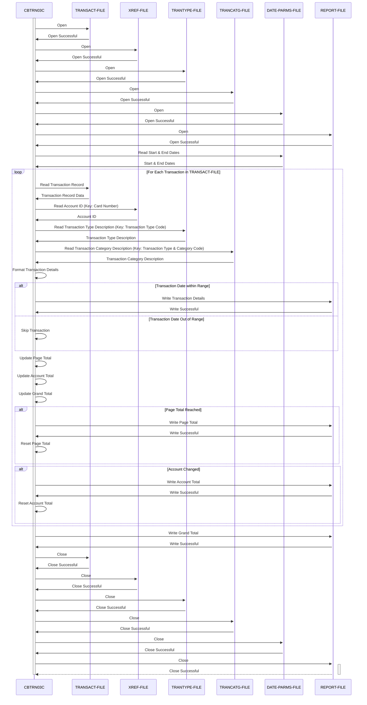

Gerado em: 1º de outubro de 2024

**Título do Documento:** Especificação do Programa de Relatório Detalhado de Transações de Cartão de Crédito CardDemo

**Descrição Resumida:** O programa de Relatório Detalhado de Transações de Cartão de Crédito CardDemo gera um relatório detalhado das transações de cartão de crédito para um intervalo de datas especificado. Ele lê dados de transações de um arquivo sequencial, recupera informações adicionais de arquivos indexados com base em números de cartão e tipos de transação e, em seguida, organiza essas informações em um relatório formatado. O relatório inclui detalhes de transações individuais, totais de página, totais de conta e um total geral de todas as transações dentro do período especificado.

**Histórias de Usuário:** Como analista de dados, preciso de um programa que possa processar dados de transações de cartão de crédito e gerar um relatório detalhado para que eu possa analisar padrões de transações, identificar tendências e reconciliar registros financeiros.

**Épico Relacionado:** 4 - Processamento de Transações

**Requisitos Funcionais:**

1.  **Ler Dados de Transações:** O programa deve ler registros de transações de cartão de crédito de um arquivo sequencial (TRANSACT-FILE). Cada registro contém informações como ID da transação, número do cartão, código do tipo de transação, código da categoria da transação, valor da transação e data e hora de processamento da transação.

2.  **Recuperar Informações da Conta:** Para cada transação, o programa deve recuperar o ID da conta correspondente de um arquivo indexado (XREF-FILE) usando o número do cartão como chave.

3.  **Recuperar Descrição do Tipo de Transação:** O programa deve recuperar a descrição para cada código de tipo de transação de um arquivo indexado (TRANTYPE-FILE) usando o código do tipo de transação como chave.

4.  **Recuperar Descrição da Categoria da Transação:** O programa deve recuperar a descrição para cada categoria de transação de um arquivo indexado (TRANCATG-FILE) usando uma combinação de código de tipo de transação e código de categoria como chave.

5.  **Filtrar Transações por Data:** O programa deve filtrar transações com base em uma data de início e término especificada, processando apenas as transações dentro desse intervalo de datas.

6.  **Calcular Totais:** O programa deve calcular e armazenar:
    *   Totais de página, acumulando os valores das transações para cada página do relatório.
    *   Totais de conta, acumulando os valores das transações para cada ID de conta exclusivo encontrado.
    *   Um total geral, acumulando os valores das transações para todas as transações processadas.

7.  **Gerar Relatório Formatado:** O programa deve gravar um relatório formatado em um arquivo de saída (REPORT-FILE). O relatório deve incluir:
    *   Cabeçalhos de relatório com o título do relatório, data de início e término.
    *   Cabeçalhos de página para cada nova página.
    *   Detalhes da transação, incluindo ID da transação, ID da conta, descrição do tipo de transação, descrição da categoria da transação e valor da transação.
    *   Totais de página após cada conjunto de transações.
    *   Totais de conta sempre que houver uma mudança no ID da conta sendo processada.
    *   Um total geral no final do relatório.

8.  **Manipular Erros de Arquivo:** O programa deve lidar com erros relacionados a arquivos de forma adequada, exibindo mensagens de erro apropriadas e encerrando normalmente em caso de problemas como:
    *   Incapacidade de abrir arquivos de entrada ou saída.
    *   Status de arquivo inválido encontrado durante operações de arquivo.

**Requisitos Não Funcionais:**

1.  **Desempenho:** O programa deve processar transações e gerar o relatório em tempo hábil, mesmo para grandes conjuntos de dados de transações. Considere otimizar as leituras de arquivo e operações de manipulação de dados para melhorar o desempenho.

2.  **Confiabilidade:** O programa deve ser confiável e produzir resultados precisos de forma consistente. Implemente tratamento de erros robusto e verificações de validação de dados para garantir a integridade dos dados.

3.  **Manutenibilidade:** O programa deve ser escrito de forma modular e bem documentada, tornando-o fácil de entender, modificar e manter.

**Critérios de Aceitação:**

1.  O programa lê com sucesso os dados da transação do TRANSACT-FILE.
2.  O programa recupera corretamente os IDs de conta do XREF-FILE com base nos números dos cartões.
3.  O programa recupera com precisão as descrições do tipo e categoria da transação dos respectivos arquivos.
4.  O programa filtra as transações com precisão de acordo com as datas de início e término especificadas.
5.  O programa calcula e exibe totais de página, totais de conta e um total geral precisos.
6.  O relatório gerado é formatado corretamente e inclui todas as informações necessárias.
7.  O programa lida com erros relacionados a arquivos de forma adequada e fornece mensagens de erro informativas.

**Melhorias de Código:**

1.  **Tratamento de Erros:** Implemente um tratamento de erros mais específico, avaliando diferentes códigos de status de arquivo e exibindo mensagens mais informativas para o usuário.
2.  **Modularidade:** Divida o programa em parágrafos menores e mais gerenciáveis ​​para melhor organização e legibilidade do código. Por exemplo, separe a lógica de gravação do relatório em um parágrafo distinto.
3.  **Validação de Dados:** Incorpore verificações de validação de dados nos dados da transação para garantir sua integridade. Por exemplo:
    *   Verifique se os valores das transações são numéricos.
    *   Verifique os tipos e categorias de transações em relação aos códigos válidos.

**Melhorias de Segurança:**

1.  **Controle de Acesso:** Implemente mecanismos de controle de acesso para restringir a execução do programa e acesso a arquivos de dados confidenciais apenas ao pessoal autorizado.
2.  **Criptografia de Dados:** Criptografe os arquivos de dados de transações para proteger informações financeiras confidenciais contra acesso não autorizado.
3.  **Registro de Auditoria:** Implemente o registro de auditoria para rastrear a execução do programa, incluindo o usuário que executou o programa, a data e hora da execução e quaisquer erros encontrados.

**Diagrama Conceitual:**

--Made by "Smart Engineering" (by Compass.UOL)--