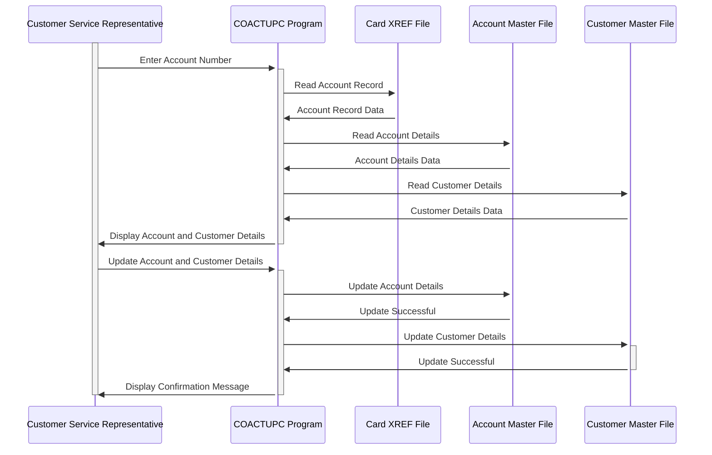

Gerado em: 1º de outubro de 2024

**Título do Documento:** Especificação do Programa de Atualização de Conta CardDemo

**Descrição Resumida:** O Programa de Atualização de Conta CardDemo é um programa COBOL projetado para permitir que usuários autorizados visualizem e atualizem informações de contas de clientes. O programa recupera dados do cliente de arquivos VSAM com base no número da conta fornecido, exibe as informações, permite modificações e, em seguida, atualiza os arquivos com os dados alterados. Ele inclui validação de dados para garantir a integridade dos dados e controle de simultaneidade para evitar a corrupção de dados de atualizações simultâneas.

**Histórias do Usuário:** Como representante de atendimento ao cliente, preciso visualizar e atualizar as informações da conta do cliente com precisão e eficiência para que eu possa fornecer suporte e atendimento ao cliente excelentes.

**Epic Relacionado:** 2 - Gestão de Contas

**Requisitos Funcionais:**

- O programa deve permitir que usuários autorizados visualizem informações da conta do cliente, incluindo status da conta, limites de crédito, saldos, data de abertura, data de expiração, data de reemissão e ID do grupo da conta.
- O programa deve permitir que usuários autorizados atualizem as informações da conta do cliente.
- O programa deve recuperar informações do cliente de arquivos VSAM (ACCTDAT, CUSTDAT, CARDDAT, CARDAIX, CXACAIX) com base no número da conta fornecido.
- O programa deve validar a entrada do usuário para garantir a integridade dos dados.
  - Os números das contas devem ser numéricos, com 11 dígitos e diferentes de zero.
  - O status da conta deve ser 'Y' ou 'N'.
  - Limite de crédito, limite de crédito em dinheiro, saldo atual, crédito do ciclo atual e débito do ciclo atual devem ser valores numéricos válidos e assinados.
  - As datas (data de abertura, data de expiração, data de reemissão, data de nascimento) devem estar no formato AAAA-MM-DD e devem ser datas válidas.
  - O SSN deve estar no formato XXX-XX-XXXX e deve ser um SSN válido.
  - A pontuação FICO deve estar entre 300 e 850.
  - Os nomes devem conter apenas caracteres alfabéticos e espaços.
  - Os campos de endereço devem ser alfanuméricos.
  - Os números de telefone devem estar no formato (XXX) XXX-XXXX e devem ser números de telefone dos EUA válidos.
  - O código do estado deve ser um código de estado dos EUA válido.
  - O código postal deve ser numérico e deve ser um código postal dos EUA válido.
  - O programa deve realizar uma validação cruzada de campo para garantir que o código postal inserido seja válido para o estado selecionado.
- O programa deve lidar com atualizações simultâneas para evitar inconsistências de dados. Antes de atualizar o registro, o programa verifica se o registro foi modificado por outro usuário desde a última leitura. Se forem detectadas alterações, a atualização será rejeitada e o usuário será informado.
- O programa deve fornecer mensagens informativas ao usuário, incluindo prompts para entrada, mensagens de confirmação, mensagens de erro e mensagens de sucesso.
- O programa deve ser capaz de navegar de volta ao menu principal ou ao programa de chamada.

**Requisitos não funcionais:**

- **Desempenho:** O programa deve recuperar e atualizar as informações do cliente rapidamente, mesmo para grandes conjuntos de dados. Os tempos de resposta devem ser mínimos para garantir a interação eficiente do usuário.
- **Confiabilidade:** O programa deve ser confiável e lidar com erros inesperados normalmente. A integridade dos dados deve ser mantida em todos os momentos, e o programa não deve travar ou corromper dados.
- **Manutenibilidade:** O programa deve ser bem estruturado e documentado para facilitar a manutenção e os aprimoramentos futuros. O código deve ser modular e fácil de entender.
- **Segurança:** O programa deve ser acessível apenas a usuários autorizados com credenciais apropriadas. Dados confidenciais, como SSN do cliente e informações financeiras, devem ser tratados com segurança.

**Critérios de aceitação:**

- O programa recupera e exibe corretamente as informações da conta do cliente com base no número da conta fornecido.
- O programa permite que usuários autorizados modifiquem as informações da conta do cliente e salva as alterações corretamente.
- O programa valida com sucesso a entrada do usuário de acordo com as regras definidas e exibe mensagens de erro apropriadas para entrada inválida.
- O programa lida com atualizações simultâneas de forma eficaz, evitando inconsistências de dados.
- O programa fornece mensagens claras e informativas ao usuário durante todo o processo.
- O programa se integra perfeitamente ao aplicativo CardDemo.

**Configurações e Constantes:**

| Constante/Parâmetro | Valor Padrão | Descrição |
|---|---|---|
| LIT-THISPGM | 'COACTUPC' | ID do Programa |
| LIT-THISTRANID | 'CAUP' | ID da Transação |
| LIT-THISMAPSET | 'COACTUP ' | Nome do conjunto de mapas |
| LIT-THISMAP | 'CACTUPA' | Nome do mapa |
| LIT-ACCTFILENAME | 'ACCTDAT ' | Nome do arquivo mestre da conta |
| LIT-CUSTFILENAME | 'CUSTDAT ' | Nome do arquivo mestre do cliente |
| LIT-CARDFILENAME | 'CARDDAT ' | Nome do arquivo de dados do cartão |
| LIT-CARDFILENAME-ACCT-PATH | 'CARDAIX ' | Índice alternativo para CARDDAT com base no ID da conta |
| LIT-CARDXREFNAME-ACCT-PATH | 'CXACAIX ' | Índice alternativo para um arquivo de referência cruzada de cartão com base no ID da conta |
| FICO-RANGE-IS-VALID | 300 THROUGH 850 | Intervalo válido para pontuação FICO |

**Melhorias de Código:**

- **Tratamento de Erros:** Implemente um mecanismo de tratamento de erros mais abrangente. Em vez de simplesmente definir sinalizadores de erro, o programa deve registrar mensagens de erro detalhadas, incluindo a condição de erro específica e os valores de dados relevantes. Isso tornará a solução de problemas e a depuração mais fáceis.
- **Modularidade:** Divida o programa em módulos ou sub-rotinas menores e mais gerenciáveis. Isso melhorará a legibilidade e a manutenção do código. Por exemplo, separe a lógica de validação de dados em uma sub-rotina dedicada.
- **Acesso a Dados:** Otimize as operações de acesso a dados. Considere o uso de métodos de acesso indexado para recuperação mais rápida de registros. 
- **Comentários:** Adicione comentários mais detalhados ao código para explicar a lógica e o propósito de cada seção. Isso tornará o código mais fácil de entender para futuros desenvolvedores.

**Melhorias de Segurança:**

- **Autenticação e Autorização:** Implemente mecanismos robustos de autenticação e autorização para garantir que apenas usuários autorizados possam acessar o programa e realizar atualizações. Considere o uso de controle de acesso baseado em função para restringir o acesso a funcionalidades específicas com base nas funções do usuário.
- **Criptografia de Dados:** Criptografe dados confidenciais, como SSN do cliente e informações financeiras, tanto em armazenamento (arquivos VSAM) quanto durante a transmissão. Isso protegerá a privacidade do cliente e evitará o acesso não autorizado a dados confidenciais.
- **Trilha de Auditoria:** Implemente uma trilha de auditoria para registrar todas as ações do usuário, incluindo visualização de dados, modificações e tentativas de acesso a dados restritos. Isso fornecerá responsabilidade e ajudará a rastrear atividades não autorizadas.

**Diagrama Conceitual:**

--Made by "Smart Engineering" (by Compass.UOL)--