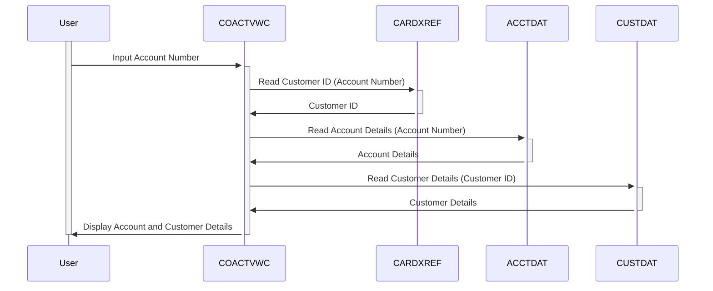

Gerado em: 1º de outubro de 2024

# **Título do Documento:** Especificação do Programa de Visualização de Conta de Cartão de Crédito

# **Descrição Resumida:**
Este programa, chamado "Visualização de Conta", faz parte de um Sistema de Gerenciamento de Cartão de Crédito maior. Seu objetivo é fornecer uma maneira de visualizar informações detalhadas sobre uma conta de cartão de crédito específica. Isso é particularmente útil para representantes de atendimento ao cliente que precisam acessar rapidamente os detalhes da conta para auxiliar os clientes.

# **Histórias do Usuário:**
Como representante de atendimento ao cliente, preciso visualizar os detalhes completos da conta de cartão de crédito de um cliente para que eu possa responder às suas perguntas com precisão e eficiência.

# **Épico Relacionado:** 
2 - Gestão de Contas

# **Requisitos Funcionais:**
1. **Entrada do Número da Conta:** O sistema deve permitir que o usuário insira o número da conta do cartão de crédito.
2. **Recuperação de Dados da Conta:** O sistema deve recuperar as seguintes informações com base no número da conta fornecido:
    - **De CARDXREF (Arquivo de Referência Cruzada da Conta):** ID do Cliente associado à conta.
    - **De CUSTDAT (Arquivo de Dados do Cliente):** Detalhes do cliente, como nome, endereço, informações de contato, etc.
    - **De ACCTDAT (Arquivo de Dados da Conta):** Detalhes específicos da conta, como saldo atual, limite de crédito, status da conta, etc.
3. **Exibição de Dados:** O sistema deve exibir as informações recuperadas em um formato claro e organizado na tela.
4. **Validação de Entrada:** O sistema deve validar o número da conta inserido para garantir que seja um formato válido e exista no sistema.
5. **Tratamento de Erros:** O sistema deve lidar com números de conta inválidos normalmente e exibir mensagens de erro adequadas ao usuário.
6. **Navegação:** O sistema deve fornecer opções para o usuário navegar para funcionalidades relacionadas, como visualizar o histórico de transações ou atualizar as informações da conta.

# **Requisitos Não Funcionais:**
1. **Desempenho:** O sistema deve recuperar e exibir informações da conta com tempo de resposta mínimo.
2. **Usabilidade:** A interface do usuário deve ser intuitiva e fácil de usar, permitindo a entrada e revisão eficientes de dados.
3. **Segurança:** O acesso à funcionalidade "Visualização de Conta" e às informações confidenciais da conta deve ser restrito apenas ao pessoal autorizado.

# **Critérios de Aceitação:**
1. O sistema recupera e exibe com sucesso todas as informações relevantes da conta quando um número de conta válido é fornecido.
2. O sistema exibe mensagens de erro adequadas para números de conta inválidos ou inexistentes.
3. A interface do usuário é fácil de navegar e fornece instruções claras para uso.
4. O sistema atende aos requisitos de desempenho definidos para tempo de resposta.
5. As medidas de controle de acesso estão em vigor para restringir o acesso apenas a usuários autorizados.

# **Melhorias de Código:**
1. **Tratamento de Erros Centralizado:** Implemente uma rotina de tratamento de erros centralizada para melhorar a manutenção do código e a consistência nos relatórios de erros.
2. **Modularidade do Código:** Divida o programa em módulos menores e mais gerenciáveis ​​para melhorar a legibilidade e a manutenção.
3. **Nomes de Variáveis ​​Significativos:** Use nomes de variáveis ​​descritivos para melhorar a legibilidade e o entendimento do código.
4. **Comentários e Documentação:** Adicione comentários claros e concisos para explicar a lógica complexa e documentar a funcionalidade do programa.

# **Melhorias de Segurança:**
1. **Autenticação e Autorização:** Implemente mecanismos robustos de autenticação para verificar as identidades dos usuários e autorizar o acesso com base em funções e privilégios.
2. **Criptografia de Dados:** Criptografe dados confidenciais, como números de contas e informações do cliente, tanto em trânsito quanto em repouso, para proteger contra acesso não autorizado.
3. **Registro de Auditoria:** Implemente o registro de auditoria para rastrear ações do usuário e eventos do sistema para auditoria de segurança e fins de conformidade.

# **Diagrama Conceitual:**

--Made by "Smart Engineering" (by Compass.UOL)--