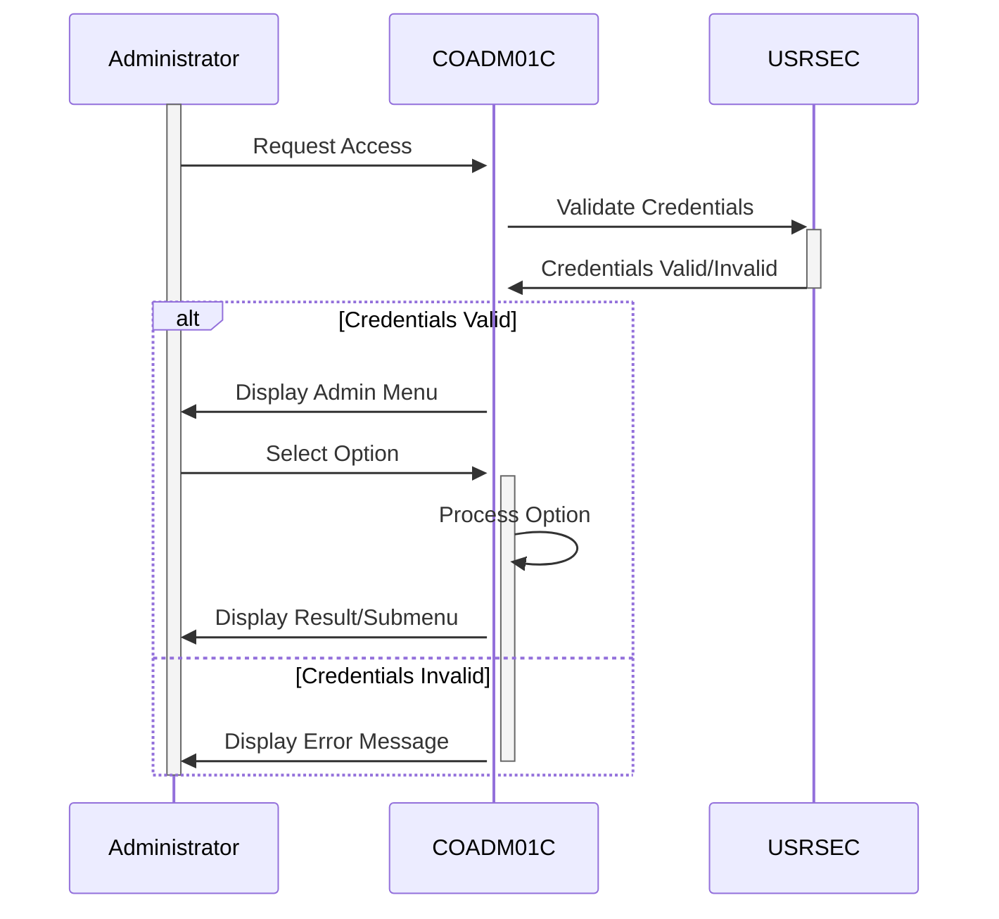

Gerado em: 1 de outubro de 2024

# **Título do Documento:** Aplicativo CardDemo - Especificação do Menu Administrativo

# **Descrição Resumida:** 
Este documento descreve o design e a funcionalidade do Menu Administrativo dentro do aplicativo CardDemo, um sistema baseado em COBOL para gerenciamento de cartões de crédito. Este menu fornece aos usuários autorizados (administradores) um hub central para acessar e executar várias tarefas administrativas relacionadas ao aplicativo.

# **Histórias do Usuário:**

Como administrador, preciso de acesso a um menu dedicado para gerenciar as funções do sistema, para que eu possa executar tarefas como gerenciamento de usuários e geração de relatórios sem navegar pela interface regular do usuário.

# **Epic Relacionado:** 6 - Gerenciamento de Usuários e Segurança

# **Requisitos Funcionais:**

1.  **Exibição do Menu:**
    *   O sistema deve exibir uma lista de opções administrativas para usuários autorizados após o login bem-sucedido.
    *   As opções do menu devem ser claramente rotuladas e organizadas logicamente.
    *   O sistema deve destacar a opção atualmente selecionada.

2.  **Seleção de Opção:**
    *   O sistema deve permitir que os administradores naveguem pelas opções do menu usando métodos de entrada designados (por exemplo, teclas de seta, mouse).
    *   O sistema deve fornecer feedback visual quando uma opção é selecionada.

3.  **Execução da Opção:**
    *   O sistema deve executar a função administrativa correspondente quando uma opção é selecionada e confirmada pelo administrador.
    *   O sistema deve exibir uma mensagem apropriada se ocorrer um erro durante a execução de uma função administrativa.

4.  **Sair do Menu:**
    *   O sistema deve fornecer uma opção para os administradores saírem do Menu Administrativo e retornarem à tela anterior ou à tela de login.

# **Requisitos Não Funcionais:**

1.  **Segurança:**
    *   Somente usuários autorizados com privilégios administrativos devem ter acesso ao Menu Administrativo.
    *   O sistema deve registrar todas as ações realizadas no Menu Administrativo para fins de auditoria.

2.  **Usabilidade:**
    *   O Menu Administrativo deve ser fácil de navegar e usar, mesmo para administradores com conhecimento técnico limitado.
    *   O sistema deve fornecer instruções claras e concisas ou mensagens de ajuda quando necessário.

3.  **Desempenho:**
    *   O Menu Administrativo deve carregar e responder rapidamente às interações do usuário.

# **Critérios de Aceitação:**

1.  **Acesso ao Menu:**
    *   Os administradores podem acessar com sucesso o Menu Administrativo após fazer login com credenciais válidas.
    *   Usuários não autorizados têm seu acesso negado ao Menu Administrativo.

2.  **Navegação do Menu:**
    *   Os administradores podem navegar pelas opções do menu usando os métodos de entrada designados.
    *   O sistema fornece feedback visual para indicar a opção atualmente selecionada.

3.  **Execução da Opção:**
    *   Selecionar e confirmar uma opção executa com sucesso a função administrativa correspondente.
    *   O sistema lida com erros normalmente e exibe mensagens apropriadas para o administrador.

4.  **Funcionalidade de Saída:**
    *   Os administradores podem sair do Menu Administrativo e retornar à tela anterior ou à tela de login sem encontrar erros.

# **Melhorias de Código:**

*   Implementar um mecanismo centralizado de tratamento de erros para gerenciar e registrar erros de forma consistente.
*   Usar uma abordagem orientada a tabela para definir opções de menu e suas ações associadas para melhorar a manutenção.
*   Adicionar comentários ao código para melhorar a legibilidade e a compreensão para futuros desenvolvedores.

# **Melhorias de Segurança:**

*   Implementar validação de entrada para evitar vulnerabilidades como injeção de SQL ou cross-site scripting (XSS).
*   Criptografar dados confidenciais armazenados ou transmitidos pelo aplicativo, como credenciais de usuário e detalhes do cartão.
*   Revisar e atualizar regularmente as listas de controle de acesso para garantir que apenas pessoal autorizado tenha privilégios administrativos.

# **Diagrama Conceitual:**

--Made by "Smart Engineering" (by Compass.UOL)--