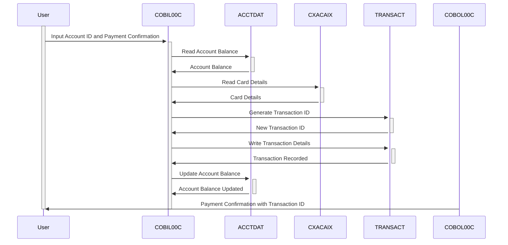

Gerado em: 1º de outubro de 2024

# CardDemo - Especificação de Pagamento de Fatura Online

## Descrição resumida

Este documento descreve a funcionalidade "Pagamento de Fatura Online" dentro do aplicativo CardDemo, permitindo que os titulares de cartão de crédito liquidem seu saldo devedor integralmente por meio de uma interface online segura. O processo é integrado ao sistema de cartão de crédito, garantindo atualizações precisas de saldo e registro de transações.

## Histórias do Usuário

Como usuário do CardDemo, quero pagar minha fatura do cartão de crédito online para poder gerenciar minha conta convenientemente sem entrar em contato com o suporte ao cliente.

## Épico Relacionado

**4 - Processamento de Transações:** Esta história se enquadra no processamento de transações, abrangendo várias funcionalidades relacionadas ao tratamento de transações com cartão de crédito de forma segura e eficiente.

## Requisitos Funcionais

1. **Recuperação do Saldo da Conta:**
   - O sistema deve recuperar e exibir o saldo atual do arquivo ACCTDAT após login bem-sucedido e validação da conta.
2. **Pagamento do Saldo Total:**
   - O sistema deve processar pagamentos apenas para o saldo devedor total.
   - Pagamentos parciais não devem ser permitidos por meio desta funcionalidade.
3. **Confirmação de Pagamento:**
   - Antes de processar, o sistema deve solicitar ao usuário que confirme seu pagamento.
   - O usuário deve confirmar explicitamente o pagamento para prosseguir.
4. **Processamento de Transações:**
   - Após a confirmação, o sistema deve gerar um ID de Transação exclusivo.
   - O sistema deve registrar os detalhes do pagamento (valor, data, hora) no arquivo TRANSACT.
   - O sistema deve atualizar o saldo da conta no arquivo ACCTDAT para refletir o pagamento.
5. **Exibição de Confirmação de Pagamento:**
   - O sistema deve exibir uma mensagem de confirmação ao usuário após o processamento bem-sucedido do pagamento.
   - A mensagem de confirmação deve incluir o ID de Transação gerado para referência futura.

## Requisitos Não Funcionais

- **Segurança:** O processo de pagamento online deve ser protegido usando protocolos de criptografia e autenticação para proteger dados confidenciais.
- **Desempenho:** O sistema deve processar pagamentos de faturas com eficiência, com tempo de resposta mínimo para recuperação de saldo, confirmação de pagamento e registro de transações.
- **Disponibilidade:** A funcionalidade de pagamento de faturas online deve estar disponível 24 horas por dia, 7 dias por semana, com tempo de inatividade mínimo.
- **Auditabilidade:** Todas as transações devem ser registradas com detalhes relevantes, incluindo ID do usuário, registro de data e hora e valor da transação, para fins de auditoria e relatórios.

## Critérios de Aceitação

- O sistema recupera e exibe com sucesso o saldo da conta atual do usuário.
- O sistema permite apenas pagamentos de saldo total e rejeita quaisquer tentativas de pagamento parcial.
- O sistema solicita ao usuário que confirme seu pagamento antes de processar.
- O sistema gera um ID de Transação exclusivo para cada pagamento bem-sucedido.
- O sistema atualiza com precisão o saldo da conta após um pagamento bem-sucedido.
- O sistema registra todos os detalhes da transação no arquivo TRANSACT para auditoria.
- O sistema exibe uma mensagem de confirmação com o ID da transação ao usuário após o pagamento bem-sucedido.

## Melhorias de Código

- **Tratamento de Erros:** Implemente um tratamento de erros robusto para gerenciar com elegância vários cenários, como entrada inválida, problemas de conexão ou fundos insuficientes.
- **Registro em Log:** Aprimore os recursos de registro em log para capturar informações detalhadas durante cada etapa do processo de pagamento da fatura, auxiliando na depuração e resolução de problemas.
- **Modularidade do Código:** Refatore o código dividindo funções grandes em módulos menores e gerenciáveis ​​para melhor legibilidade e manutenção.

## Melhorias de Segurança

- **Criptografia de Dados:** Criptografe dados confidenciais, incluindo números de conta e detalhes de pagamento, tanto em trânsito quanto em repouso, para evitar acesso não autorizado.
- **Validação de Entrada:** Implemente validação de entrada rígida para higienizar as entradas do usuário e evitar vulnerabilidades como injeção de SQL ou scripts entre sites (XSS).
- **Autenticação e Autorização:** Imponha mecanismos de autenticação fortes, como autenticação de dois fatores e autorização baseada em função para controlar o acesso à funcionalidade de pagamento de faturas.

## Diagrama Conceitual

--Made by "Smart Engineering" (by Compass.UOL)--