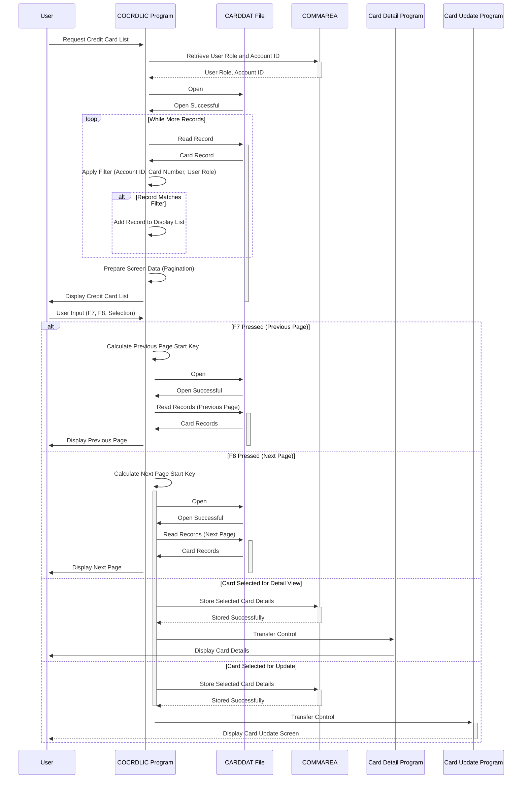

Gerado em: 1 de outubro de 2024

# **Título do Documento:** Exibição e Navegação da Lista de Cartões de Crédito

# **Descrição Resumida:**
Este módulo apresenta uma lista de cartões de crédito ao usuário, permitindo navegação e seleção. Administradores visualizam todos os cartões, enquanto usuários regulares veem cartões vinculados à sua conta.

# **Histórias do Usuário:**
Como administrador de cartão de crédito, preciso visualizar uma lista de todos os cartões de crédito no sistema para gerenciá-los com eficiência.

Como usuário regular, preciso visualizar uma lista de cartões de crédito associados à minha conta para poder revisar os detalhes do meu cartão.

# **Épico Relacionado:**
3 - Gerenciamento de Cartão de Crédito

# **Requisitos Funcionais:**
- **Controle de Acesso Baseado em Função do Usuário:**
    - Administradores podem visualizar todos os cartões de crédito.
    - Usuários regulares só podem visualizar cartões vinculados ao seu próprio número de conta, passado para o programa por meio de uma área de comunicação (`COMMAREA`).
- **Exibir Lista de Cartões de Crédito:**
    - O programa recupera e exibe uma lista de cartões de crédito, aderindo às regras de controle de acesso.
- **Paginação:**
    - A lista é exibida em páginas, com um número máximo de registros por página (por exemplo, 7).
    - Os usuários podem navegar pelas páginas usando as teclas de função:
        - `F7` - Página Anterior
        - `F8` - Próxima Página
- **Filtragem:**
    - Os usuários podem opcionalmente filtrar a lista por:
        - ID da Conta: um número de 11 dígitos.
        - Número do Cartão: um número de 16 dígitos.
- **Seleção para Visualização Detalhada/Atualização:**
    - Os usuários podem selecionar um único cartão da lista para:
        - Visualizar informações detalhadas do cartão (transferidas para um programa dedicado de detalhes do cartão).
        - Atualizar as informações do cartão (transferidas para um programa dedicado de atualização de cartão).

# **Requisitos Não Funcionais:**
- **Desempenho:** O programa deve recuperar e exibir a lista de cartões de crédito com tempo de resposta mínimo, mesmo para conjuntos de dados grandes.
- **Usabilidade:**
    - O layout da tela deve ser claro, conciso e fácil de entender.
    - As opções de navegação e filtragem devem ser intuitivas.
- **Confiabilidade:** O programa deve funcionar de forma confiável, tratando erros normalmente e evitando a corrupção de dados.
- **Manutenibilidade:** O código deve ser modular, bem documentado e fácil de entender para futuras manutenções e aprimoramentos.

# **Critérios de Aceitação:**
- O programa exibe corretamente uma lista paginada de cartões de crédito com base na função do usuário e nos filtros aplicados.
- Os usuários podem navegar pelas páginas com sucesso usando as teclas `F7` e `F8`.
- A filtragem por ID de conta e/ou número do cartão funciona corretamente.
- Selecionar um cartão transfere corretamente os detalhes do cartão para o programa apropriado para visualização detalhada ou atualização.
- O programa lida com erros normalmente, exibindo mensagens informativas para o usuário.
- O programa atende às expectativas de desempenho, exibindo a lista rapidamente, mesmo com um grande número de registros de cartão de crédito.

# **Configurações e Constantes:**
| Constante/Parâmetro | Valor Padrão | Descrição |
|---|---|---|
| `WS-MAX-SCREEN-LINES` | 7 | Número máximo de registros de cartão de crédito exibidos por página. |
| `LIT-CARD-FILE` | `'CARDDAT '` | Nome do arquivo VSAM que armazena os dados do cartão de crédito. |
| `LIT-CARD-FILE-ACCT-PATH` | `'CARDAIX '` | Nome do índice alternativo no arquivo `CARDDAT`, provavelmente usado para recuperação eficiente por ID de conta. |

# **Melhorias de Código:**
- **Tratamento de Erros:**
    - Implementar um mecanismo de tratamento de erros mais centralizado para otimizar o relatório de erros e a recuperação.
    - Fornecer mensagens de erro mais específicas ao usuário, indicando a natureza do erro e as possíveis soluções.
- **Estrutura do Código:**
    - Refatorar blocos de código repetitivos em sub-rotinas reutilizáveis para melhorar a legibilidade e a manutenção do código. Por exemplo, as seções de inicialização de array de tela e configuração de atributo podem ser simplificadas.
- **Documentação:**
    - Adicionar comentários abrangentes para explicar a lógica do programa, as estruturas de dados e as funções.
    - Criar documentação externa que descreva as especificações do programa, instruções de uso e detalhes técnicos.
- **Desempenho:**
    - Investigar o uso de um algoritmo de classificação mais eficiente para a lista de cartões de crédito se o desempenho se tornar um problema com conjuntos de dados muito grandes.

# **Melhorias de Segurança:**
- **Criptografia de Dados:**
    - Criptografar informações confidenciais do cartão de crédito armazenadas no arquivo `CARDDAT` para proteger contra acesso não autorizado em caso de violação de dados.
- **Registro de Auditoria:**
    - Implementar o registro de auditoria para rastrear as ações do usuário, como visualizar, atualizar e excluir registros de cartão de crédito, para fins de segurança e conformidade.
- **Validação de Entrada:**
    - Fortalecer a validação de entrada para os filtros de ID de conta e número do cartão para evitar possíveis ataques de injeção.
- **Comunicação Segura:**
    - Se o programa se comunicar com outros sistemas ou bancos de dados, garantir que os canais de comunicação sejam seguros e criptografados.

# **Diagrama Conceitual:**

--Made by "Smart Engineering" (by Compass.UOL)--