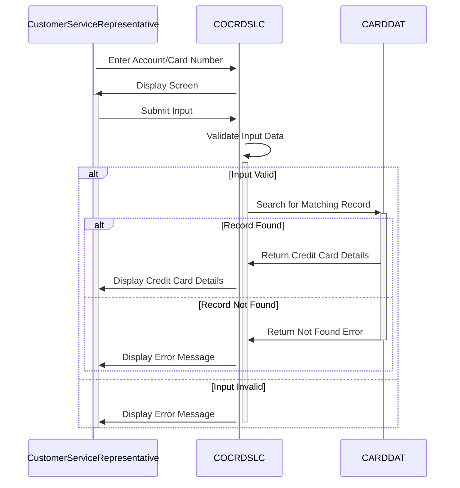

Gerado em: 1º de outubro de 2024

# **Título do Documento:** Programa de Recuperação de Detalhes do Cartão de Crédito - Especificação Funcional

# **Descrição Resumida:**

Este programa permite que representantes de atendimento ao cliente acessem informações detalhadas do cartão de crédito inserindo o número da conta ou o número do cartão. O programa prioriza a segurança dos dados validando as entradas do usuário antes de acessar dados confidenciais.

# **Histórias do Usuário:**

Como representante de atendimento ao cliente, preciso conseguir recuperar rapidamente os detalhes do cartão de crédito de um cliente usando o número da conta ou o número do cartão para que eu possa auxiliá-lo em suas consultas.

# **Epic Relacionado:** 
3 - Gestão de Cartão de Crédito

# **Requisitos Funcionais:**

1.  **Captura e Validação de Entrada:**
    *   O sistema deve permitir que o usuário insira um número de conta de 11 dígitos ou um número de cartão de 16 dígitos.
    *   O sistema deve validar se o número da conta ou número do cartão inserido é numérico.
    *   O sistema deve exibir uma mensagem de erro se os dados inseridos não forem numéricos ou não tiverem o comprimento correto.

2.  **Pesquisa e Recuperação no Banco de Dados:**
    *   O sistema deve pesquisar no banco de dados CARDDAT um registro correspondente usando o número da conta ou número do cartão inserido.
    *   Se um registro correspondente for encontrado, o sistema deve recuperar os seguintes detalhes do cartão de crédito:
        *   Nome do titular do cartão
        *   Número do cartão
        *   Data de validade
        *   Status

3.  **Exibição de Dados:**
    *   O sistema deve exibir os detalhes do cartão de crédito recuperados ao usuário em um formato claro e legível.

# **Requisitos Não Funcionais:**

1.  **Desempenho:**
    *   O sistema deve recuperar e exibir os detalhes do cartão de crédito dentro de 3 segundos após o usuário enviar a solicitação.

2.  **Segurança:**
    *   O sistema deve permitir que apenas usuários autorizados acessem os detalhes do cartão de crédito.
    *   O sistema não deve exibir nenhum detalhe do cartão de crédito se as informações inseridas forem inválidas.

3.  **Disponibilidade:**
    *   O sistema deve estar disponível 24 horas por dia, 7 dias por semana.

4.  **Manutenibilidade:**
    *   O sistema deve ser projetado de forma modular para permitir fácil manutenção e atualizações.

# **Critérios de Aceitação:**

1.  O sistema recupera e exibe com sucesso os detalhes do cartão de crédito quando um número de conta ou número de cartão válido é inserido.
2.  O sistema exibe uma mensagem de erro apropriada quando informações inválidas ou incompletas são inseridas.
3.  O sistema atende aos requisitos de desempenho, segurança e disponibilidade descritos na seção de requisitos não funcionais.

# **Melhorias de Código:**
*   **Tratamento de Erros Padronizado:** Implementar uma abordagem consistente e amigável para lidar com erros, incluindo a exibição de mensagens de erro descritivas para o usuário.
*   **Otimização de Código:** Explorar oportunidades para otimizar o código para melhorar o desempenho, especialmente ao lidar com interações com o banco de dados.
*   **Documentação:** Adicionar comentários claros e concisos ao código para melhorar sua legibilidade e capacidade de manutenção.
*   **Parametrização:** Considerar mover nomes de arquivo e outras constantes para um arquivo de configuração para facilitar a manutenção e configurações específicas do ambiente.

# **Melhorias de Segurança:**
*   **Autenticação e Autorização:** Implementar mecanismos robustos de autenticação para verificar as identidades dos usuários e autorizar o acesso a informações confidenciais do cartão de crédito.
*   **Limpeza de Entrada:** Limpar todas as entradas do usuário para evitar vulnerabilidades como injeção de SQL.
*   **Registro e Auditoria:** Registrar todas as tentativas de acesso a dados, incluindo detalhes do usuário, carimbos de data/hora e ações executadas, para auditoria de segurança e fins de monitoramento.
*   **Criptografia de Dados:** Criptografar dados confidenciais do cartão de crédito em trânsito e em repouso para protegê-los de acesso não autorizado.

# **Diagrama Conceitual:**

--Made by "Smart Engineering" (by Compass.UOL)--