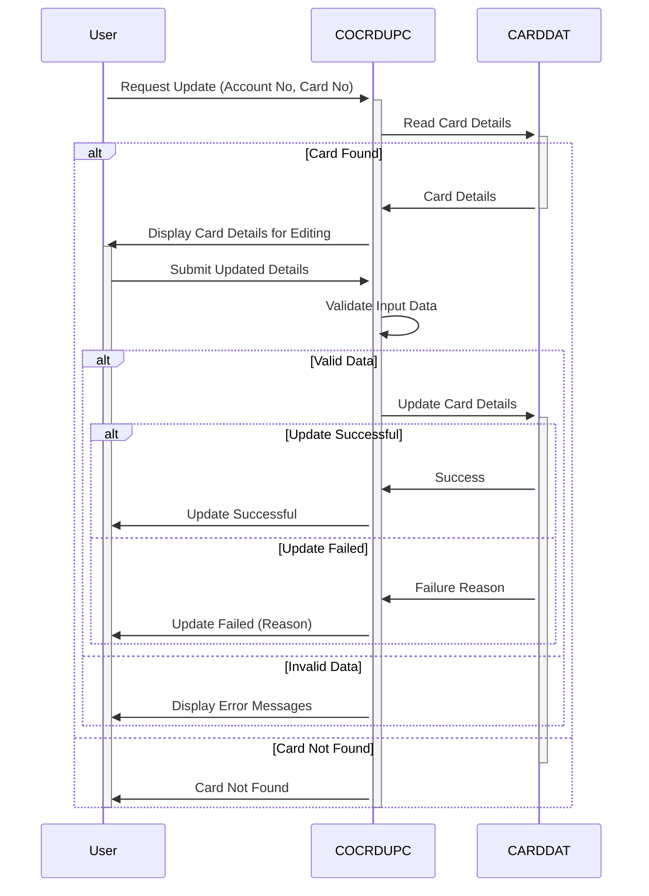

Gerado em: 1º de outubro de 2024

# Especificação do Programa de Atualização de Detalhes do Cartão de Crédito

## Descrição Resumida

Este documento detalha o programa utilizado para atualização online de informações de cartão de crédito. Ele recebe uma solicitação, valida as informações e atualiza os detalhes do cartão de crédito no banco de dados, garantindo a integridade e segurança dos dados.

## Casos de Uso

Como analista de crédito, preciso visualizar e atualizar os detalhes do cartão de crédito do cliente para que eu possa gerenciar suas contas de forma eficaz.

## Épico Relacionado

**3 - Gestão de Cartão de Crédito**

## Requisitos Funcionais

1. **Recepção de Solicitação:**
   - O programa recebe uma solicitação para visualizar ou atualizar os detalhes do cartão de crédito. Esta solicitação inclui o número da conta e o número do cartão.
2. **Recuperação de Dados:**
   - O programa recupera as informações existentes do cartão de crédito do banco de dados com base nos números de conta e cartão fornecidos.
3. **Validação de Entrada:**
   - O programa valida a entrada do usuário para garantir a precisão dos dados.
     - Número da Conta: Deve ser numérico e ter 11 dígitos.
     - Número do Cartão: Deve ser numérico e ter 16 dígitos.
     - Nome do Titular do Cartão: Pode conter apenas letras e espaços.
     - Data de Validade: Deve ser uma data válida no futuro.
     - Status do Cartão: Deve ser 'Y' (ativo) ou 'N' (inativo).
4. **Processamento de Atualização:**
   - Se os dados de entrada forem válidos, o programa atualiza o registro correspondente no banco de dados.
   - O programa implementa mecanismos de bloqueio para evitar a corrupção de dados de atualizações simultâneas.
5. **Confirmação e Feedback:**
   - O programa fornece feedback ao usuário, confirmando o sucesso da atualização ou se ocorreram erros.

## Requisitos Não Funcionais

- **Segurança:** O programa deve se integrar aos módulos de segurança existentes para garantir que apenas pessoal autorizado possa acessar e modificar dados confidenciais.
- **Desempenho:** O programa deve lidar com atualizações de forma eficiente, minimizando o tempo de resposta para o usuário.
- **Auditabilidade:** O programa deve registrar todas as ações de atualização, incluindo usuário, registro de data e hora e alterações feitas, para fins de auditoria e rastreamento.

## Critérios de Aceite

- O programa recupera e exibe com sucesso os detalhes existentes do cartão de crédito com base em números de conta e cartão válidos.
- O programa atualiza com sucesso os detalhes do cartão de crédito no banco de dados após a validação bem-sucedida da entrada.
- O programa exibe mensagens de erro apropriadas para dados de entrada inválidos ou operações de atualização malsucedidas.
- O programa impede atualizações simultâneas no mesmo registro de cartão de crédito.
- Todas as ações de atualização são registradas em uma trilha de auditoria segura.

## Melhorias de Código

- Implementar tratamento de erros centralizado para melhor manutenção.
- Adicionar comentários detalhados ao código para melhorar a legibilidade.
- Otimizar consultas de banco de dados para melhorar o desempenho.

## Melhorias de Segurança

- Integrar com os mecanismos existentes de autenticação e autorização para verificar as permissões do usuário.
- Criptografar informações confidenciais do cartão de crédito tanto em trânsito quanto em repouso.
- Implementar técnicas de mascaramento de dados para proteger dados confidenciais de acesso não autorizado.

## Diagrama Conceitual:

--Made by "Smart Engineering" (by Compass.UOL)--