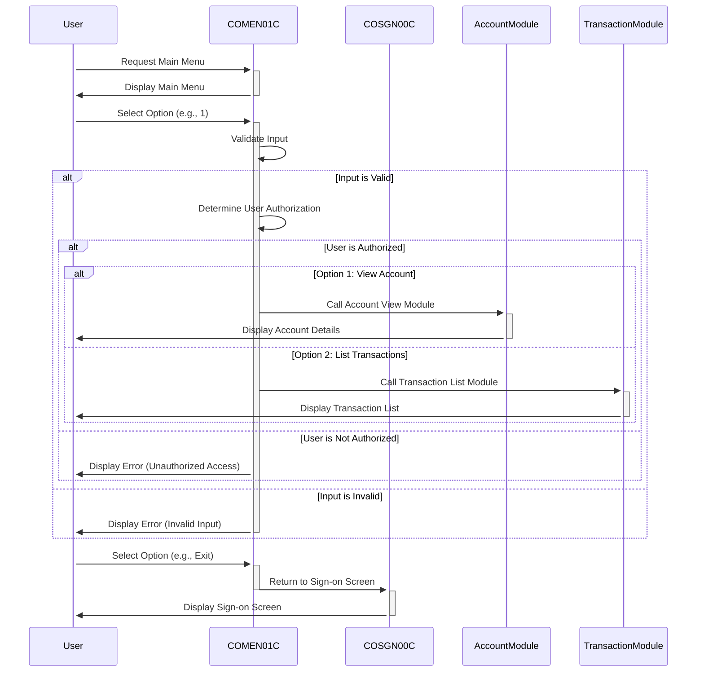

Gerado em: 1 de outubro de 2024

# **Documento de Título:** Aplicativo CardDemo - Especificação do Programa de Menu Principal

# **Descrição Resumida:**
O programa de Menu Principal do CardDemo, COMEN01C.cbl, serve como o ponto central de navegação para usuários regulares dentro do aplicativo CardDemo. Ele apresenta um menu de opções personalizadas para a função do usuário, captura sua escolha, valida a entrada e o direciona para o módulo apropriado para execução. Isso garante acesso seguro às funcionalidades autorizadas e fornece uma interface amigável para interagir com o sistema.

# **Histórias do Usuário:**
Como um usuário regular do aplicativo CardDemo, preciso de um sistema de menus claro e fácil de usar para que eu possa acessar e executar várias ações relacionadas à minha conta, como visualizar os detalhes da minha conta, listar transações ou fazer um pagamento.

# **Epic Relacionado:**
6 - Gerenciamento de Usuários e Segurança: Este epic se concentra em gerenciar o acesso do usuário, funções e permissões para garantir a segurança do sistema e a confidencialidade dos dados.

# **Requisitos Funcionais:**
* O programa deve exibir um menu de opções numeradas para o usuário.
* O programa deve solicitar ao usuário que insira o número correspondente à ação desejada.
* O programa deve validar a entrada do usuário para garantir que seja um número válido dentro do intervalo de opções disponíveis.
* O programa deve verificar se o usuário está autorizado a executar a ação selecionada com base em seu tipo de usuário.
* O programa deve redirecionar o usuário para o módulo de programa apropriado com base em sua opção selecionada.
* O programa deve exibir uma mensagem de erro se o usuário inserir uma entrada inválida e solicitar que ele insira novamente.
* O programa deve permitir que o usuário saia do menu e retorne à tela de login.

# **Requisitos Não Funcionais:**
* O programa deve responder à entrada do usuário em 2 segundos.
* O programa deve estar disponível para uso 99,9% do tempo.
* O programa deve ser projetado de forma modular e sustentável.
* O programa deve seguir os padrões e convenções de codificação.

# **Critérios de Aceitação:**
* O menu principal deve ser exibido com sucesso após o login do usuário.
* Todas as opções de menu válidas devem ser exibidas corretamente.
* O programa deve validar corretamente a entrada do usuário e exibir mensagens apropriadas.
* O programa deve redirecionar o usuário com sucesso para o módulo selecionado após a entrada válida.
* O programa deve lidar com entradas inválidas com elegância e solicitar uma nova entrada.
* O programa deve permitir que o usuário retorne à tela de login.

# **Melhorias de Código:**
* Implementar tratamento de erros centralizado para melhor manutenção.
* Adicionar recursos de registro para rastrear ações do usuário e eventos do sistema.
* Usar nomes de variáveis descritivos para aumentar a legibilidade.
* Dividir parágrafos grandes em procedimentos menores e mais gerenciáveis.

# **Melhorias de Segurança:**
* Implementar sanitização de entrada para evitar ataques de injeção.
* Mascarar informações confidenciais, como senhas, na tela.
* Impor políticas de senha forte.
* Revisar e atualizar as listas de controle de acesso regularmente.

# **Diagrama Conceitual:**

--Made by "Smart Engineering" (by Compass.UOL)--