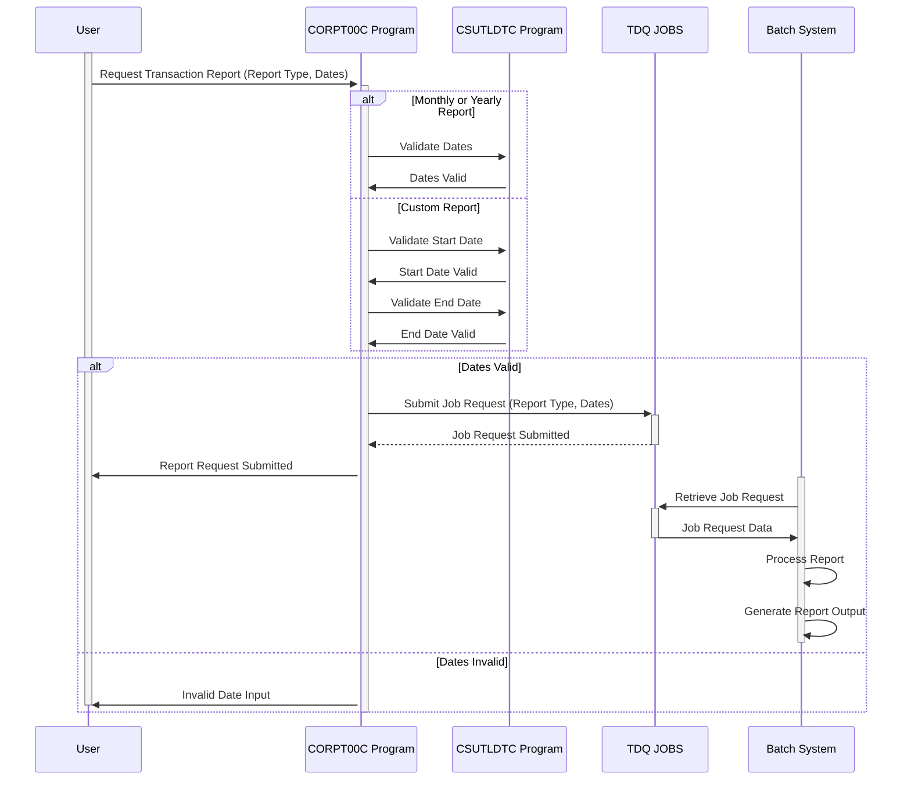

Gerado em: 1º de outubro de 2024

# **Título do Documento:** CardDemo Submissão de Relatório de Transações - Especificação do Programa

# **Descrição Resumida:**

Este documento de especificação detalha a funcionalidade do programa `CORPT00C.cbl` dentro da aplicação CardDemo. Este programa permite que os usuários iniciem a geração de relatórios de transações com base em períodos predefinidos (mensal, anual) ou um intervalo de datas personalizado. O programa valida a entrada do usuário, prepara uma solicitação de trabalho em lote e a envia para processamento.

# **Histórias do Usuário:**

Como usuário comercial, preciso gerar relatórios resumidos de transações de cartão de crédito para vários períodos (mensal, anual ou intervalo de datas personalizado) para analisar as tendências e o desempenho dos negócios.

# **Epic Relacionado:**

**5 - Relatórios e Análise**

# **Requisitos Funcionais:**

1. **Seleção do Tipo de Relatório:**
   - O programa deve permitir que o usuário escolha entre três tipos de relatório:
     - Mensal
     - Anual
     - Personalizado

2. **Entrada de Data (Relatório Personalizado):**
   - Para o tipo de relatório "Personalizado", o programa deve solicitar ao usuário que insira uma data de início e uma data de término.

3. **Validação de Data:**
   - O programa deve validar as datas inseridas quanto a:
     - **Formato:** As datas devem estar no formato AAAA-MM-DD.
     - **Ordem Lógica:** A data de início não pode ser posterior à data de término.
     - **Datas Válidas:** As datas inseridas devem representar datas de calendário válidas.

4. **Geração de Solicitação de Relatório:**
   - Com base no tipo de relatório selecionado e nas datas inseridas, o programa deve gerar uma solicitação de trabalho em lote contendo:
     - Tipo de relatório
     - Data de início
     - Data de término

5. **Submissão de Trabalho:**
   - O programa deve enviar a solicitação de trabalho em lote gerada para uma fila para processamento pelo sistema de processamento em lote.

6. **Feedback do Usuário:**
   - O programa deve fornecer ao usuário feedback sobre o status da solicitação do relatório:
     - Mensagem de confirmação após o envio bem-sucedido
     - Mensagem de erro em caso de entrada inválida ou outros problemas

# **Requisitos Não Funcionais:**

1. **Desempenho:** O programa deve processar a entrada do usuário e enviar a solicitação de relatório com latência mínima, idealmente em 2 segundos.
2. **Confiabilidade:** O programa deve ser robusto e lidar com erros inesperados normalmente, sem travar. Deve garantir a integridade dos dados e evitar a geração de relatórios incorretos.
3. **Manutenibilidade:** O código do programa deve ser bem documentado e seguir uma estrutura modular para facilitar futuras modificações e aprimoramentos.
4. **Segurança:** O programa deve ser acessível apenas a usuários autorizados com as permissões necessárias para gerar relatórios de transações.

# **Critérios de Aceitação:**

1. O programa compila e vincula com sucesso, sem erros ou avisos.
2. O programa exibe corretamente a tela de seleção do tipo de relatório e lida com a entrada do usuário.
3. O programa valida com sucesso as datas inseridas e fornece mensagens de erro apropriadas para entrada inválida.
4. O programa gera uma solicitação de trabalho em lote bem formatada, contendo o tipo de relatório, a data de início e a data de término corretos.
5. O programa envia a solicitação de trabalho para a fila designada sem erros.
6. O programa fornece ao usuário mensagens de feedback apropriadas (confirmação ou erro) com base no resultado do envio da solicitação.
7. O programa lida com erros inesperados normalmente e exibe mensagens de erro informativas para o usuário.

# **Melhorias de Código:**

1. **Tratamento de Erros:** Implemente uma rotina de tratamento de erros centralizada para capturar e registrar erros de forma consistente. Exiba mensagens de erro detalhadas para o usuário, incluindo o código do erro e uma breve descrição.
2. **Modularidade:** Divida o parágrafo `PROCESS-ENTER-KEY` em sub-rotinas menores e mais gerenciáveis com base no tipo de relatório. Isso melhorará a legibilidade e a manutenção do código.
3. **Biblioteca de Validação de Data:** Considere o uso de uma biblioteca ou utilitário de validação de data dedicado em vez da lógica de validação embutida. Isso melhorará a reutilização do código e potencialmente simplificará o processo de validação.
4. **Configuração:** Externalize parâmetros configuráveis, como o nome TDQ (`JOBS`) e o nome do programa em lote (`TRANREPT`), para um arquivo de configuração separado ou variáveis de ambiente. Isso melhorará a flexibilidade e a facilidade de implantação.

# **Melhorias de Segurança:**

1. **Sanitização de Entrada:** Implemente a sanitização de entrada adequada para evitar vulnerabilidades como injeção de SQL ou injeção de comando, embora a implementação atual sugira um sistema orientado a lote.
2. **Autenticação e Autorização:** Imponha mecanismos rígidos de autenticação e autorização para garantir que apenas usuários autorizados possam acessar e iniciar o processo de geração de relatórios.
3. **Auditoria:** Registre todas as solicitações de geração de relatórios, incluindo o ID do usuário, carimbo de data/hora, tipo de relatório e intervalo de datas, para fins de auditoria e rastreamento.

# **Diagrama Conceitual:**

--Made by "Smart Engineering" (by Compass.UOL)--