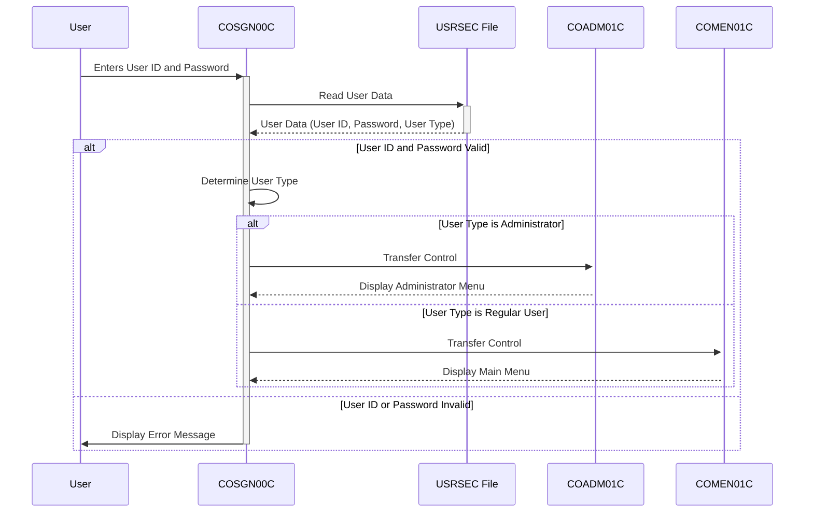

Gerado em: 1º de outubro de 2024

# **Título do Documento:** Aplicativo CardDemo - Especificação do Módulo de Autenticação (Sign-on)

# **Descrição Resumida:**
Este documento descreve as especificações para o módulo de Autenticação (COSGN00C) dentro do aplicativo CardDemo, um sistema baseado em COBOL projetado para gerenciamento de cartão de crédito. O módulo garante a autenticação segura do usuário, validando as credenciais do usuário em relação aos dados armazenados. Após a verificação bem-sucedida, ele concede aos usuários acesso ao aplicativo com base em suas funções definidas, direcionando-os para as funcionalidades apropriadas.

# **Histórias do Usuário:**
Como um Administrador de Segurança, desejo garantir que apenas pessoal autorizado possa acessar o aplicativo CardDemo, visualizar informações confidenciais do cliente e realizar transações, para manter a segurança dos dados e impedir o acesso não autorizado.

# **Épico Relacionado:**
6 - Gerenciamento de Usuários e Segurança

# **Requisitos Funcionais:**
1. **Exibir Tela de Autenticação:** O sistema deve exibir uma tela de autenticação para o usuário, solicitando que ele insira seu ID de Usuário e Senha.
2. **Capturar Entrada do Usuário:** O sistema deve capturar o ID de Usuário e a Senha inseridos pelo usuário.
3. **Validar Credenciais do Usuário:** O sistema deve validar o ID de Usuário e a Senha inseridos em relação aos dados armazenados no arquivo de segurança do usuário (USRSEC).
    * Se o ID de Usuário não existir, uma mensagem de erro "Usuário não encontrado. Tente novamente ..." deve ser exibida.
    * Se o ID de Usuário existir, mas a Senha inserida não corresponder à Senha armazenada, uma mensagem de erro "Senha incorreta. Tente novamente ..." deve ser exibida.
4. **Determinar o Tipo de Usuário:** Após a validação bem-sucedida do ID de Usuário e da Senha, o sistema deve determinar o tipo de usuário (por exemplo, Administrador ou Usuário Regular) com base nas informações armazenadas no arquivo de segurança do usuário (USRSEC).
5. **Direcionar o Usuário para o Menu Apropriado:** Com base no tipo de usuário, o sistema deve redirecionar o usuário para a parte relevante do aplicativo:
    * Se o usuário for um Administrador, o sistema deve transferir o controle para o menu do Administrador (Programa COADM01C).
    * Se o usuário for um Usuário Regular, o sistema deve transferir o controle para o Menu Principal (Programa COMEN01C).

# **Requisitos Não Funcionais:**
1. **Segurança:** O processo de autenticação deve ser seguro, garantindo que apenas usuários autorizados com credenciais válidas possam acessar o aplicativo. As senhas devem ser armazenadas com segurança para evitar acesso não autorizado.
2. **Desempenho:** O processo de autenticação deve ser concluído em um prazo razoável, fornecendo aos usuários acesso rápido ao aplicativo.
3. **Usabilidade:** A tela de autenticação deve ser amigável e fácil de entender, permitindo que os usuários insiram suas credenciais facilmente.
4. **Confiabilidade:** O módulo de autenticação deve ser confiável, autenticando consistentemente usuários válidos e rejeitando tentativas de login inválidas.
5. **Disponibilidade:** O módulo de autenticação deve estar disponível durante o horário operacional do aplicativo CardDemo para garantir acesso ininterrupto para usuários autorizados.

# **Critérios de Aceitação:**
1. **Autenticação Bem-Sucedida:** Usuários com credenciais válidas (ID de Usuário e Senha corretos) devem ser autenticados com sucesso e ter acesso ao aplicativo.
2. **Autenticação Mal-Sucedida:** Usuários com credenciais inválidas (ID de Usuário ou Senha incorretos) ou usuários não autorizados devem ter o acesso negado e mensagens de erro apropriadas devem ser exibidas.
3. **Redirecionamento Baseado em Função:** Após a autenticação bem-sucedida, os usuários devem ser redirecionados para o menu correto com base em seu tipo de usuário (Administrador ou Usuário Regular).
4. **Segurança de Senha:** As senhas devem ser armazenadas com segurança usando mecanismos de criptografia ou hashing apropriados.
5. **Tratamento de Erros:** O sistema deve lidar com diferentes cenários de erro adequadamente, como entrada inválida, credenciais incorretas e erros do sistema, e exibir mensagens de erro informativas para o usuário.
6. **Desempenho:** O processo de autenticação deve ser concluído em um prazo aceitável, garantindo uma experiência de usuário tranquila.

# **Melhorias de Código:**
1. **Aplicação de Complexidade de Senha:** Implementar regras de complexidade de senha exigindo que os usuários definam senhas com um comprimento mínimo, uma mistura de letras maiúsculas e minúsculas, números e caracteres especiais.
2. **Criptografia de Senha:** Utilizar um algoritmo de criptografia forte para criptografar senhas armazenadas no arquivo USRSEC, aumentando a segurança.
3. **Especificidade da Mensagem de Erro:** Fornecer mensagens de erro mais específicas para o usuário, diferenciando entre um ID de Usuário inválido e uma senha incorreta.
4. **Tentativas de Login Mal-Sucedidas:** Implementar um mecanismo para rastrear tentativas de login malsucedidas. Após um número predefinido de tentativas malsucedidas, o sistema deve bloquear temporariamente a conta do usuário para evitar ataques de força bruta.
5. **Log:** Implementar o registro detalhado de todas as tentativas de autenticação, incluindo o ID de Usuário usado, registro de data e hora e se a tentativa foi bem-sucedida ou não. Essas informações podem ser valiosas para auditoria de segurança e solução de problemas.

# **Melhorias de Segurança:**
1. **Autenticação Multifator (MFA):** Implementar MFA para adicionar uma camada extra de segurança ao processo de autenticação.
2. **Política de Expiração de Senha:** Implementar uma política de expiração de senha para aplicar alterações regulares de senha.
3. **Gerenciamento de Sessão Segura:** Após a autenticação bem-sucedida, gerar um ID de sessão exclusivo e usar cookies seguros para gerenciar sessões de usuário, evitando o sequestro de sessão.
4. **Validação de Entrada:** Fortalecer a validação de entrada para evitar vulnerabilidades de injeção de SQL e cross-site scripting (XSS).
5. **Teste de Segurança Regular:** Conduzir avaliações de segurança regulares e testes de penetração para identificar e solucionar possíveis vulnerabilidades.

# **Diagrama Conceitual:**

--Made by "Smart Engineering" (by Compass.UOL)--