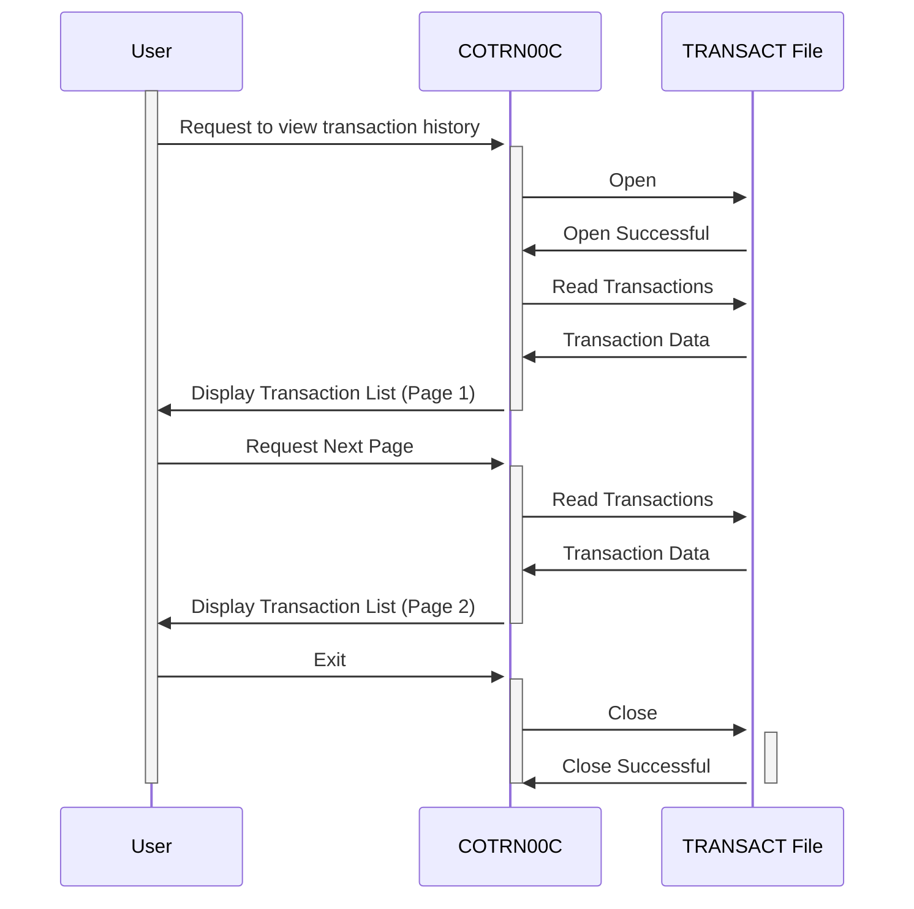

Gerado em: 1 de outubro de 2024

# **Título do Documento:** Módulo de Listagem de Transações CardDemo - Especificação de Negócio

# **Descrição Resumida:**

O módulo de Listagem de Transações CardDemo permite que os usuários revisem seu histórico de transações de cartão de crédito. É semelhante a visualizar um extrato bancário digital. Os usuários podem navegar pelas páginas de transações anteriores, com cada transação exibindo informações importantes, como data, descrição e valor.

# **Histórias do Usuário:**

Como usuário do CardDemo, desejo visualizar um histórico das minhas transações de cartão de crédito para poder acompanhar meus gastos e garantir a precisão das minhas declarações.

# **Épico Relacionado:**

4 - Processamento de Transações

# **Requisitos Funcionais:**

* **Recuperação de Transações:** O sistema deve recuperar e exibir transações associadas à conta do usuário conectado.
* **Paginação:** As transações devem ser apresentadas em páginas gerenciáveis para evitar sobrecarga de informações.
* **Navegação:** Os usuários devem poder navegar para frente e para trás pelas páginas de transações.
* **Seleção de Transação:** Os usuários devem ter a opção de selecionar uma transação específica para visualizar informações mais detalhadas (não totalmente implementado na versão atual).
* **Tratamento de Erros:** O sistema deve exibir mensagens claras em caso de erros, como atingir o final do histórico de transações ou tentar navegar além da primeira ou última página.

# **Requisitos Não Funcionais:**

* **Desempenho:** A lista de transações deve carregar de forma rápida e eficiente, mesmo para usuários com um grande histórico de transações.
* **Usabilidade:** A interface para visualizar transações deve ser intuitiva e fácil de navegar.
* **Segurança:** O acesso aos dados da transação deve ser restrito apenas a usuários autorizados.

# **Critérios de Aceite:**

* O sistema recupera e exibe com sucesso as transações associadas ao usuário conectado.
* As transações são exibidas em um formato paginado, com um número definido pelo usuário de transações por página (atualmente codificado).
* Os usuários podem navegar para frente e para trás pelas páginas de transações sem encontrar erros.
* O sistema exibe mensagens apropriadas quando o usuário chega ao início ou ao final do histórico de transações.
* O sistema trata erros com elegância e exibe mensagens informativas para o usuário.

# **Melhorias de Código:**

* Implementar paginação configurável pelo usuário, permitindo que os usuários escolham quantas transações exibir por página.
* Concluir a funcionalidade de seleção de transação, permitindo que os usuários visualizem informações detalhadas para uma transação específica.
* Considere adicionar opções de pesquisa ou filtragem para ajudar os usuários a encontrar transações específicas.

# **Melhorias de Segurança:**

* Implementar medidas de autenticação mais robustas, como autenticação de dois fatores, para evitar acesso não autorizado.
* Criptografar dados confidenciais de transações em trânsito e em repouso para proteger a privacidade do usuário.
* Implementar trilhas de auditoria para rastrear o acesso do usuário aos dados da transação para fins de segurança e conformidade.

# **Diagrama Conceitual:**

--Made by "Smart Engineering" (by Compass.UOL)--