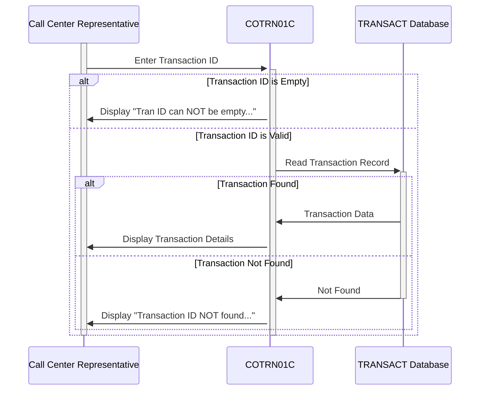

Gerado em: 1º de outubro de 2024

# CardDemo Recuperação de Detalhes de Transação - Especificação do Programa

## Descrição Resumida:
Este programa, parte da aplicação CardDemo, permite que representantes de call center visualizem os detalhes de uma transação específica de cartão de crédito usando seu ID único. Isso auxilia no atendimento ao cliente e na verificação de transações.

## Histórias do Usuário:
Como representante de call center, preciso acessar e visualizar rapidamente os detalhes de uma transação específica para que eu possa responder às perguntas dos clientes com precisão e eficiência.

## Épico Relacionado:
4 - Processamento de Transações

## Requisitos Funcionais:
1. **Entrada de ID de Transação:**
    - O sistema deve permitir que o usuário insira um ID de transação.
    - O sistema deve validar se o campo de entrada não está vazio.
2. **Recuperação de Dados de Transação:**
    - O sistema deve recuperar o registro de transação do banco de dados 'TRANSACT' que corresponda ao ID de transação inserido.
3. **Exibição de Detalhes de Transação:**
    - Se uma transação correspondente for encontrada, o sistema deve exibir os seguintes detalhes:
        - ID da transação
        - Número do cartão de crédito
        - Tipo de transação
        - Categoria da transação
        - Origem da transação
        - Valor da transação
        - Descrição da transação
        - Timestamp de origem da transação
        - Timestamp de processamento da transação
        - ID do comerciante
        - Nome do comerciante
        - Cidade do comerciante
        - CEP do comerciante
4. **Tratamento de Erros:**
    - Se o ID de transação inserido estiver vazio, o sistema deve exibir uma mensagem de erro "Tran ID can NOT be empty...".
    - Se nenhuma transação correspondente for encontrada, o sistema deve exibir uma mensagem de erro "Transaction ID NOT found...".
    - Se ocorrer um erro durante o acesso ao banco de dados, o sistema deve exibir uma mensagem de erro "Unable to lookup Transaction...".
5. **Navegação:**
    - O sistema deve permitir que o usuário navegue de volta para a tela anterior.
    - O sistema deve permitir que o usuário limpe o campo de entrada.

## Requisitos Não Funcionais:
1. **Desempenho:**
    - O sistema deve recuperar e exibir os detalhes da transação em 3 segundos.
2. **Segurança:**
    - Somente usuários autorizados devem poder acessar o sistema.
    - O sistema deve apenas recuperar e exibir dados do banco de dados 'TRANSACT'.
3. **Usabilidade:**
    - O sistema deve ser fácil de usar e navegar.
    - O sistema deve exibir mensagens de erro de forma clara e concisa.

## Critérios de Aceitação:
1. O sistema deve recuperar e exibir com sucesso os detalhes da transação para um ID de transação válido.
2. O sistema deve exibir mensagens de erro apropriadas para entradas inválidas ou erros do sistema.
3. O sistema deve ser acessível apenas a usuários autorizados.
4. O sistema deve atender aos requisitos de desempenho e usabilidade definidos.

## Melhorias de Código:
1. **Tratamento de Erros Centralizado:** Implemente uma rotina de tratamento de erros centralizada para gerenciar diferentes cenários de erro normalmente e fornecer mensagens de erro consistentes.
2. **Modularidade de Código:** Refatore o código em módulos/funções menores e reutilizáveis para melhorar a legibilidade e a manutenção do código.
3. **Validação de Dados:** Implemente verificações de validação de dados para o ID de transação inserido para evitar erros comuns de entrada de dados.

## Melhorias de Segurança:
1. **Limpeza de Entrada:** Limpe as entradas do usuário para evitar vulnerabilidades baseadas em injeção.
2. **Autenticação e Autorização:** Implemente mecanismos robustos de autenticação e autorização para controlar o acesso ao sistema e seus dados.
3. **Registro:** Implemente o registro de auditoria para rastrear ações do usuário e eventos do sistema para auditoria de segurança e solução de problemas.

## Diagrama Conceitual:

--Made by "Smart Engineering" (by Compass.UOL)--