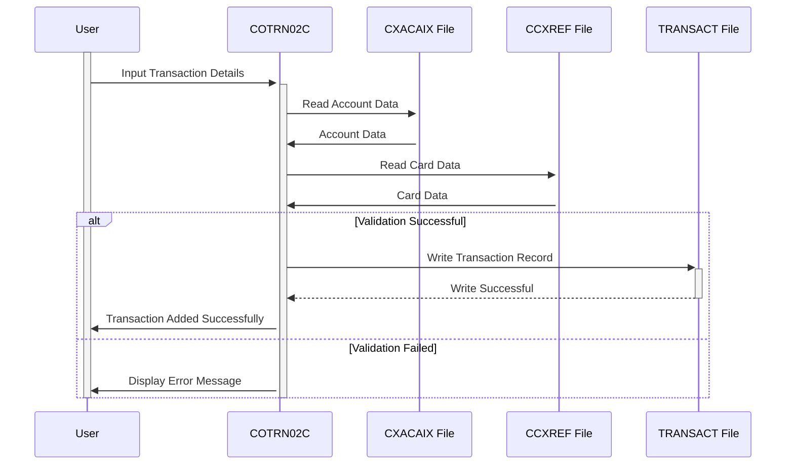

Gerado em: 1º de outubro de 2024

**Título do Documento:** Especificação do Programa de Adição de Transações CardDemo

**Descrição Resumida:** Este documento detalha a funcionalidade "Adicionar Transação" no aplicativo CardDemo, permitindo que usuários autorizados insiram detalhes de novas transações de cartão de crédito no sistema. Este processo envolve a validação da entrada do usuário em relação a regras predefinidas e o registro da transação após a validação bem-sucedida.

**Histórias do Usuário:** Como analista de dados, preciso garantir que todos os registros de transações usados para análise sejam precisos e completos para manter a integridade dos dados e gerar insights confiáveis.

**Épico Relacionado:**  4 - Processamento de Transações

**Requisitos Funcionais:**
- O sistema deve permitir que usuários autorizados insiram novos detalhes de transações, incluindo ID da conta, número do cartão, tipo de transação, categoria, valor, data, detalhes do comerciante e descrição.
- O sistema deve validar a entrada do usuário quanto ao tipo de dados, formato e campos obrigatórios. 
    - ID da conta e número do cartão devem ser numéricos e existir no sistema.
    - O valor da transação deve estar no formato -99999999.99.
    - As datas devem estar no formato AAAA-MM-DD.
    - Todos os campos obrigatórios devem ser preenchidos.
- O sistema deve gerar um ID de transação exclusivo para cada nova transação.
- O sistema deve registrar os detalhes completos da transação no arquivo TRANSACT após a validação bem-sucedida.
- O sistema deve fornecer feedback em tempo real aos usuários durante a entrada de dados para erros de validação.
- O sistema deve permitir que os usuários copiem dados da última transação inserida para transações consecutivas semelhantes.
- O sistema deve lidar com erros graciosamente, fornecendo mensagens informativas ao usuário sem interromper seu fluxo de trabalho.

**Requisitos Não Funcionais:**
- **Desempenho:** O sistema deve processar e registrar transações de forma eficiente, com tempo de resposta mínimo para transações online.
- **Confiabilidade:** O sistema deve garantir a precisão e consistência dos dados, aplicando regras de validação e tratando erros de forma eficaz.
- **Manutenibilidade:** O código deve ser bem estruturado, modular e documentado para facilitar a manutenção e as atualizações.
- **Segurança:** O sistema deve restringir o acesso a usuários autorizados e registrar todas as ações para garantir a segurança e a auditabilidade dos dados.

**Critérios de Aceitação:**
- O sistema deve registrar com sucesso uma nova transação no arquivo TRANSACT com informações precisas e completas ao atender a todos os critérios de validação.
- O sistema deve exibir mensagens de erro apropriadas e impedir o registro da transação se alguma regra de validação for violada.
- O sistema deve lidar com diferentes interações do usuário, como entrada de dados, confirmação, cancelamento e solicitações para copiar dados de transações anteriores, de forma suave e eficiente.

**Melhorias de Código:**
- Implementar rotinas de tratamento de erros centralizadas para melhorar a legibilidade e a manutenção do código.
- Adicionar comentários detalhados ao código para explicar a lógica e o propósito de diferentes seções.
- Explorar técnicas de otimização de desempenho, como armazenamento em buffer de dados e indexação, para lidar com grandes volumes de transações.

**Melhorias de Segurança:**
- Implementar medidas rígidas de controle de acesso para restringir a funcionalidade de adição de transação apenas ao pessoal autorizado.
- Criptografar dados confidenciais de transações, como números de cartão e valores, tanto em trânsito quanto em repouso.
- Manter um log de auditoria abrangente de todas as adições, modificações e exclusões de transações, incluindo IDs de usuário e timestamps.

**Diagrama Conceitual:**

--Made by "Smart Engineering" (by Compass.UOL)--