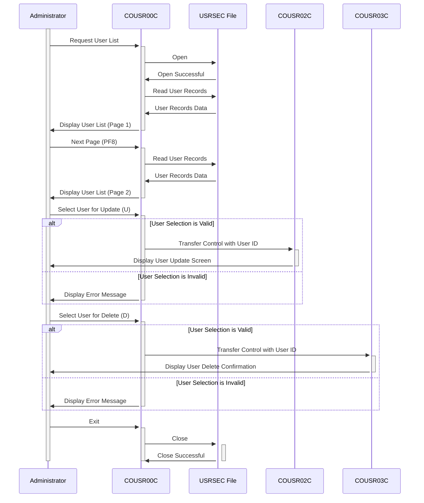

Gerado em: 1º de outubro de 2024

# Aplicativo CardDemo - Especificação da Funcionalidade de Lista de Usuários

## Descrição Resumida

A funcionalidade de Lista de Usuários no aplicativo CardDemo permite que os administradores visualizem e gerenciem contas de usuário. Ela fornece uma lista paginada de usuários, permitindo que os administradores naveguem pelos registros, selecionem usuários específicos e executem ações como atualizar ou excluir contas de usuário.

## Histórias do Usuário

Como administrador, preciso visualizar uma lista de todos os usuários no sistema para gerenciar suas contas de forma eficaz.

## Épico Relacionado

6 - Gerenciamento de Usuários e Segurança

## Requisitos Funcionais

- O sistema deve permitir que os administradores visualizem uma lista de todos os usuários no sistema.
- A lista de usuários deve incluir as seguintes informações para cada usuário: ID do Usuário, Primeiro Nome, Sobrenome e Tipo de Usuário.
- O sistema deve exibir a lista de usuários em um formato paginado, com no máximo 10 usuários por página.
- O sistema deve permitir que os administradores naveguem pelas páginas da lista de usuários usando teclas de função (PF7 para a página anterior, PF8 para a próxima página).
- O sistema deve permitir que os administradores selecionem um usuário da lista para executar ações como atualizar ou excluir.
- O sistema deve validar as seleções do usuário para garantir que apenas opções válidas (U/D) sejam processadas.
- Com base na ação selecionada, o sistema deve redirecionar o administrador para o programa apropriado (COUSR02C para atualização, COUSR03C para exclusão) junto com o ID do usuário selecionado.
- O sistema deve lidar com o cenário em que nenhum usuário é encontrado no arquivo USRSEC.
- O sistema deve lidar com casos em que o usuário tenta navegar além da primeira ou última página da lista de usuários.

## Requisitos Não Funcionais

- O sistema deve recuperar e exibir a lista de usuários com tempo de resposta mínimo (dentro de 2 segundos).
- O sistema deve ser acessível apenas por pessoal autorizado, garantindo a confidencialidade e segurança dos dados.
- A interface do usuário deve ser amigável e intuitiva para os administradores navegarem e realizarem ações.
- O sistema deve fornecer mensagens de erro claras em caso de entrada inválida ou erros do sistema.

## Critérios de Aceitação

- A funcionalidade da lista de usuários deve estar acessível a administradores autenticados.
- A lista de usuários deve exibir com precisão as informações do usuário recuperadas do arquivo USRSEC.
- A funcionalidade de paginação deve funcionar corretamente, permitindo que os usuários naveguem por todos os registros de usuários.
- Os administradores devem ser capazes de selecionar um usuário e executar ações de atualização ou exclusão com sucesso.
- O sistema deve lidar com erros normalmente e exibir mensagens apropriadas para o usuário.

## Melhorias de Código

- Implementar um algoritmo de classificação mais eficiente para exibir usuários, especialmente para conjuntos de dados grandes.
- Melhorar o tratamento de erros, fornecendo mensagens de erro mais específicas e registrando-as para fins de depuração.
- Adicionar comentários para melhorar a legibilidade e a manutenção do código.
- Considerar o uso de uma estrutura de dados para armazenar informações do usuário em vez de variáveis individuais para melhor organização.
- Usar uma convenção de nomenclatura consistente para variáveis e funções para aumentar a legibilidade do código.

## Melhorias de Segurança

- Implementar validação de entrada para evitar vulnerabilidades de injeção de SQL.
- Criptografar informações confidenciais do usuário armazenadas no arquivo USRSEC para proteger contra acesso não autorizado.
- Implementar medidas de controle de acesso para restringir a funcionalidade da lista de usuários apenas ao pessoal autorizado.
- Auditar regularmente o sistema para identificar e solucionar possíveis vulnerabilidades de segurança.

## Diagrama Conceitual:

--Made by "Smart Engineering" (by Compass.UOL)--