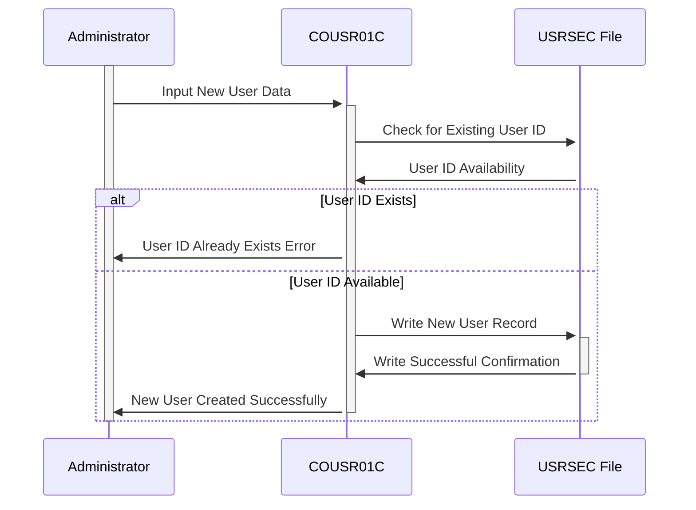

Gerado em: 1º de outubro de 2024

# **Título do Documento:** CardDemo Gerenciamento de Usuários - Adicionar Novo Usuário Especificação do Programa

# **Descrição Resumida:**

Este documento detalha a funcionalidade "Adicionar Novo Usuário" dentro do sistema CardDemo, com foco no programa COUSR01C. Este programa é responsável por registrar com segurança novos usuários, garantindo a precisão dos dados e reforçando os protocolos de segurança.

# **Histórias do Usuário:**

Como administrador, preciso ser capaz de adicionar novos usuários ao sistema para que eles possam acessar o CardDemo e executar suas tarefas atribuídas.

# **Épico Relacionado:**

6 - Gerenciamento de Usuários e Segurança

# **Requisitos Funcionais:**

1.  **Controle de Acesso:** O programa deve ser acessível apenas a usuários com privilégios de administrador.
2.  **Entrada de Dados:** O programa deve fornecer campos de entrada para capturar as seguintes informações do usuário:
    *   Nome (Obrigatório)
    *   Sobrenome (Obrigatório)
    *   ID do Usuário (Obrigatório, Exclusivo)
    *   Senha (Obrigatória)
    *   Tipo de Usuário (Obrigatório - "Regular" ou "Admin")
3.  **Validação de Dados:** O programa deve validar os dados inseridos para:
    *   Campos Obrigatórios: garantir que todos os campos obrigatórios sejam preenchidos.
    *   ID do Usuário Exclusivo: verificar se o ID do Usuário inserido já está em uso.
    *   Tipo de Dados: validação básica do tipo de dados (por exemplo, garantir que os nomes contenham apenas caracteres alfabéticos).
4.  **Armazenamento de Dados do Usuário:** Após a validação bem-sucedida, o programa deve armazenar as informações do novo usuário no arquivo USRSEC (banco de dados do usuário).
5.  **Confirmação e Feedback:**
    *   Sucesso: exibir uma mensagem de confirmação após a criação bem-sucedida do usuário.
    *   Erro: fornecer mensagens de erro claras e específicas para quaisquer falhas de validação, orientando o administrador a corrigir a entrada.
6.  **Navegação na Tela:**
    *   Fornecer opções para navegar de volta à tela anterior (Menu Admin) ou limpar os campos de entrada para adicionar outro usuário.

# **Requisitos Não Funcionais:**

1.  **Segurança:**
    *   O programa deve seguir as Diretrizes de Segurança do Aplicativo CardDemo para armazenamento e gerenciamento de senhas.
    *   A entrada de senha deve ser mascarada para garantir a confidencialidade.
2.  **Desempenho:**
    *   O processo de criação do usuário deve ser concluído em um prazo razoável (por exemplo, dentro de 2 segundos).
3.  **Usabilidade:**
    *   A interface do programa (tela) deve ser fácil de entender e usar, com rótulos e instruções claras.
    *   As mensagens de erro devem ser concisas e informativas.
4.  **Manutenibilidade:**
    *   O código do programa deve ser bem estruturado, documentado e seguir os padrões de codificação para facilitar a manutenção futura.

# **Critérios de Aceite:**

1.  O programa adiciona com sucesso um novo usuário ao arquivo USRSEC com dados válidos.
2.  O programa impede a criação de usuários com campos obrigatórios ausentes.
3.  O programa impede a criação de usuários com IDs de usuário duplicados.
4.  O programa fornece mensagens de erro claras e específicas para falhas de validação.
5.  O programa oferece opções de navegação de tela intuitivas.

# **Melhorias de Código:**

1.  **Tratamento de Erros:** Implementar uma rotina centralizada de tratamento de erros para gerenciar diferentes cenários de erro com mais eficácia.
2.  **Segurança de Senha:** Aprimorar a segurança da senha aplicando hash e sal às senhas antes de armazená-las no arquivo USRSEC.
3.  **Limpeza de Entrada:** Implementar técnicas de limpeza de entrada para evitar vulnerabilidades como injeção de SQL ou cross-site scripting.
4.  **Modularidade:** Refatorar o código em módulos reutilizáveis (sub-rotinas ou funções) para melhorar a manutenção.
5.  **Documentação:** Adicionar comentários abrangentes ao código para explicar a lógica e a funcionalidade de diferentes seções.

# **Melhorias de Segurança:**

1.  **Complexidade da Senha:** Impor regras de complexidade de senha (por exemplo, comprimento mínimo, caracteres especiais) para aumentar a força da senha.
2.  **Controle de Acesso:** Implementar o controle de acesso baseado em função (RBAC) em um nível granular para restringir o acesso a funcionalidades específicas com base nas funções do usuário.
3.  **Log e Auditoria:** Registrar todas as tentativas de criação de usuário, incluindo criações bem-sucedidas e falhas, para auditoria e monitoramento de segurança.
4.  **Comunicação Segura:** Se o aplicativo transmitir dados pela rede, usar protocolos seguros (por exemplo, TLS/SSL) para proteger informações confidenciais.

# **Diagrama Conceitual:**

--Made by "Smart Engineering" (by Compass.UOL)--