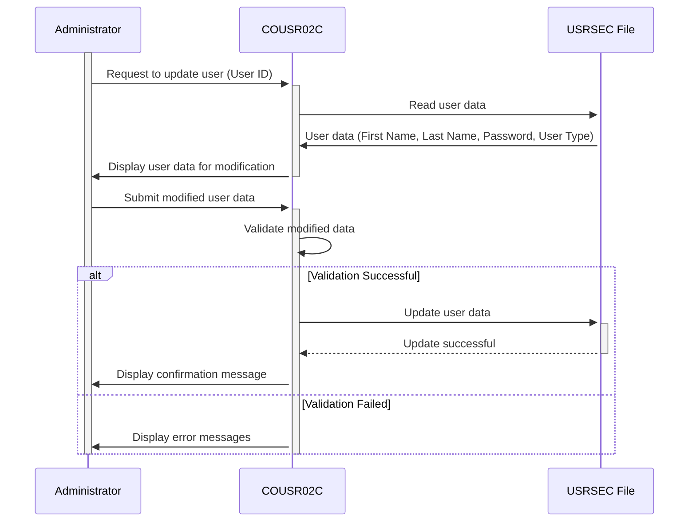

--CONTEÚDO TRADUZIDO--
Gerado em: 1º de outubro de 2024

# Especificação do Programa de Atualização de Usuário CardDemo

## Descrição Resumida

Este documento descreve as especificações do programa COUSR02C, que gerencia as atualizações de usuários no aplicativo CardDemo. Este programa lida com tarefas como recuperar detalhes do usuário, validar modificações, atualizar o banco de dados de usuários e fornecer feedback ao administrador.

## Histórias do Usuário

Como administrador do sistema, quero poder atualizar as informações do usuário para poder manter os dados do usuário precisos para o aplicativo CardDemo.

## Épico Relacionado

6 - Gerenciamento de Usuários e Segurança

## Requisitos Funcionais

1. **Recuperação de Dados do Usuário:**
   - O programa deve permitir que o administrador recupere informações existentes do usuário usando o ID do usuário.
   - Após a recuperação bem-sucedida, o programa deve exibir o primeiro nome, sobrenome, senha e tipo de usuário.

2. **Modificação de Dados:**
   - O programa deve permitir que o administrador modifique o primeiro nome, sobrenome, senha e tipo de usuário.
   - O ID do usuário não deve ser modificável.

3. **Validação de Entrada:**
   - O programa deve validar os dados modificados para garantir que todos os campos obrigatórios sejam preenchidos e os formatos de dados estejam corretos.
   - Regras de validação específicas:
      - **ID do Usuário:** Não modificável, deve corresponder ao ID do usuário existente.
      - **Primeiro Nome:** Obrigatório, apenas caracteres alfabéticos permitidos.
      - **Sobrenome:** Obrigatório, apenas caracteres alfabéticos permitidos.
      - **Senha:** Obrigatória, deve aplicar regras de complexidade (por exemplo, comprimento mínimo, combinação de caracteres).
      - **Tipo de Usuário:** Obrigatório, deve ser um tipo de usuário válido definido pelo sistema (por exemplo, Administrador, Usuário Padrão).

4. **Atualização do Banco de Dados:**
   - Se os dados modificados passarem na validação, o programa deve atualizar o registro do usuário no arquivo USRSEC.

5. **Confirmação e Tratamento de Erros:**
   - O programa deve exibir uma mensagem de confirmação após a atualização bem-sucedida do usuário.
   - O programa deve exibir mensagens de erro apropriadas se:
      - O ID do usuário não for encontrado.
      - A validação de dados falhar.
      - Ocorrerem erros durante o processo de atualização do banco de dados.

## Requisitos Não Funcionais

1. **Segurança:**
   - Somente administradores autorizados com privilégios de acesso apropriados devem poder acessar e modificar as informações do usuário.
   - As senhas devem ser armazenadas com segurança usando criptografia.

2. **Usabilidade:**
   - O programa deve fornecer uma interface amigável para os administradores visualizarem, modificarem e atualizarem as informações do usuário.
   - As mensagens de erro devem ser claras, concisas e informativas.

3. **Desempenho:**
   - O processo de atualização do usuário deve ser concluído dentro de um prazo razoável (por exemplo, dentro de 2 segundos).

4. **Confiabilidade:**
   - O programa deve atualizar as informações do usuário no banco de dados com precisão.
   - O programa deve lidar com erros normalmente e evitar a corrupção de dados.

5. **Manutenibilidade:**
   - O programa deve ser bem documentado para facilitar a manutenção e os aprimoramentos futuros.

## Critérios de Aceitação

1. **Atualização de Usuário Bem-Sucedida:**
   - Dado um ID de usuário existente, o administrador deve ser capaz de recuperar, modificar e atualizar as informações do usuário com sucesso.
   - As informações atualizadas devem ser refletidas corretamente no arquivo USRSEC.
   - Uma mensagem de confirmação deve ser exibida após a atualização bem-sucedida.

2. **ID de Usuário Não Encontrado:**
   - Dado um ID de usuário inválido, o programa deve exibir uma mensagem de erro indicando que o ID de usuário não foi encontrado.

3. **Erros de Validação de Dados:**
   - Dados de entrada inválidos (por exemplo, campos obrigatórios vazios, formatos de dados incorretos), o programa deve exibir mensagens de erro apropriadas para cada regra de validação violada.

4. **Tratamento de Erros:**
   - Em caso de erros durante o processo de atualização do banco de dados, o programa deve exibir uma mensagem de erro genérica e registrar os detalhes do erro para solução de problemas.

## Melhorias de Código

1. **Complexidade da Senha:**
   - Implemente regras de complexidade de senha (por exemplo, comprimento mínimo, combinação de maiúsculas, minúsculas, números, caracteres especiais) para aumentar a segurança do sistema.
   - Forneça feedback ao administrador sobre os requisitos de complexidade da senha.

2. **Confirmação de Senha:**
   - Solicite ao administrador que digite a nova senha duas vezes para evitar erros de digitação.
   - Compare as duas entradas e prossiga somente se elas corresponderem.

3. **Trilha de Auditoria:**
   - Implemente uma trilha de auditoria para registrar todas as atualizações de usuários, incluindo:
      - ID de usuário do administrador que está fazendo a alteração.
      - Carimbo de data/hora da alteração.
      - Campos que foram modificados.
      - Valores antigos e novos dos campos modificados.

4. **Tratamento de Erros:**
   - Implemente mensagens de erro mais específicas com base no tipo de erro encontrado (por exemplo, erro de conexão com o banco de dados, erro de bloqueio de registro).
   - Registre informações detalhadas sobre erros em um arquivo ou banco de dados para solução de problemas.

5. **Documentação do Código:**
   - Adicione comentários para explicar o propósito e a lógica de diferentes seções do código.
   - Use nomes de variáveis ​​significativos.

## Melhorias de Segurança

1. **Criptografia de Senha:**
   - Criptografe senhas no arquivo USRSEC usando um algoritmo de criptografia forte para proteger dados confidenciais contra acesso não autorizado.
   - Não armazene senhas em texto simples.

2. **Limpeza de Entrada:**
   - Limpe todas as entradas do usuário para evitar ataques de injeção, como injeção de SQL ou cross-site scripting (XSS).

3. **Controle de Acesso:**
   - Implemente o controle de acesso baseado em função (RBAC) para restringir o acesso à funcionalidade de atualização do usuário apenas ao pessoal autorizado.

## Diagrama Conceitual

--Made by "Smart Engineering" (by Compass.UOL)--