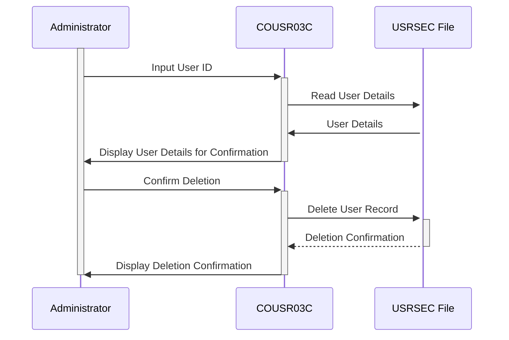

Gerado em: 1 de outubro de 2024

# CardDemo Gerenciamento de Usuários - Exclusão de Usuário

## Descrição Resumida
Esta especificação detalha a função "Exclusão de Usuário" dentro da aplicação CardDemo. Esta função permite que usuários autorizados (administradores) removam contas de usuário com segurança.

## Histórias de Usuário
Como administrador do sistema, preciso ser capaz de excluir contas de usuário para poder gerenciar o acesso do usuário e garantir a segurança do sistema.

## Épico Relacionado:
6 - Gerenciamento de Usuários e Segurança

## Requisitos Funcionais
* **Identificação do Usuário:** O sistema deve permitir que um administrador insira um ID de usuário para identificar a conta a ser excluída.
* **Verificação do Usuário:** O sistema deve recuperar e exibir os detalhes do usuário para confirmação antes da exclusão.
* **Confirmação de Exclusão:** O sistema deve exigir confirmação explícita do administrador antes de excluir a conta do usuário.
* **Execução da Exclusão:** Após a confirmação, o sistema deve remover o registro do usuário do arquivo USRSEC.
* **Comunicação de Resultados:** O sistema deve exibir uma mensagem de sucesso após a exclusão bem-sucedida ou uma mensagem de erro se a exclusão falhar.

**Regras de Negócio:**
* Somente administradores autenticados com permissões apropriadas podem excluir contas de usuário.
* O sistema deve verificar o ID do usuário antes da exclusão para evitar a exclusão acidental da conta errada.
* Todas as ações de exclusão de usuário devem ser registradas para fins de auditoria.

## Requisitos Não Funcionais
* **Segurança:** Somente pessoal autorizado deve poder excluir contas de usuário. O sistema deve empregar mecanismos robustos de autenticação e autorização para garantir que somente usuários autorizados possam acessar e executar esta função.
* **Integridade de Dados:** O sistema deve garantir que a conta de usuário correta seja excluída. Ele deve fornecer etapas de confirmação claras ao administrador antes de remover permanentemente quaisquer dados.
* **Auditabilidade:** Todas as ações de exclusão de usuário, incluindo o usuário que iniciou a exclusão, a data e hora da ação e o ID de usuário da conta excluída, devem ser registradas para fins de auditoria e rastreamento.

## Critérios de Aceite
* Um administrador autenticado deve ser capaz de excluir uma conta de usuário existente com sucesso.
* O sistema deve exibir uma mensagem de confirmação após a exclusão bem-sucedida do usuário.
* O sistema deve lidar com IDs de usuário inválidos normalmente e exibir uma mensagem de erro apropriada.
* O sistema deve registrar todas as ações de exclusão de usuário para fins de auditoria.

## Melhorias de Código
* Implementar consultas parametrizadas para evitar vulnerabilidades de injeção de SQL ao acessar o arquivo USRSEC.
* Adicionar tratamento de erros para operações de arquivo para lidar normalmente com erros potenciais durante o acesso ao arquivo.
* Usar uma estrutura de registro para fornecer registros detalhados para facilitar a solução de problemas e o monitoramento.

## Melhorias de Segurança
* Implementar políticas de senha forte para contas de administrador.
* Habilitar a autenticação de dois fatores para contas de administrador para evitar acesso não autorizado.
* Revisar e atualizar regularmente as listas de controle de acesso para funções de gerenciamento de usuários.

## Diagrama Conceitual

--Made by "Smart Engineering" (by Compass.UOL)--