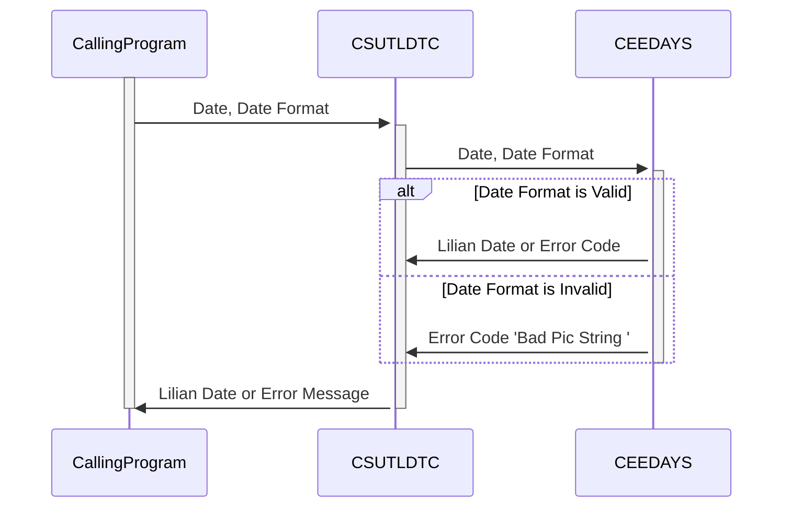

Gerado em: 1º de outubro de 2024

# Aplicativo CardDemo: Utilitário de Conversão de Data (CSUTLDTC)

## Descrição Resumida:
Este programa utilitário, CSUTLDTC, é um componente crítico do aplicativo CardDemo. Sua função principal é converter datas de vários formatos legíveis por humanos, como "MM-DD-YYYY", para o formato Lilian. Este formato, uma representação numérica da data, é essencial para que os computadores realizem cálculos e comparações com eficiência.

## Histórias de Usuário:
Como administrador do sistema, preciso de uma maneira confiável de converter datas de diferentes formatos em um formato padrão para processamento de dados e geração de relatórios eficientes.

## Épico Relacionado:
9 - Utilitários do Sistema

## Requisitos Funcionais:
1. **Receber Data e Formato:** O programa deve aceitar duas entradas: a string de data a ser convertida e o formato correspondente da data de entrada (por exemplo, "MM-DD-YYYY", "DD-MM-YYYY").
2. **Validar Formato de Data:** Deve verificar se o formato da data de entrada é reconhecido e suportado pelo sistema. Se o formato for inválido, o programa deve gerar uma mensagem de erro "Bad Pic String " e sair.
3. **Validar Data:** O programa deve verificar a validade da própria data de entrada. Por exemplo, 30 de fevereiro é uma data inválida e deve ser sinalizada como "Invalid month  ".
4. **Converter para o Formato Lilian:** Se a data e o formato forem válidos, o programa deverá converter a data de entrada para o formato Lilian, uma representação numérica da data.
5. **Retornar Data Lilian ou Erro:** Após a conversão bem-sucedida, retorne a data Lilian. Se alguma validação falhar, o programa deve retornar uma mensagem de erro descritiva indicando o problema.

## Requisitos Não Funcionais:
1. **Precisão:** O processo de conversão deve ser preciso para evitar discrepâncias em cálculos relacionados à data ou inconsistências de dados.
2. **Desempenho:** O processo de conversão deve ser eficiente para evitar impactar o desempenho de outros processos do sistema, especialmente ao lidar com grandes volumes de dados.
3. **Manutenibilidade:** O código deve ser bem estruturado e documentado para facilitar a manutenção e as atualizações.

## Critérios de Aceitação:
1. **Conversão Bem-Sucedida:** Dada uma data e formato válidos, o programa deve converter a data para o formato Lilian com precisão.
2. **Tratamento de Formato de Data Inválido:** Dado um formato de data inválido, o programa deve gerar uma mensagem de erro "Bad Pic String ".
3. **Tratamento de Data Inválida:** Dada uma data inválida, o programa deve gerar uma mensagem de erro indicando o problema específico (por exemplo, "Invalid month  ").
4. **Relato de Erros:** Todas as mensagens de erro devem ser claras, concisas e úteis para solução de problemas.

## Melhorias de Código:
1. **Tratamento de Erros Centralizado:** Implemente uma rotina de tratamento de erros centralizada para gerenciar todas as condições de erro de forma consistente e sustentável.
2. **Mensagens de Erro Aprimoradas:** Forneça mensagens de erro mais informativas, incluindo a data ou formato inválido, para ajudar na depuração mais rápida.
3. **Log:** Incorpore recursos de log para registrar conversões bem-sucedidas, erros e outras informações relevantes para auditoria e solução de problemas.

## Melhorias de Segurança:
Embora este utilitário não lide diretamente com dados confidenciais, considere o seguinte:
1. **Validação de Entrada:** Implemente validação de entrada rigorosa para evitar qualquer dado inesperado ou tentativas de injeção de código malicioso.
2. **Log Seguro:** Se os logs forem implementados, certifique-se de que sejam armazenados com segurança e que o acesso seja restrito apenas ao pessoal autorizado.

## Diagrama Conceitual:

--Made by "Smart Engineering" (by Compass.UOL)--