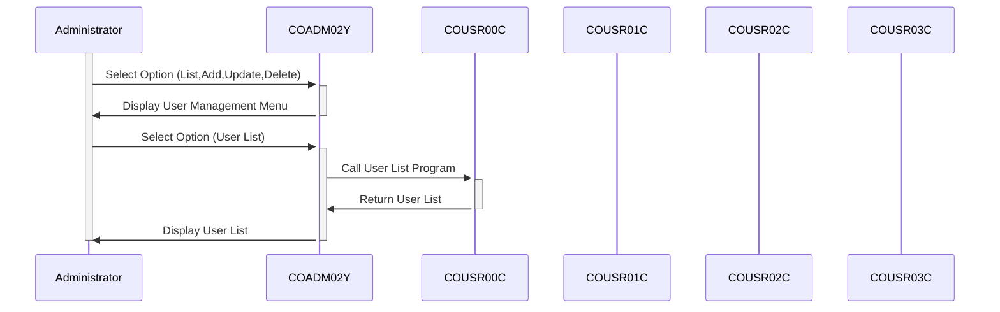

Gerado em: 1º de outubro de 2024

# **Título do Documento:** CardDemo Application - Especificação do Menu de Gerenciamento de Usuários Administrativos

# **Descrição Resumida:**
Este documento descreve as especificações para o menu administrativo "User Management" (Gerenciamento de Usuários) dentro da aplicação CardDemo. Este menu é um componente crítico da estrutura de segurança do sistema, fornecendo ao pessoal autorizado ferramentas para gerenciar contas de usuário e suas permissões associadas.

# **Histórias do Usuário:**
Como administrador do sistema, preciso ser capaz de gerenciar contas de usuário para poder controlar o acesso à aplicação CardDemo.

# **Épico Relacionado:**
6 - Gerenciamento de Usuários e Segurança

# **Requisitos Funcionais:**
O menu "User Management" (Gerenciamento de Usuários) deve fornecer as seguintes funcionalidades:
* **User List** (Lista de Usuários):
    - Exibir uma lista de todas as contas de usuário existentes, incluindo nomes de usuário, IDs de usuário e níveis de acesso.
    - Permitir que os administradores pesquisem usuários específicos com base no nome de usuário ou ID do usuário.
* **User Add** (Adicionar Usuário):
    - Permitir que os administradores criem novas contas de usuário fornecendo um nome de usuário exclusivo, senha e nível de acesso.
    - Aplicar regras de complexidade de senha para garantir a segurança de novas contas.
* **User Update** (Atualizar Usuário):
    - Permitir que os administradores modifiquem informações de usuários existentes, como nomes de usuário, senhas e níveis de acesso.
    - Registrar todas as alterações feitas nas contas de usuário para fins de auditoria.
* **User Delete** (Excluir Usuário):
    - Permitir que os administradores excluam contas de usuário existentes.
    - Exigir confirmação antes de excluir uma conta para evitar exclusões acidentais.

# **Requisitos Não Funcionais:**
* **Segurança:**
    - O menu "User Management" (Gerenciamento de Usuários) deve ser acessível apenas a administradores autenticados e autorizados.
    - As credenciais do usuário devem ser armazenadas com segurança usando algoritmos de criptografia ou hashing.
* **Desempenho:**
    - O menu deve carregar e responder às ações do usuário rapidamente, com latência mínima.
* **Usabilidade:**
    - O menu deve ter uma interface amigável que seja fácil de navegar e entender.
* **Confiabilidade:**
    - O menu deve funcionar de forma confiável e consistente, sem erros ou comportamento inesperado.

# **Critérios de Aceitação:**
* O menu "User Management" (Gerenciamento de Usuários) deve ser integrado com sucesso à aplicação CardDemo.
* Todas as funcionalidades do menu devem ser testadas e verificadas para funcionar conforme o esperado.
* O menu deve atender a todos os requisitos especificados de segurança, desempenho, usabilidade e confiabilidade.
* Os administradores do sistema devem ser capazes de usar o menu para gerenciar contas de usuário e controlar o acesso à aplicação CardDemo de forma eficaz.

# **Melhorias de Código:**
* **Tratamento de Erros:** Implementar tratamento de erros robusto para lidar com situações inesperadas, como falhas de conexão com o banco de dados ou entradas inválidas do usuário.
* **Log:** Aprimorar o log para capturar todas as ações do usuário, eventos do sistema e erros para fins de auditoria e solução de problemas.
* **Documentação:** Fornecer documentação abrangente para o código do menu, funcionalidades e configuração para facilitar a manutenção e melhorias futuras.

# **Melhorias de Segurança:**
* **Validação de Entrada:** Implementar validação de entrada rígida para evitar injeção de SQL e outras vulnerabilidades de segurança.
* **Gerenciamento de Sessão:** Implementar gerenciamento de sessão seguro para proteger as contas de usuário contra acesso não autorizado.
* **Política de Senha:** Impor uma política de senha forte que exija que os usuários criem senhas que atendam a determinados requisitos de complexidade.

# **Diagrama Conceitual:**

--Made by "Smart Engineering" (by Compass.UOL)--