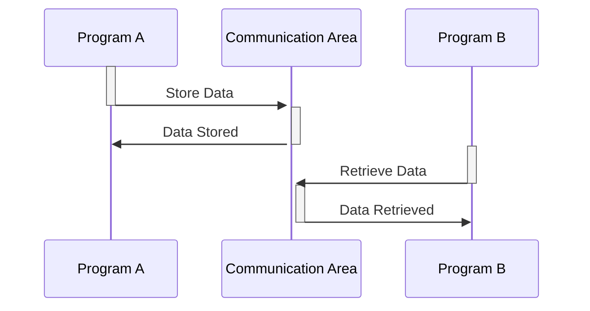

Gerado em: 1º de outubro de 2024

**Título do Documento:** CardDemo Application - Especificação da Área de Comunicação Entre Programas

**Descrição Resumida:**
O aplicativo CardDemo utiliza uma área de comunicação comum para compartilhar informações entre seus diferentes programas. Essa área, definida no arquivo COCOM01Y.cpy, atua como um mensageiro, carregando detalhes importantes como dados do cliente, informações da conta e detalhes do usuário entre várias partes do aplicativo.

**Histórias do Usuário:**
Como desenvolvedor do aplicativo CardDemo, preciso de uma maneira padronizada de trocar informações entre diferentes programas para que os dados possam ser compartilhados de forma consistente e confiável.

**Épico Relacionado:**
9 - Utilitários do Sistema

**Requisitos Funcionais:**
- A área de comunicação deve armazenar informações gerais sobre a transação, incluindo os programas de envio e recebimento, o ID do usuário e o tipo de usuário (administrador ou regular).
- Informações específicas do cliente, como ID do cliente, nome e detalhes da conta, devem ser incluídas na área de comunicação.
- A área de comunicação deve ser acessível a todos os programas dentro do aplicativo CardDemo.

**Requisitos Não Funcionais:**
- A área de comunicação deve ser projetada para uma troca eficiente de dados, minimizando a sobrecarga e maximizando o desempenho.
- A integridade dos dados deve ser mantida, garantindo que todos os programas usem as mesmas definições e formatos de dados.

**Critérios de Aceitação:**
- A área de comunicação é utilizada com sucesso por diferentes programas dentro do aplicativo CardDemo para trocar dados.
- A integridade dos dados é mantida e não há instâncias de corrupção ou interpretação incorreta de dados.
- O uso de uma área de comunicação comum não afeta negativamente o desempenho do aplicativo.

**Melhorias de Código:**
- Implementar verificações de validação de dados dentro da área de comunicação para garantir que os dados que estão sendo passados entre os programas sejam precisos e consistentes.
- Adicionar rotinas de tratamento de erros para lidar normalmente com situações em que os dados estão ausentes ou inválidos.
- Documentar a estrutura e o uso da área de comunicação para facilitar a manutenção e o desenvolvimento futuro.

**Melhorias de Segurança:**
- Criptografar informações confidenciais, como números de cartão de crédito, antes de armazená-las na área de comunicação.
- Implementar mecanismos de controle de acesso para restringir o acesso a dados confidenciais com base em funções e permissões do usuário.
- Auditar regularmente o uso da área de comunicação para detectar qualquer acesso não autorizado ou atividade suspeita.

**Diagrama Conceitual:**

--Made by "Smart Engineering" (by Compass.UOL)--